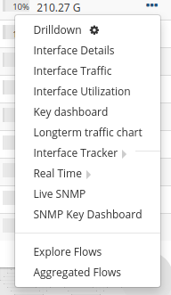

# Routers and Interfaces

The main tool you will need to work with **Device level** views of
Netflow is the ***Routers and Interfaces*** tool. You can select a
timeframe, then you will be shown a list of routers with traffic
summaries, then you can select a router and see the interfaces, finally
you can monitor the interface itself or drilldown even further into
hosts , applications, flows on that interface. You can even pull up a
Real Time stabber of any of the drilldowns.

:::note
To access Routers and Interfaces : Select Netflow > Routers and Interfaces
:::

The Routers and Interfaces Tool  

## Using the router interface tool

The screen has 4 major parts,

1. **Time Selector** — select a timewindow for the analysis. The
   default is the most recent 15 minutes. Once you select the time
   window, that is fixed for all the subsequent drilldowns. Dont be
   afraid to select large time windows. Trisul can handle it.
2. **Router Table** — table showing list of all routers active in the
   selected time window. Table shows the number of interfaces active,
   total volume pushed through the router and other info.
3. **Magic Map** — a visualization of the top interfaces **across all
   routers** allows you to directly select an interface. This is also
   useful to get a view of the relative volumes seen by interfaces
   across your network.
4. **Interfaces Table** — when you click on a router, the interface
   table is filled with details about all the interfaces on that router
   active in the selected time window.
5. **Interface Alias** — when you want to know the alias name or
   interface peering details, you can select the ‘Show Interface Alias’
   option.

From the interface table there are a number of drilldown options
available.

## Drilldown from the interfaces table

Having selected a router and interface you can drilldown and access the
following by Clicking on the three lines drop down option on the right side against each interfaces.

| Option                  | Opens                                 | Use this for                                                                                                                                                                                                                                                |
| ----------------------- | ------------------------------------- | ----------------------------------------------------------------------------------------------------------------------------------------------------------------------------------------------------------------------------------------------------------- |
| Drilldown               | Interface drilldown                   | The most common options like What are the Top apps, hosts, conversations, and raw flows on the interface. If you have *Interface Tracking* enabled you get perfect accuracy even for long term (weeks) analysis                                             |
| Interface Details       | Interface Detail                      | To See the interface details like if-index,if-name,alias,port,ifspeed,etc in one shot                                                                                                                                                                       |
| Interface Traffic       | Real Time Interface traffic Chart     | Provides real time Interface usage from Netflow                                                                                                                                                                                                             |
| Interface Utilization   | Real Time Interface Utilization Chart | Provides real time Interface utilization from Netflow                                                                                                                                                                                                       |
| Key Dashboard           | Interface key dashboard               | To see interface metrics, assign name, jump to flows, and traffic analysis at interface level                                                                                                                                                               |
| Long term traffic chart | Long term charts                      | Default 7 day view of interface IN/OUT traffic - 1 chart per day                                                                                                                                                                                            |
| Interface Tracker       | Enable                                | Enables [Interface Tracker](interface_tracker.html) Enabling this on important interfaces where you wish to get long term reports of hosts and application usage. You can get the bandwidth of every host,application by total,into and out of an interface |
| Interface Tracker       | Disable                               | Disable an interface tracker. Without an interface tracker, you will get only an overview of hosts,apps by total.                                                                                                                                           |
| Real Time               | Real Time Utilization                 | Real time bandwidth chart of interface usage                                                                                                                                                                                                                |
| Real Time               | Real Time Source Dest IP              | Real time view of Source and Dest Hosts active                                                                                                                                                                                                              |
| Real Time               | Real Time Flows                       | Real Time most active flows on interface                                                                                                                                                                                                                    |
| Real Time               | Real Time Recv vs Xmit                | Real Time charts showing Receive and Transmit bandwidth on that interface (from Netflow)                                                                                                                                                                    |
| Live SNMP               | Charts                                | Use SNMP to show a 10-sec view of Recv and Xmit traffic on the interface                                                                                                                                                                                    |
| SNMP Key Dashboard      | Key Dashboard                         | If SNMP based metrics is installed , this opens the interface metrics in the SNMP-Interface counter group.                                                                                                                                                  |
| Explore Flows           | Explore Network Flows                 | Provides detailed activity of each and every flow in and out of that interface                                                                                                                                                                              |
| Aggregated Flows        | Aggregate Network Flows               | Provides all matching flows and show aggregated volumes by hosts, ports, protocols from that interface                                                                                                                                                      |
