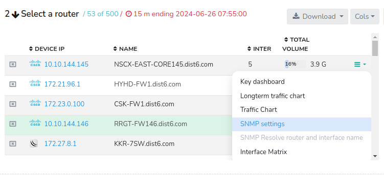
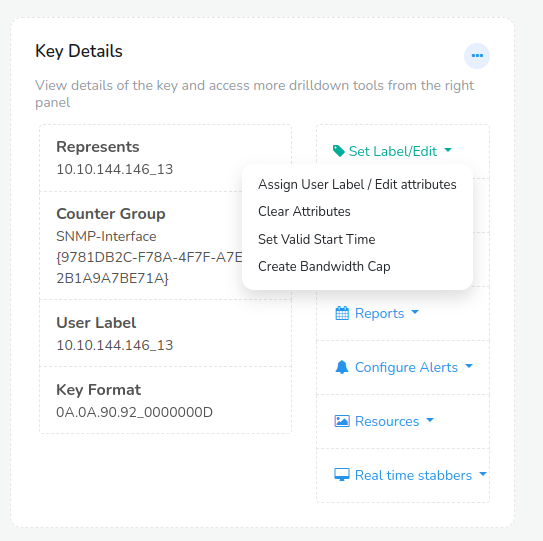
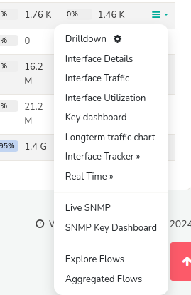
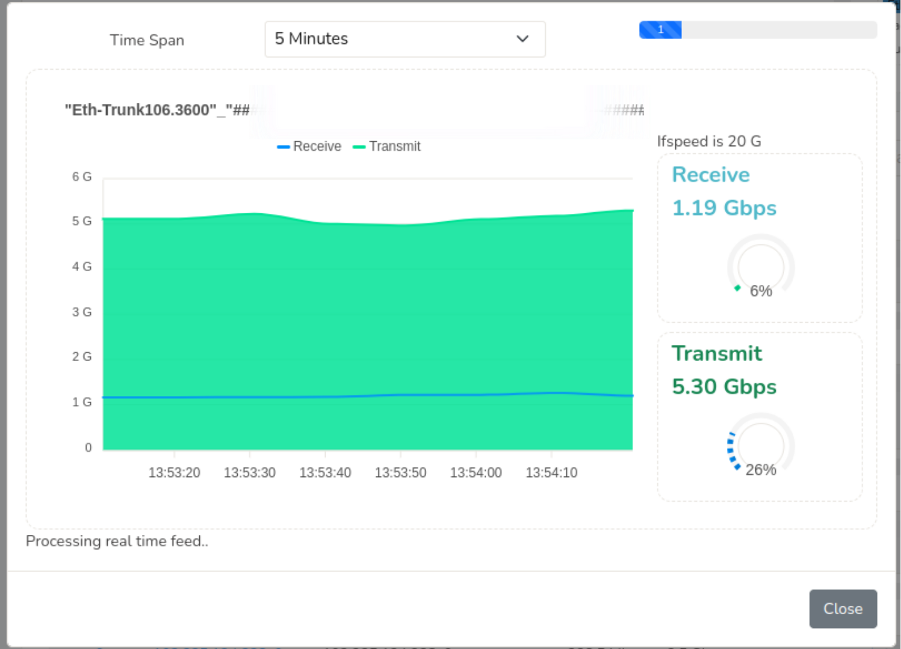
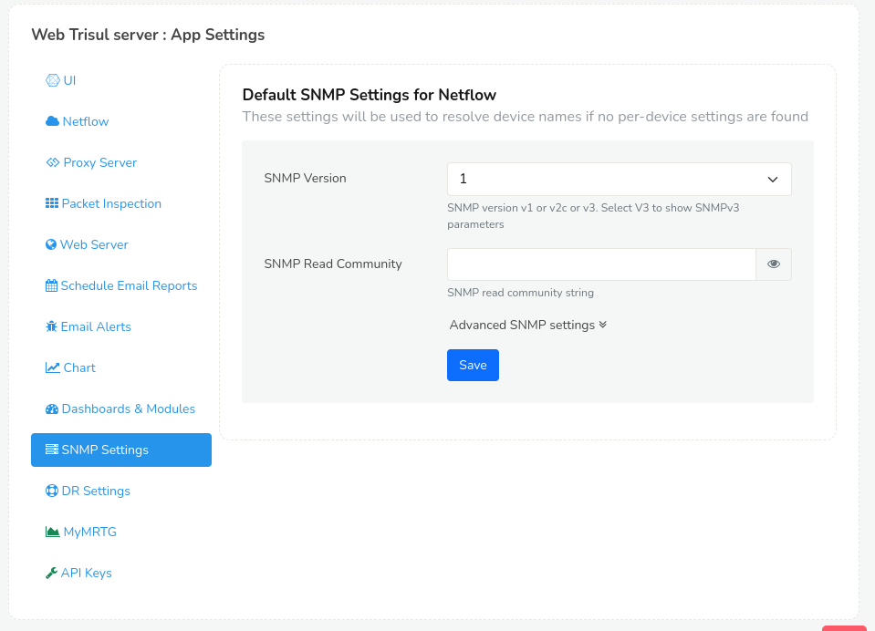

# Using SNMP

Trisul can use SNMP to complement Netflow. You can use it to discover
Device names, interface names, interface speeds, plot real time SNMP
traffic charts, etc.

## Package

To enable SNMP you need to install the following packages on the
Trisul-Hub node.

```language-bash
# ubuntu
apt install snmp

# centos/redhat
yum install net-snmp net-snmp-utils 
```

## Configuring SNMP

You need to first specify the authentication details for each SNMP
device.

:::note navigation

Login as user, then select \_Netflow \> Router and Interfaces

:::



Click on SNMP Settings and enter the SNMP v2 or SNMP v3 parameters.

## Resolving names

When you click the *Options* menu

| Settings                               | Description                                                                                                                                                                           |
| -------------------------------------- | ------------------------------------------------------------------------------------------------------------------------------------------------------------------------------------- |
| Key Dashboard                          | Every Item in trisul has a key. Similarly every router is associated with an unique key and this options fetches the key details for every device                                     |
| Long Term Chart                        | You can view the long term traffic trends as a chart using this option                                                                                                                |
| SNMP Settings                          | Configure SNMPv2 or SNMPv3 parameters.                                                                                                                                                |
| SNMP resolve router and interface name | Query the SNMP device and automatically assign names to the router and all the interfaces using the “Interface Name” value in the SNMP MIB. Usually this is like `Gigabit/1/0/12` etc |
| Router Tracker                         | Router tracker feature enables the detailed analysis of hosts and applications at device level                                                                                        |
| Show Router Description                | Show the router description in the table. This is the value of sysDescr from the SNMP MIB                                                                                             |

### When the IP address of the SNMP agent is different

In some environments, the SNMP agent runs on a different IP address than
the one shown in the table. If this is the case, then trying to resolve
using SNMP via the IP address shown in the routers table will fail. You
need to specify a *Key Attribute* for the router called
`snmp.management_ip`. Follow these steps.

- First configure SNMPv2 or v3 parameters for the device.
- Select *Options \> Key Dashboard*
- Select *Assign user label / Edit attributes* as shown below



Scroll down to the *Attributes* section and add the following string
`snmp.management_ip=10.x.x.x` replace with actual IP.

- Update

Now you should be able to resolve the router and inteface names.

## Viewing SNMP traffic charts

> Against any interface select Options



You get the following options

| Settings           | Description                                                                                                                                                                        |
| ------------------ | ---------------------------------------------------------------------------------------------------------------------------------------------------------------------------------- |
| Live SNMP          | This brings up a live 5 second updated view of SNMP In/Out traffic chart for that interface.                                                                                       |
| SNMP Key Dashboard | If you have the *Trisul SNMP APP* installed, Trisul automatically polls all interfaces and maintains historical charts. This takes you to the key dashboard for historical charts. |

### Live SNMP

Shows a 10-sec updated chart of network traffic on the interface
obtained via SNMP. A very useful debugging tool.



## Configuring SNMP Globally.

Suppose if there are no devices listed in the routers and interfaces,
you want to resolve device names if no per-device settings are found,
you can use this setting to configure SNMP globally. or if there are
more number of devices with same SNMP settings, you can use this
settings to configure SNMp in a single shot.

To configure this, Login as Admin

:::note navigation

Click on Manage -\> App Settings -\> SNMP Settings.

:::


