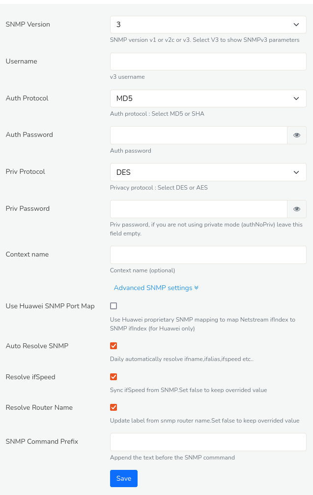

# Using SNMP

Trisul can use SNMP to complement Netflow. You can use it to discover
Device names, interface names, interface speeds, plot real time SNMP
traffic charts, etc.

## Package

To enable SNMP you need to install the following packages on the
Trisul-Hub node.

```language-bash
# ubuntu
apt install snmp

# centos/redhat
yum install net-snmp net-snmp-utils 
```

## Configuring SNMP

You need to first specify the authentication details for each SNMP
device.  
For that, Login as `user` and,

:::info navigation

:point_right: Go to Netflow &rarr; Router and Interfaces

:::


*Figure: Showing SNMP Settings Option in Routers and Interfaces*

Click on SNMP Settings and enter the SNMP v2 or SNMP v3 parameters

## Resolving Names

When you click the *Options* button on the right side of each router on the router table. The following list of menu will be available for drilldown.

| Settings                               | Description                                                        |
| -------------------------------------- | ------------------------------------------------------------------ |
| Key Dashboard                          | Every Item in trisul has a key. Similarly every router is associated with an unique key and this options fetches the key details for every device                                     |
| Long Term Traffic Chart                        | You can view the long term traffic trends as a chart using this option                                                                                                                |
| Traffic Chart | This fetches the traffic chart of the selected router.                                                                                          |
| SNMP Settings                          | Configure SNMPv2 or SNMPv3 parameters.                                                                                                                                                |
| SNMP resolve router and interface name | Query the SNMP device and automatically assign names to the router and all the interfaces using the “Interface Name” value in the SNMP MIB. Usually this is like `Gigabit/1/0/12` etc |
| [Interface Matrix](/docs/ug/netflow/drilldown#interface-traffic-matrix--chord-diagram) | Displays traffic flows between interfaces.                                                                                          |

So, to resolve names of the routers. Click on the *SNMP Resolve Router and Interface Names* option from the drop down.

### When the IP Address of the SNMP Agent is Different

In some environments, the SNMP agent runs on a different IP address than
the one shown in the table. If this is the case, then trying to resolve
using SNMP via the IP address shown in the routers table will fail. You
need to specify a *Key Attribute* for the router called
`snmp.management_ip`. To do that, Follow these steps.

- First configure SNMP v2 or v3 parameters for the device using the aforementioned [*Configuring SNMP*](/docs/ug/netflow/snmp#configuring-snmp) steps .
- Then click on the *Options* button on the right side of the router name and select *Key Dashboard* from the drop down.
- You can see the *Key Details* on the right side of the *Key Dashboard* as shown in the figure below. Click *Select *Assign user label / Edit attributes* option from *Set Label/Edit*.


*Figure: Showing Option to Resolve Names for Routers and Interfaces*

You can see a form where you can edit details of the *key* with number of fields. Scroll down to the *Attributes* field and add the following string `snmp.management_ip=10.x.x.x` replace with actual IP. And click *Update*.
Now you should be able to resolve the router and interface names.

## Viewing SNMP Traffic Charts

You can view SNMP traffic charts for any interface from the interface table. Click on the *Options* button on the right side against any interface on the interface table.


*Figure: Drilldown Options for Interfaces*

From the list of [Interface drilldown options](/docs/ug/netflow/routers_and_interfaces#drilldown-from-the-interfaces-table), you can select the following options to view SNMP traffic charts. 

| Settings           | Description                                                                                |
| ------------------ | ------------------------------------------------------------------------------------------ |
| Live SNMP          | This brings up a live 5 second updated view of SNMP In/Out traffic chart for that interface.                                                                                       |
| SNMP Key Dashboard | If you have the *Trisul SNMP APP* installed, Trisul automatically polls all interfaces and maintains historical charts. This takes you to the key dashboard for historical charts. |


### Live SNMP

The *Live SNMP* option in the interface is a very useful debugging tool that provides real time monitoring of SNMP traffic data for a specific interface. It shows a 10-sec updated chart of network traffic on the interface obtained via SNMP.


*Figure: Live SNMP*

## Configuring SNMP Globally

There are scenarios where you might want to configure SNMP globally. 

**Scenario 1**: When you want to start monitoring devices but no devices are listed in the *routers and interfaces* section, where you want to resolve device names. In tha case, if no per-device settings are found, you can use the following setting to configure SNMP globally. 

**Scenario 2**: If there are more number of devices with same SNMP settings, you can use the following settings to configure SNMP in a single shot.

To configure SNMP globally, Login as `admin`

:::info navigation

:point_right: Click on Web Admin: Manage &rarr; App Settings &rarr; SNMP Settings.

:::


*Figure: SNMP Settings*    

| Field | Description |
|-------------------------------|--------------------------------------------------------------------------------|
| SNMP Version | The version of SNMP to use (e.g., v1, v2c, or v3)                                               |
| Username | The Username for SNMP Authentication                                                                |
| Auth Protocol | The authentication protocol to use ( MD5 or SHA)                                               |
| Auth Password | The password for SNMP authentication                                                           |
| Priv Protocol | The privacy protocol to use (e.g., DES or AES)                                                 |
| Priv Password | The password for SNMP Privacy                                                                  |
| Context Name  | The context name for SNMP v3                                                                   |

Click *Advanced Settings* for further configurations.

| Field | Description |
|-------------------------------|--------------------------------------------------------------------------------|
| Use Huawei SNMP Port Map | Enable this if youre using Huawei devices which uses custom SNMP port mapping       |
| Auto Resolve SNMP | Automatically resolve SNMP for interfaces                                                  |
| Resolve ifSpeed | Resolve the interface speed (ifSpeed) using SNMP                                             |
| Resolve Router Name | Resolve the router name using SNMP                                                       |
| SNMP Command Prefix | Specify a prefix for SNMP commands                                                       |

Once providing all the fields and ensuring the configuration, click *Save*.