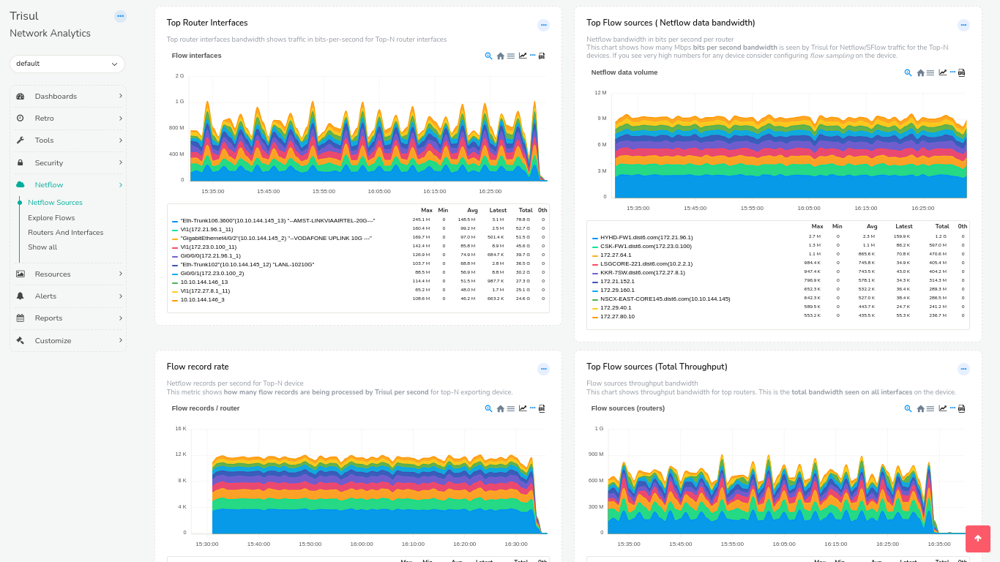

# Netflow Sources Dashboard

The Netflow Sources dashboard provide you the following system level
information on a Time Series chart.

Per Router (flow exporter)

1.  **Flow record Rate** — number of flows per second per router being
    processed
2.  **Flow sources** — bandwidth per router
3.  **Flow volume** — netflow bandwidth. This is an important
    parameters. Shows the Netflow Record rate in Mbps

Per Interface

1.  **Total volume** — bandwidth of Top 10 interfaces

## Using Netflow Sources

Select *Netflow -\> Netflow sources* to open the dashboard

Things to try :

1.  Expand timeframe using the “Time Window” drop down on the top
2.  Click on any item inside the chart legend to drilldown into long
    term views
3.  Click on <i class='fa fa-line-chart'></i> to add any chart as a
    **Reference chart** to others. This allows you to compare different
    panels.

