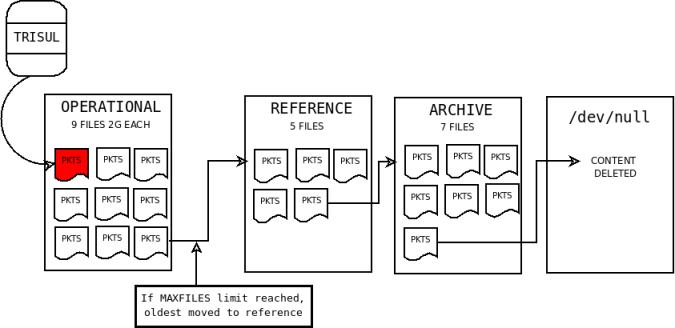

# Packet Capture Basics

The Trisul raw packet engine is designed towards these goals :

1. **Scaling** — The amount of data is only limited by the disk resources at your disposal

2. **Multi disk** — Supports multiple disks to optimize $/byte

3. **Flexibility** — Allows you to specify policies to cut down storage requirements

4. **Security** — Encrypts the raw packet storage

:::note free licence

**Free License**  
Note that the [free license](https://trisul.org/free) only allows you to store a maximum of 10GB per Probe. You can use rules to cut down the traffic, such as not storing encrypted traffic.

:::

## Sliding slices

Trisul uses an innovative sliding mechanism to store raw packets.

Raw packets are stored in three directories.

| Directory | Name               | Description                                               |
| --------- | ------------------ | --------------------------------------------------------- |
| *oper*    | Operational slices | recent data that is most likely to be called up           |
| *ref*     | Reference slices   | not so recent data so okay to be on slower disks          |
| *archive* | Archive slices     | unlikely but may be called upon, could be on slower disks |

As each directory gets filled up, the oldest slice from that directory 
moves to the next area. Slices from the archive silently move to `/dev/null`(they are deleted). The figure below illustrates the concept. Note that trisul only writes to the *oper* slices.

