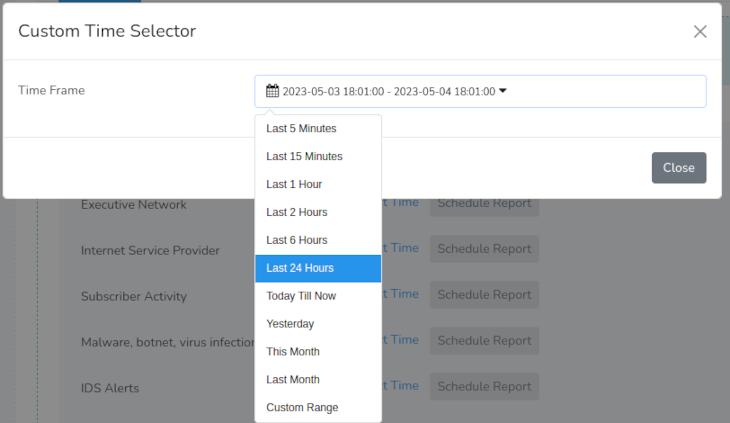

# Trisul Reporting Framework

Trisul Reports provide summaries of network traffic data, where users can gain insights into various aspects of network activity. Trisul devised a centralized reporting system to facilitate users to easily access a wide range of network traffic reports in one place instead of navigating to various dashboards to view the each report. Based on the selected template data, Trisul generates reports with which users can,
1) **View** the reports that are presented in user-friendly formats using tables, charts, and graphs.
2) **Customize** reports by modifying templates, adding filters, or changing visualization options.
3) **Schedule** for automatic generation and configure email for reports delivery.

Trisul further enhanced the reporting framework that consists of two reporting systems for quick analysis of common network traffic aspects. 

1) [Readymade Reports](/docs/ug/reports/readymade) 
2) [Custom Reports](/docs/ug/reports/flexible_reports) 

## Report Time

For each report type, you can easily select a number of predefined time windows using a [*Time Selector*](/docs/ug/ui/elements#time-selector)

