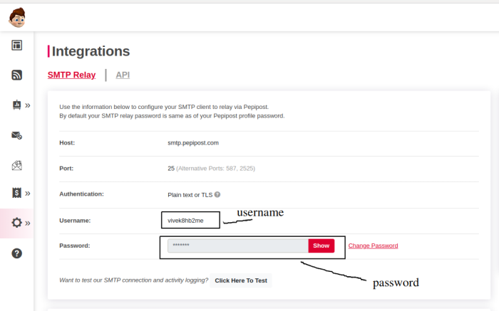

# Setup E-Mail

Describes how you can setup an email account to send outgoing email reports and alerts.

Note You need a valid SMTP email account (even Gmail will work).

## How to setup E-Mail

Select *Reports → Email settings*

1. Press **Configure Email**
2. Enter the following information

| Email Server                 | Email server name for eg `smtp.gmail.com`                                                                                                                     |
| ---------------------------- | ------------------------------------------------------------------------------------------------------------------------------------------------------------- |
| SMTP Port Number             | Usually it is 25, Gmail and secure TLS uses 587                                                                                                               |
| Authentication Protocol      | Select from options provided or “No auth”. If you are unsure the default usually works.                                                                       |
| From Email Address           | Your email account fully qualified *mikep123@gmail.com*                                                                                                       |
| Email Password               | Password for From Email. Provided by the email server admin                                                                                                   |
| Disable SSL Cert Verfication | If you are using an email server with a self signed cert, check this box to have Trisul skip the certificate validation checks.                               |
| SMTP Relay User (optional)   | Use this to send SMTP email via relays like sendgrid,mailchimp,pepipost etc. This is the user id given to you by the provider. Leave it blank if not required |

## Send a test email

After you have configured the email settings, its a good idea to send a test email to see if everything works.

Select *Reports → Email settings*

1. Press Edit
2. Enter the “Target Email ID” and press Send Test Email

## Pepipost integration

Web Trisul supports Email sending with SMTP Relay provided by Pepipost.com. Here is how you use it.

#### Get Pepipost credentials

Login to your Pepipost account and go to *Settings > Integrations > SMTP Relay*

Save the user name and password as shown in the picture below.

#### Configure email settings in Trisul

Enter the email settings as shown

| Email Server                 | smtp.pepipost.com                                                                     |
| ---------------------------- | ------------------------------------------------------------------------------------- |
| SMTP Port Number             | 587                                                                                   |
| Authentication Protocol      | Login SMTP Auth (default)                                                             |
| From Email Address           | something@yourdomain.com. This domain integration must be completed in Pepipost first |
| Email Password               | **Pepipost SMTP Password (noted down from previous step)**                            |
| Disable SSL Cert Verfication | Unchecked                                                                             |
| SMTP Relay User (optional)   | **Your Pepipost Username (noted from previous step)**                                 |

Then try sending a Test Mail.
