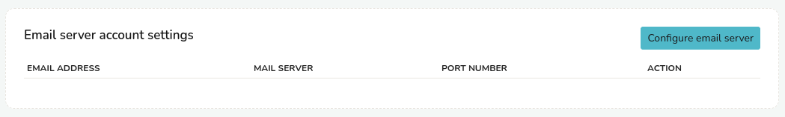
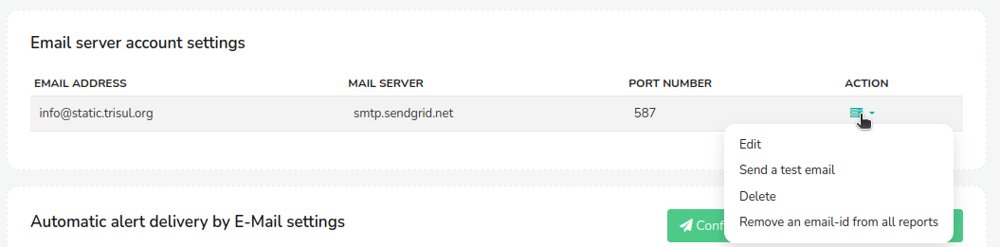
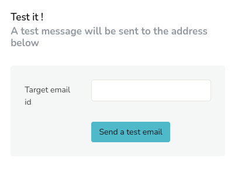
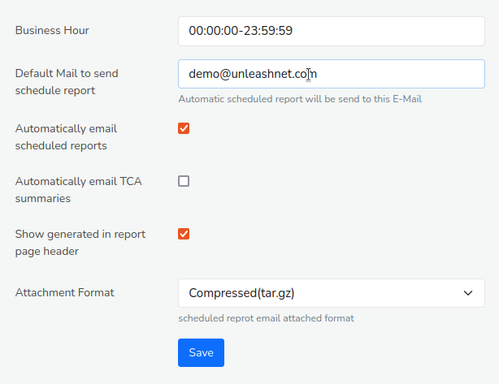

# Setup E-Mail

When you schedule a report, the email address to be "sent from" is configured in this *Email settings*. This section describes how you can setup an email account to send outgoing email reports and alerts.

>Note: You need a valid SMTP email account (even Gmail will work).

## How to Setup E-Mail

To open the Email Settings,

:::info Navigation
:point_right: Select *Reports → Email settings*
:::
This will take you to the *Email Server Account Settings* page where you can configure the email address to be "sent from". For that, Click *Configure Email Server* button on the upper right hand side.

  
*Figure: Email Account Settings Module*
  
  
In ths window, Click on *Configure email server*.  And you can configure an Email server by filling up the following fields using which Web Trisul will send outgoing mails.
  
  | Fields                        | Description                                                                   |
  | ----------------------------- | ----------------------------------------------------------------------------- |
  | Email Server                  | Hostname or IP of the SMTP server                                             |
  | SMTP Port Number              | SMTP Port (Usually 25. For Gmail use 587)                                     |
  | Authentication Protocol       | Click from the drop down list of authenticaton protocols                                                                                                       |
  | From Email Address            | This is displayed as the sender's address on the recipient's inbox                                                                                                           |
  | Password/API Key              | Email Password,API Key,or Provider password like pepipost,sendgrid                                                                                               |
  | Disable SSL Cert verification | Disable certificate verification. Eg, if your email server uses self signed certificates                                                                                                    |
  | SMTP Relay User (optional)    | Use this to send SMTP email via relays like sendgrid,mailchimp,pepipost etc. This is the user id given to you by the provider. Leave it blank if not required                                |

### Newly Configured Email Address

Once you have configured the mail address by filling those fields, it will be displayed on the *Email Server Account Settings* page as in the following example.

*Figure: Newly configured email address*

As you can see there are details of the newly configured mail address including email address, mail server name, port number, and an action button to perform functions on the configured mail address like Edit, Send a test email, Delete, and Remove an email id from all reports.

## Send a Test Email

After you have configured the email settings, its a good idea to send a test email to see if everything works.
You can click the Action button of the newly configured email address and click *Edit*.

The following edit window will open up where you can find a *Test it!* window on the right hand side of the page.

*Figure: Test Email*

Enter an email address on the “Target Email ID” and click Send a Test Email.

## Configure Target Email Address

Once you have configured and tested the email address for the reports to be "sent from" now lets see how to configure the target email address to automatically email the scheduled reports.

To open *Schedule Email Reports* page, Login as `admin` and

:::info Navigation
:point_right: Go to Web Admin- Manage&rarr; Settings- App Settings&rarr; Click Schedule Email Reports
:::

This will open up the following configuration for automatically emailing the scheduled reports.

*Figure: Schedule Email Reports*

Provide details for the following fields.

| Fields                                | Description                                                             |
|---------------------------------------|-------------------------------------------------------------------------|
| Business Hour				         	| Configure the business hours for the reports to include or exclude	  |
| Default Mail to Send 	Schedule Report | Enter the email address where you want the reports to be delivered 	  |
| Automatically Email Scheduled Reports | Check this checkbox to automatically send scheduled reports             | 
| Automatically Email TCA Summaries		| Check this checkbox to automatically send TCA Summaries                 |
| Show Generated in Report Page Header  | Shows the report generated time in the page header                      |
| Attachment Format                     | Select a attachment format for the scheduled Report                     |

Once providing all the details, Click *Save*. You have now configured the default mail to send scheduled reports!

## Pepipost Integration

Web Trisul supports Email sending with SMTP Relay provided by Pepipost.com. Here is how you use it.

#### Get Pepipost Credentials

Login to your Pepipost account and go to *Settings > Integrations > SMTP Relay*

Save the user name and password as shown in the picture below.

*Figure: SMTP Relay in Pepipost Account*

#### Configure Email Settings in Trisul

Enter the email settings as shown

| Fields                       | Description                                                |
| ---------------------------- | ---------------------------------------------------------- |
| Email Server                 | smtp.pepipost.com                                          |
| SMTP Port Number             | 587                                                        |
| Authentication Protocol      | Login SMTP Auth (default)                                  |
| From Email Address           | something@yourdomain.com. This domain integration must be completed in Pepipost first                                                                                       |
| Email Password               | **Pepipost SMTP Password (noted down from previous step)** |
| Disable SSL Cert Verfication | Unchecked                                                  |
| SMTP Relay User (optional)   | **Your Pepipost Username (noted from previous step)**      |

Then try sending a Test Mail.
