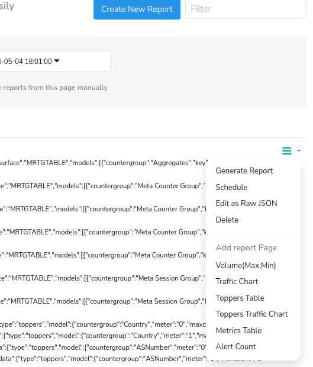
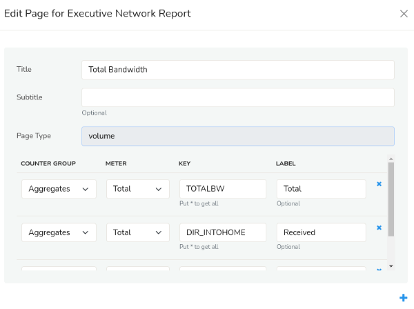
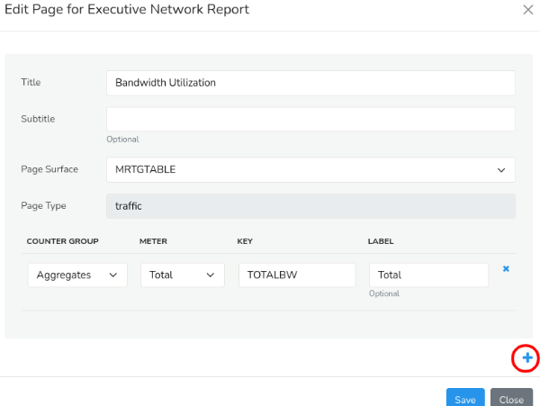
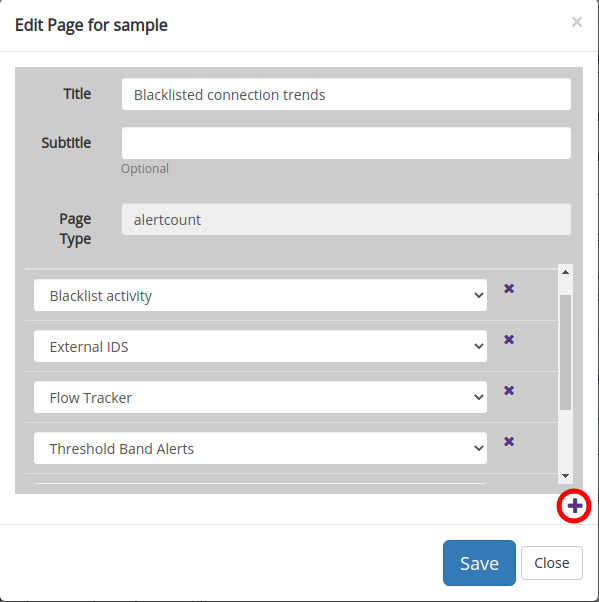
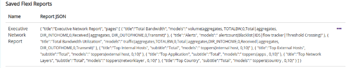

# Custom Reports

We have introduced a new feature called the Flexible reports with 
which you can generate results for any metric for any counter group with
 a particular key. This would help users to create their own custom 
reports based on their needs.

Flexible reports are based on three main parameters like Traffic,Toppers & Volume. Flexi reports work with Report JSON, where a common format is followed. You can refer to that and create your own reports.

## Accessing the Custom Reports

To access the Flexible reports,

:::note navigation

Login as `user` . Select Reports → Readymade. Click on the Custom Reports tab.

:::

You can create your own custom report by clicking on the ‘Create New Report’ option.

*Flexible report Index view*

You will get a dialog box with fields.

| Field Name          | Description                 |
| ------------------- | --------------------------- |
| Report Name         | Name for your references    |
| Report Header Title | Report title for every page |

There are five different kinds of reports that you can create.

- Volume Report
- Traffic Chart Report
- Toppers Table Report
- Metrics Table Report
- Alert Count Report

*Available Flexible Report types*

## Volume Report

This kind of reports are used to provide volume for several counter 
groups. for example if you want to find the volume of http and https, 
you will use counter group as apps and enter key as http and https. You 
will find a dialog box

*Search Form for Volume type report*

Here is the table with description for available fields to create Volume type reports.

| Field Name    | Description                                      |
| ------------- | ------------------------------------------------ |
| Title         | Title of the Report                              |
| Subtitle      | Sub-title for the report                         |
| Page type     | Volume                                           |
| Counter group | Select the desired counter group                 |
| Meter         | A parameter or data point within a counter group |
| Key           | Enter the valid key-format                       |
| Label         | Description of the key item                      |

If you want to add more keys you can click on the ‘+’ symbol at the bottom of the dialog box.

Select save option.

To view the report, select the three dots symbol near the newly 
created report. Select ’generate report option to generate the report 
you have created

*Sample pdf for Volume based flexible report*

## Traffic Chart Report

This kind of report is used to provide bandwidth report for several 
metrics in the form of colourful charts. You will find a dialog box.

*Search form for traffic type report*

Here is the table with description for available fields to create Traffic type reports.

| Field Name    | Description                                            |
| ------------- | ------------------------------------------------------ |
| Title         | Title of the Report                                    |
| Subtitle      | Sub-title for the report                               |
| Page surface  | Type of bandwidth chart                                |
| Page type     | traffic                                                |
| Counter group | Select the desired counter group                       |
| Key           | Enter the valid key-format for the metric to be mapped |
| Label         | Description of the key item                            |

If you want to add more keys you can click on the ‘+’ symbol at the bottom of the dialog box.

Select save option.

To view the report, select the three dots symbol near the newly 
created report. Select ‘generate report’ option to generate the report 
you have created

*Sample pdf for Traffic chart based report*

## Toppers Table Report

This kind of report is generally used to view toppers from several 
counter groups in the form of a table. You will find a dialog box

*Search form for toppers type report*

Here is the table with description for available fields to create Toppers type reports.

| Field Name         | Description                                           |
| ------------------ | ----------------------------------------------------- |
| Title              | Title of the Report                                   |
| Subtitle           | Sub-title for the report                              |
| Key Filter         | Filter toppers in re2 regex format                    |
| Inverse Key Filter | Inverse toppers in re2 regex format                   |
| Page type          | toppers                                               |
| Counter group      | Select the desired counter group                      |
| Meters             | Select the meters such as total,transmit,recieved,etc |
| Max Count          | Specify the nunber of toppers to be shown             |

Select save option.

To view the report, select the three dots symbol near the newly 
created report. Select ‘generate report’ option to generate the report 
you have created

*Sample pdf for Toppers based report*

## Metrics Table Report

For instance, if you want a volume report for all metrics(total,recieved,transmit,etc) for a particular counter group for a
 particular key, we can use metrics table.

*Search form for Metrics type report*

Here is the table with description for available fields to create Metric type reports.

| Field Name    | Description                                            |
| ------------- | ------------------------------------------------------ |
| Title         | Title of the Report                                    |
| Subtitle      | Sub-title for the report                               |
| Page type     | metricstable                                           |
| Counter group | Select the desired counter group                       |
| Meters        | Select the meters such as total,transmit,recieved,etc  |
| Key           | Enter the valid key-format for the metric to be mapped |

If you want to add more keys you can click on the ‘+’ symbol at the bottom of the dialog box.

Select save option.

To view the report, select the three dots symbol near the newly 
created report. Select ‘generate report option to generate the report 
you have created’

*Sample pdf for Metrics based reports*

## Alert Count Report

This is specially for alert based reports.

*Search form for alert type report*

Here is the table with description for available fields to create Alert type reports.

| Field Name  | Description                     |
| ----------- | ------------------------------- |
| Title       | Title of the Report             |
| Subtitle    | Sub-title for the report        |
| Page type   | alertcount                      |
| Alert group | Select the alert group you want |

If you want to add more alert groups you can click on the ‘+’ symbol 
at the bottom of the dialog box and select another alert group.

Select save option.

To view the report, select the three dots symbol near the newly 
created report. Select ‘generate report’ option to generate the report 
you have created

*Sample pdf for alert type reports*

## Saved Flexi Reports

Once you create the flexi report it gets saved automatcially and you 
can edit any type of flexi report individually using the edit symbol.

You can also delete the report by clicking on the ‘x’ symbol.

*Saved Flexible Reports*

## Schedule Report

You can schedule the report you have created by clicking on the dots symbol on the right.

Select the schedule option to schedule the report on hourly,daily,monthly or yearly basis.
