# Custom Reports

We have introduced a new feature called the Flexible reports with which you can generate results for any metric for any counter group with a particular key. This would help users to create their own custom 
reports based on their needs.

Flexible reports are based on three main parameters like Traffic,T oppers & Volume. Flexi reports work with Report JSON, where a common format is followed. You can refer to that and create your own reports.

## Custom Reports Page

The Custom Reports Page comes with four main components,
1) Create New Report Button
2) Filter
3) Time Selector
4) Custom Report List

### Create New Report Button
Using *Create New Report* button you can create a new custom report in two ways.
1) You can import a report by clicking on the small arrow on the right side of the Create New Report button which will drop down with an option **Import from JSON**. Click on that and choose a file to import and click Import. 
2) Click on the **Create New Report** button itself and a dialog box apperas with the following fields. 

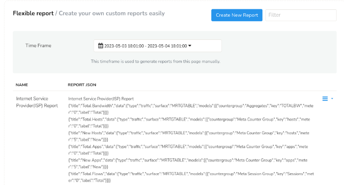

*Figure: Flexible report Index view*

You will get a dialog box with fields.

| Field Name          | Description                 |
| ------------------- | --------------------------- |
| Report Name         | Name for your references    |
| Report Header Title | Report title for every page |

This will create an empty report with only Report Name and Report Title. 

### Filter
Using *Filter* bar in custom report page you can fetch any particular report searching by the name of the report, title, key, countergroup, label or meter. And it will display the report in that name or all the reports containing the mentioned counter group, meter, key or label.

### Time Selector
The Time Selector feature enables you to define a temporal scope for report generation, with a default setting of the most recent 15 minutes. Once a time window is selected, it remains fixed for generating all the reports on the page and their associated drill-downs. You can choose from a range of pre-defined time ranges, including:

- Last 1 hour

- Last 24 hours

- This month

- Last month and more.

Alternatively, you can specify a custom date range by selecting the *Custom Range* option, which allows for the selection of a specific period from the past.

### Custom Report List
The custom report list is the list of report names that has been created or imported by you. 

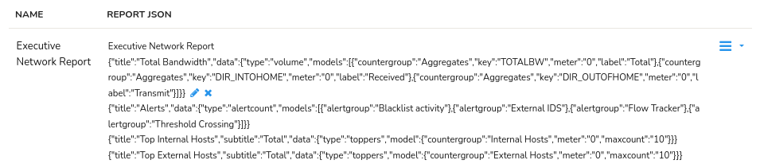

The custom report list contains the following columns.

| Column           | Description                                                                               |
| ---------------- | ----------------------------------------------------------------------------------------- |
| Name             | Name of the Report                                                                        |
| Report JSON      | Contains the report fields in editable JSON format where each report can be edited by clicking the pencil icon next to the JSON report or can be deleted by clicking the x icon next to it                                                                                                             |
| Option button    | Click on the option button to drilldown for more options to customize the report                                                                                                         |

## Accessing the Custom Reports

To access the Flexible reports,

:::note navigation

Login as `user` and Select Reports → Readymade →  Click on the *Custom* Reports tab.

:::

Once you have created an empty report using *Create New Report* you can edit the same using the Option button against each report name. The context menu from the option button allows you to perform various functions on the report. The following functions can be performed on the selected report name.

| Options                                       | Description                                                    |
| --------------------------------------------- | ---------------------------------------------------------------|
| Generate Report                               | Generates the report for the selected Report name for the specified time range from the *Time Slector*                              |
| [Schedule](/docs/ug/reports/schedreports)     | Schedule the selected report on hourly,daily,monthly or yearly basis.                                                                                                           |
| Edit as Raw JSON                              | Edit Report as Raw JSON                                        |
| Export as JSON                                | Export the selected report in JSON format                      |
| Delete                                        | Delete the selected report                                     |
| Assign Report                                 | Assign the selected report to a particular user from particular context                                                                                                          |
| Revoke Report                                 | Revoke the assigned report from the users                      |

With the option button, there are six different kinds of reports that you can create separately or altogether under one report name.

- Volume Report
- Traffic Chart Report
- Toppers Table Report
- CrossKey Drilldown
- Metrics Table Report
- Alert Count Report

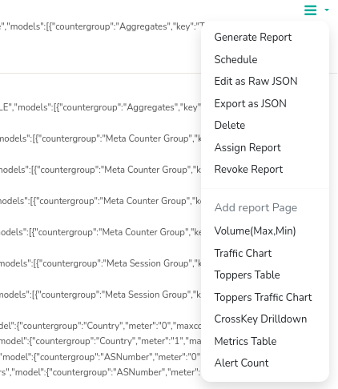

*Figure: Available Flexible Report types*

## Volume Report
Volume Report in Trisul is the detailed report on traffic volume of various countergroups that you can choose from. Volume report provides insights into traffic volume, top talkers, traffic classification, and time based analysis. For example if you want to find the volume of http and https, you will use counter group as apps and enter key as http and https. 

To create a volume report, Click *Volume(Max,Min)* Report from the option button against the report name under all the flexible reports. You will find the following dialog box to fill in.

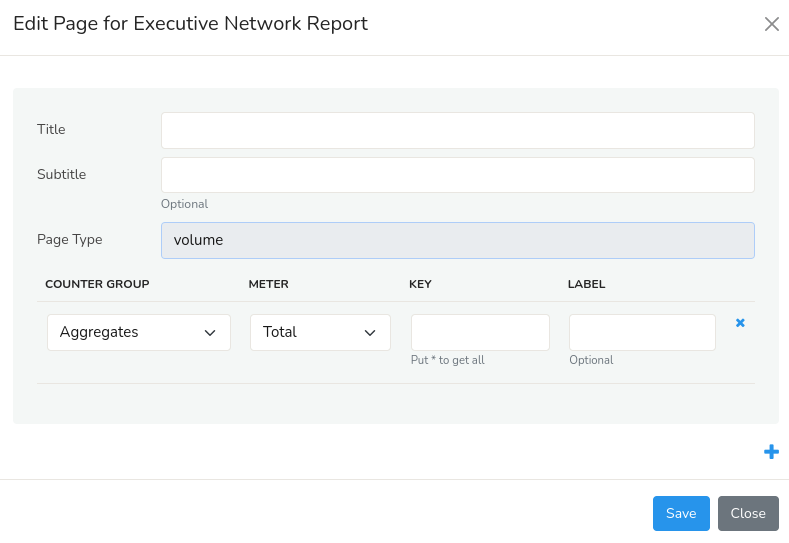

*Figure: Search Form for Volume type report*

Here is the table with description for available fields to create Volume type reports.

| Field Name    | Description                                      |
| ------------- | ------------------------------------------------ |
| Title         | Title of the Report                              |
| Subtitle      | Sub-title for the report                         |
| Page type     | Volume                                           |
| Counter group | Select the desired counter group                 |
| Meter         | A parameter or data point within a counter group |
| Key           | Enter the valid key-format                       |
| Label         | Description of the key item                      |

If you want to add more keys you can click on the ‘+’ symbol at the bottom of the dialog box.

Select save option.

To view the report, select the option button on the right side against the newly 
created report. Select *generate report* option to generate the report 
you have created

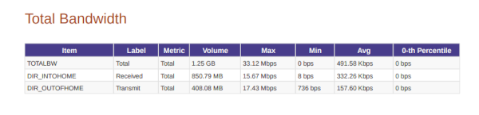

*Figure: Sample pdf for Volume based flexible report*

## Traffic Chart Report

A Traffic Chart Report in Trisul is a graphical representation of network traffic volume over a specified time period. It displays the amount of data transmitted (in bytes or packets) across the network, allowing you to visualize traffic patterns, trends, and anomalies. This kind of report is used to provide bandwidth report for several metrics in the form of colourful charts. 

To create a traffic chart report, Click *Traffic Chart* Report from the option button against the report name under all the flexible reports. You will find the following dialog box to fill in.

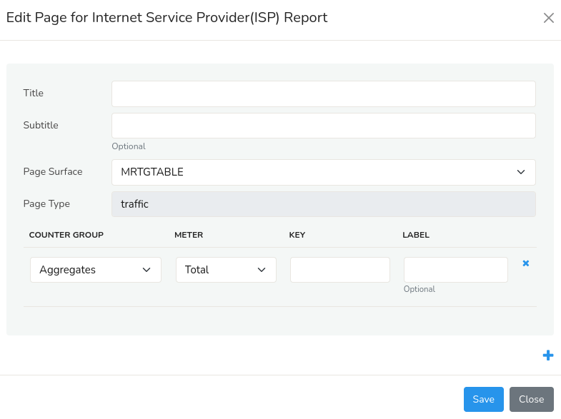

*Figure: Search form for traffic type report*

Here is the table with description for available fields to create Traffic type reports.

| Field Name    | Description                                            |
| ------------- | ------------------------------------------------------ |
| Title         | Title of the Report                                    |
| Subtitle      | Sub-title for the report                               |
| Page surface  | Type of bandwidth chart                                |
| Page type     | traffic                                                |
| Counter group | Select the desired counter group                       |
| Key           | Enter the valid key-format for the metric to be mapped |
| Label         | Description of the key item                            |

If you want to add more keys you can click on the ‘+’ symbol at the bottom of the dialog box.

Select save option.

To view the report, select the option button near the newly 
created report. Select *Generate report* option to generate the report 
you have created

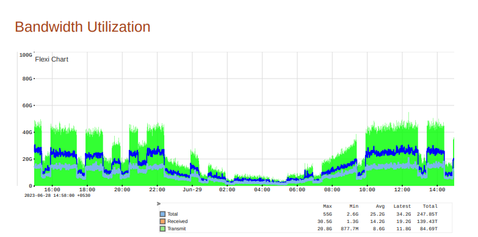

*Figure: Sample pdf for Traffic chart based report*

## Toppers Table Report

This kind of report is generally used to view toppers from several 
counter groups in the form of a table. 

To create a Toppers table report, Click *Toppers Table* Report from the option button against the newly created report name under all the flexible reports. You will find the following dialog box to fill in.

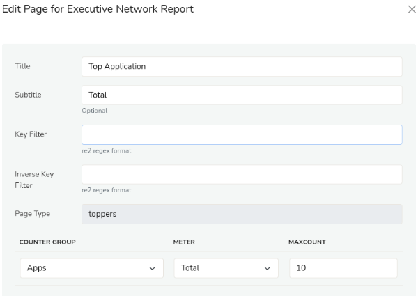

*Figure: Search form for toppers type report*

Here is the table with description for available fields to create Toppers type reports.

| Field Name         | Description                                           |
| ------------------ | ----------------------------------------------------- |
| Title              | Title of the Report                                   |
| Subtitle           | Sub-title for the report                              |
| Key Filter         | Filter toppers in re2 regex format                    |
| Inverse Key Filter | Inverse toppers in re2 regex format                   |
| Page type          | toppers                                               |
| Counter group      | Select the desired counter group                      |
| Meters             | Select the meters such as total,transmit,recieved,etc |
| Max Count          | Specify the nunber of toppers to be shown             |

Select save option.

To view the report, select the option button near the newly 
created report. Select *Generate report* option to generate the report 
you have created

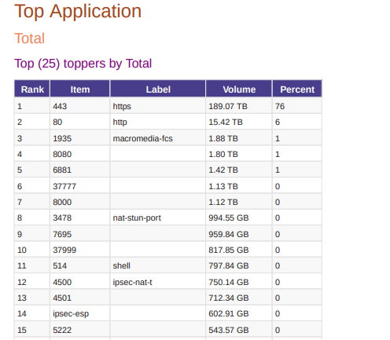

*Figure: Sample pdf for Toppers based report*

## Toppers Traffic Chart Report

A Topper's Traffic Chart Report in Trisul is a report that displays the top traffic generators or consumers on the network, based on criteria such as:
Top Talkers: Devices or hosts generating the most network traffic
Top Listeners: Devices or hosts receiving the most network traffic
Top Protocols: Network protocols (e.g., HTTP, FTP, SSH) generating the most traffic
Top Flows: Network flows (connections) generating the most traffic

To create a Toppers traffic chart report, Click *Toppers Traffic Chart* Report from the option button against the newly created report name under all the flexible reports. You will find the following dialog box to fill in.

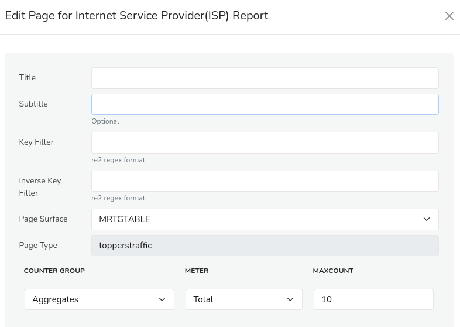

*Figure: Search form for toppers traffic chart report*

Here is the table with description for available fields to create Toppers traffic chart reports.

| Field Name         | Description                                           |
| ------------------ | ----------------------------------------------------- |
| Title              | Title of the Report                                   |
| Subtitle           | Sub-title for the report                              |
| Key Filter         | Filter toppers in re2 regex format                    |
| Inverse Key Filter | Inverse toppers in re2 regex format                   |
| Page surface       | Type of bandwidth chart                               |
| Page type          | toppers traffic                                       |
| Counter group      | Select the desired counter group                      |
| Meters             | Select the meters such as total,transmit,recieved,etc |
| Max Count          | Specify the nunber of toppers to be shown             |

Select save option.

To view the report, select the option button near the newly 
created report. Select *Generate report* option to generate the report 
you have created

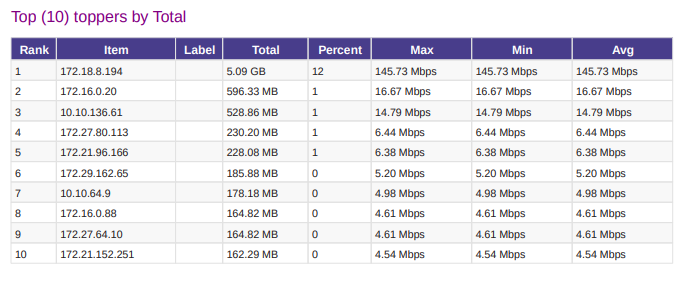

*Figure: Sample pdf report for Toppers traffic for hosts counter group*

## CrossKey Drilldown Report

A Crosskey Drilldown Report in Trisul is a report that provides a detailed analysis of network traffic by correlating multiple keys or dimensions, such as Source IP, Destination IP, Protocol, Port, and Interface.

To create a CrossKey Drilldown report, Click *CrossKey Drilldown* Report from the option button against the newly created report name under all the flexible reports. You will find the following dialog box to fill in.

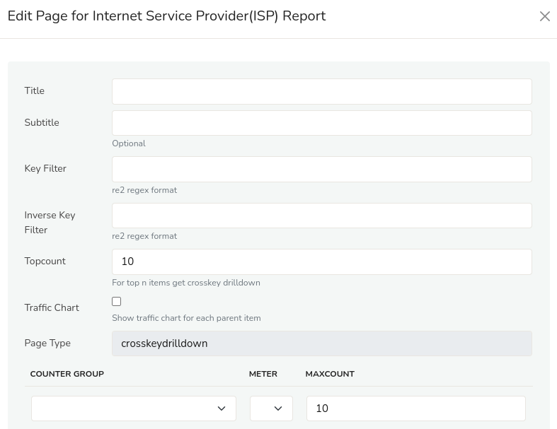

*Figure: Search form for CrossKey Drilldown report*

Here is the table with description for available fields to create Toppers traffic chart reports.

| Field Name         | Description                                           |
| ------------------ | ----------------------------------------------------- |
| Title              | Title of the Report                                   |
| Subtitle           | Sub-title for the report                              |
| Key Filter         | Filter toppers in re2 regex format                    |
| Inverse Key Filter | Inverse toppers in re2 regex format                   |
| Top Count          | Type of bandwidth chart                               |
| Traffic Chart      | toppers traffic                                       |
| Page type          | CrossKey Drilldown                                    |
| Counter group      | Select the desired counter group                      |
| Meters             | Select the meters such as total,transmit,recieved,etc |
| Max Count          | Specify the nunber of toppers to be shown             |

Select save option.

To view the report, select the option button near the newly 
created report. Select *Generate report* option to generate the report 
you have created

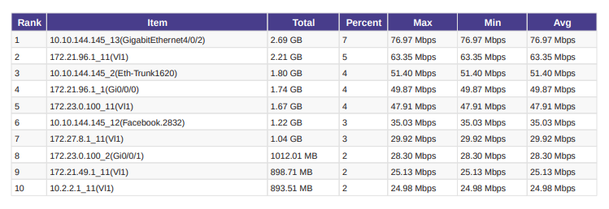

*Figure: Sample pdf report for CrossKey Drilldown for FlowIntf_bx_Apps counter group*

## Metrics Table Report

A Metric Table Report in Trisul is a tabular representation of network metrics, providing a detailed summary of network traffic and performance data. This report displays various network metrics in a table format, allowing for easy analysis and comparison of network activity.

For instance, if you want a volume report for all metrics(total,recieved,transmit,etc) for a particular counter group for a particular key, we can use metrics table.

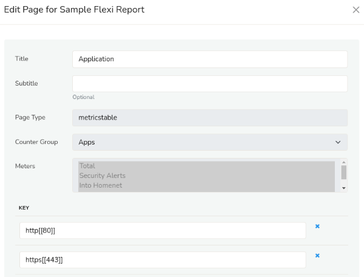

*Figure: Search form for Metrics type report*

Here is the table with description for available fields to create Metric type reports.

| Field Name    | Description                                            |
| ------------- | ------------------------------------------------------ |
| Title         | Title of the Report                                    |
| Subtitle      | Sub-title for the report                               |
| Page type     | metricstable                                           |
| Counter group | Select the desired counter group                       |
| Meters        | Select the meters such as total,transmit,recieved,etc  |
| Key           | Enter the valid key-format for the metric to be mapped |

If you want to add more keys you can click on the ‘+’ symbol at the bottom of the dialog box.

Select save option.

To view the report, select the option button near the newly 
created report. Select *Generate report* option to generate the report 
you have created.

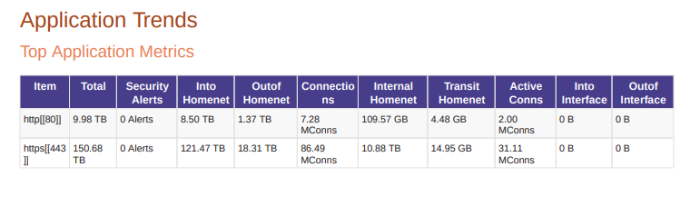

*Figure: Sample pdf for Metrics based reports*

## Alert Count Report
An Alert Count Report in Trisul is a report that displays the number of alerts generated by Trisul's alerting system over a specified time period. Trisul's alerting system monitors network traffic and triggers alerts when predefined conditions or thresholds are met, indicating potential security threats, performance issues, or other notable events. This report is specially for alert based reports.

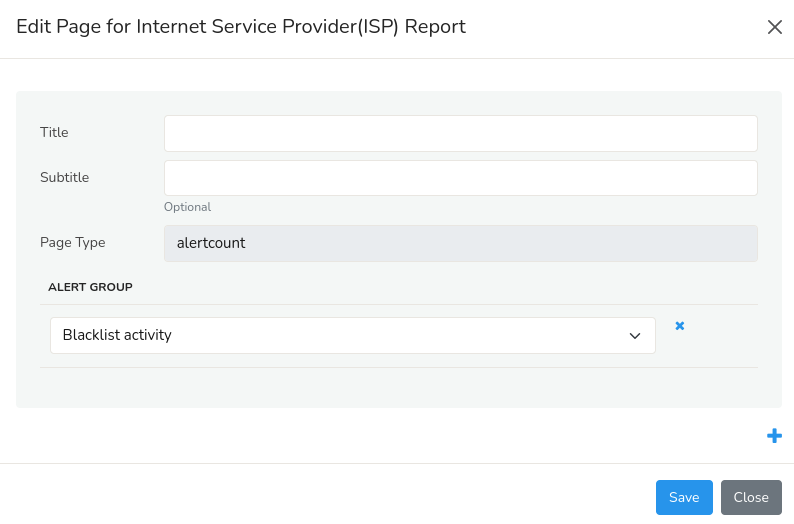

*Figure: Search form for alert type report*

Here is the table with description for available fields to create Alert type reports.

| Field Name  | Description                     |
| ----------- | ------------------------------- |
| Title       | Title of the Report             |
| Subtitle    | Sub-title for the report        |
| Page type   | alertcount                      |
| Alert group | Select the alert group you want |

If you want to add more alert groups you can click on the ‘+’ symbol 
at the bottom of the dialog box and select another alert group.

Select save option.

To view the report, select the option button near the newly 
created report. Select *Generate report* option to generate the report 
you have created

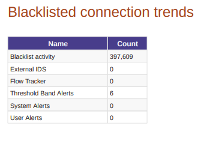

*Figure: Sample pdf for alert count reports*