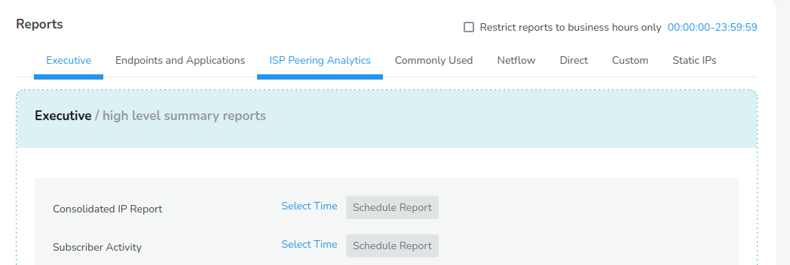
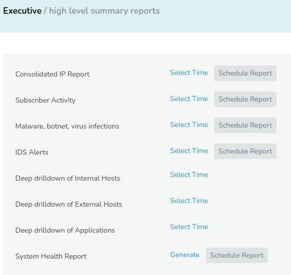
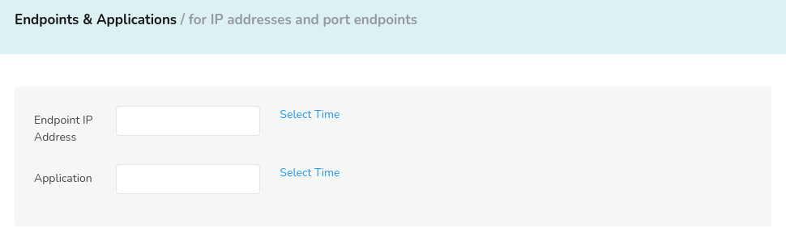
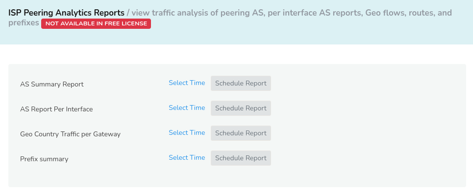
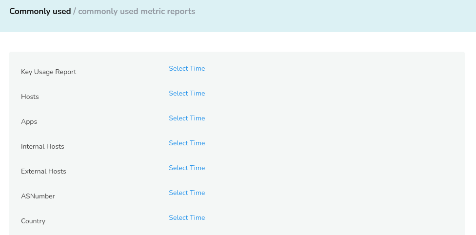
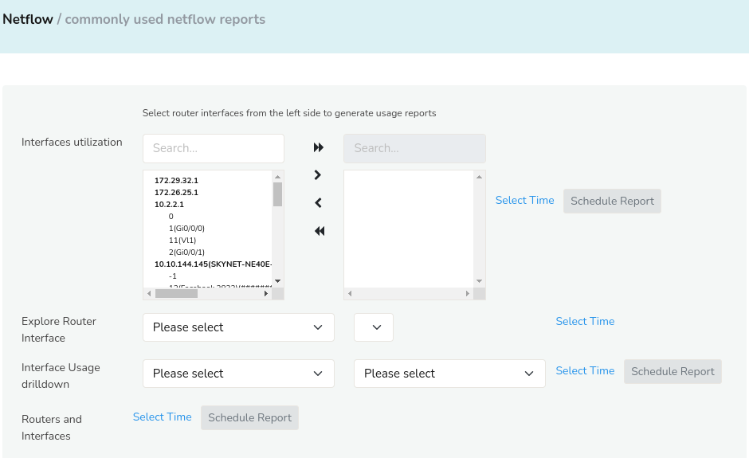
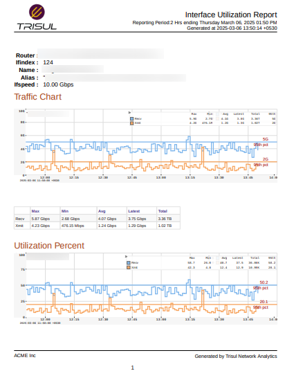
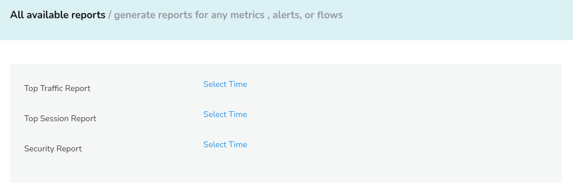
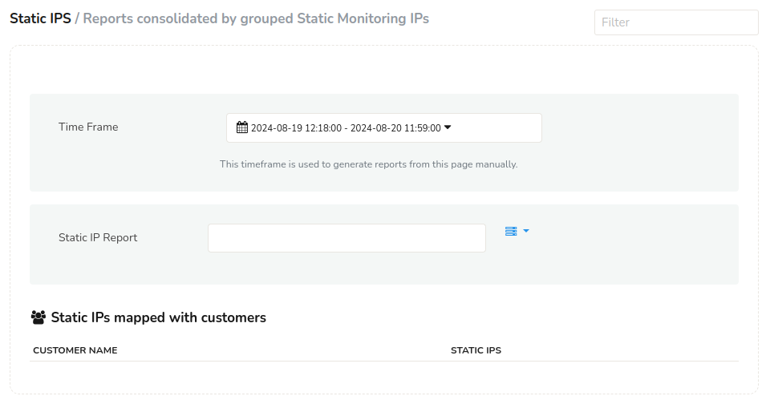

# Readymade Reports 

*Readymade Reports* are built-in reports based on pre-defined templates for quick analysis of common network traffic aspects. It provides a starting point for further customization. Examples of pre-defined templates include top talkers, top listeners, inbound and outbound traffic volume.

There are 7 readymade reports readily available in Trisul including
- Executive Reports
- End Points and Applications
- ISP Peering Analytics
- Commonly Used
- Netflow
- Direct
- Static IPs

## Accessing Reports

To view *Reports*, Login as user and,
:::info Navigation
:point_right: Go to Reports&rarr; Readymade
:::

The following is the *Ready to use Reports* page where you will be landed, 

*Figure: Reports Tab*

As you can see there are a number of report types as tabs and a checkbox. From here you can,

- Select a report type from the list of tabs,
- Enter the data, and
- Click on a timeframe to generate the report. 
- You can check the *Restrict reports to business hours only* check box on the upper right hand side to exclude non-business hours.

> You can configure the business hours by logging in as admin and navigating to, Web Admin&rarr; Manage&rarr; App Settings&rarr; Schedule Email Reports

Lets explore each of the report types in detail for better understanding. 

### Executive Reports
In Trisul, an Executive Report is a high-level summary of network traffic analysis, providing key insights and trends in a concise and easy-to-understand format. 

Executive Reports in Trisul include the following pre-defined templates for quick access,

*Figure: Executive reports*

| Report Name                       | Description                                                         |
| --------------------------------- | ------------------------------------------------------------------- |
| Consolidated IP Report            | A summary of IP address activity, including Total,in and out bandwidth traffic with top Internal hosts,top apps and port network layer protocols.                                                                                                |
| Subscriber Activity               | An overview of all your internal hosts. The term subscribers refers to entities within your domain. The report contains bandwidth usage details, TCP connections, hosts that generated most alerts, etc.                                                                                         |
| Malware, botnet, virus infections | Summary of all your internal hosts on the network that might be compromised. This Report template requires the Badfellas plugin. The determination of compromise is based on blacklisting implemented by the [Badfellas plugin](/docs/ag/install/badfellas)                                          |
| IDS Alerts                        |  Summary of alerts generated by the Intrusion Detection System (IDS), including potential security threats via Snort/Suricata                                                    |
| Deep drilldown of Internal Hosts  | Detailed analysis of internal hosts, including traffic patterns, applications used, and security threats. The data presented in the report include Most active internal hosts, For each of the top internal hosts, Which external hosts are they talking to, Which applications are they using, and Which flow tags are active.                                                                                           |
| Deep drilldown of External Hosts  | Detailed analysis of external hosts communicating with the network, including traffic patterns and security threats. The data presented in the report include Most active external hosts (those on the internet or outside your home network), For each of the top external hosts, Which internal hosts are they talking to, Which applications are they using, and Which flow tags are active.                             |
| Deep drilldown of Applications    | Detailed analysis of application traffic, including usage patterns, security threats, and performance metrics. The data presented in the report include Most active applications, For each of the top applications, Which external hosts are involved, Which internal hosts are involved, and Which flow tags are active.                                                                                                    |
| System Health Reports             | Provides insights into the overall health and performance of the system in which Trisul is installed. Reports include, DB status, storage status,and active hub/probe details.        |

### Endpoints and Applications Report

*Endpoints and Applications* Report type in Trisul provides insights into IP-level traffic analysis, Conversation analysis and Security alerts. The *Endpoint* report includes total bandwidth used by the IP, Receive/Transmit bandwidth of IP, Top applications used, Top conversations with other hosts, Alert types, Source & Destination IP, and Latest Malware Alerts. 

And *Application* report type offers insights into port-level traffic analysis, Application usage and Traffic patterns including total bandwidth for the port number, In and Out traffic, Top hosts by total volume, Top applications, Top server hosts, Top client hosts, Top external hosts, Top tags, and Top flows.

You can fill in the following fields in *Endpoints and Applications* report by selecting a [time frame](/docs/ug/ui/elements#time-selector).

*Figure: Endpoints and Applications Report*

| Report Name         | Description                                                          |
| ------------------- | -------------------------------------------------------------------- |
| Endpoint IP Address | Generates a summary report for a specific IP Address                 |
| Application         | Generates a summary report for a specific port/ application          |

### ISP Peering Analytics Report

ISP Peering Analytics in Trisul provides insights and data visualizations on traffic distribution, top traffic sources, BGP routing, and Peer AS traffic. This report includes AS summary bandwidth chart showing traffic breakup of total bandwidth usage, top AS Egress, top AS Ingress, BGP peer and origin AS report showing breakup of AS report into peer AS and origin AS using the BGP route database, top peer AS Egress, and top peer AS Ingress and more

You can fill in the following fields in *ISP Peering Analytics* report by [selecting a time frame](/docs/ug/ui/elements#time-selector).

*Figure: ISP Peering Analytics Report*

| Report Name                     | Description                                                        |
| ------------------------------- | ------------------------------------------------------------------ |
| AS Summary Report               | Generates a detailed AS Report for all Routers and Interfaces      |
| AS Report per Interface         | Generates a Detailed AS Report per Interface                       |
| Geo Country Traffic per Gateway | Country to ISP gateway mapping reports                             |
| Prefix Summary                  | Generates a detailed report for prefixes in and out of ISP network |

### Commonly Used Reports

Some commonly used reports are built as pre-defined report templates in Trisul including Key usage report, Hosts, Apps, Internal hosts, External hosts, ASNumber, and Country.

*Figure: Commonly Used Reports*

You can fill in the following fields in *Commonly Used* report by selecting a [time frame](/docs/ug/ui/elements#time-selector) and providing the fields required.

| Report Name      | Description                                          |
| ---------------- | ---------------------------------------------------- |
| Key usage report | Track usage of key activity from any counter groups. |
| Hosts            | Get report of top hosts on your networ               |
| Apps             | Get report of top applications on your network.      |
| Internal Hosts   | Get report of top internal hosts on your network.    |
| External Hosts   | Get report of top external hosts on your network.    |
| ASNumber         | Get report of top ASNumber on your network.          |
| Country          | Get report of top countries on your network.         |

### Netflow Reports

Trisul *Netflow* reports provide detailed analysis for traffic bandwidth and users for a particular router interface. 

*Figure: Netflow Reports*

You can fill in the following fields in *Commonly Used* report by selecting a [time frame](/docs/ug/ui/elements#time-selector) and providing the fields required. T

| Report name               | Description                                                                 |
| ------------------------- | --------------------------------------------------------------------------- |
| Interfaces Utilization    | Utilization report for selected Interfaces from Routers                     |
| Explore Router Interface  | Flow based report for a particular Interface                                |
| Interface Usage Drilldown | Generates Report for traffic bandwidth and users for a particular Interface |
| Routers and Interfaces    | Router and Interface activity                                               |

#### Interface Utilization Reports

The Interfaces Utilization report provides a comprehensive overview of the utilization of selected interfaces from routers.

:::info navigation
:point_right: Login as user and Go to Reports &rarr; Readymade &rarr; NetFlow &rarr; Interfaces Utilization
:::

- To select router interfaces from the left side of the *Interfaces utilization* window, use the single arrow for single selection and double arrow to select all. The selected interfaces appear on the right side. 
- Click *Select Time* and select a time range to generate report for that particular time.
- Click [*Schedule Report*](/docs/ug/reports/schedreports#schedule-a-new-report) to schedule this report.

##### **Interface Components and Details**

  
*Figure: Interface Utilization Report*

The Interfaces Utilization report provides a comprehensive overview of network interface performance, including:

| Detail | Description |
|--------|-------------|
| Router Name | The name of the router associated with the interface |
| IfIndex | A unique identifier for the interface |
| Name | The name of the interface |
| Alias | An optional alias or description for the interface |
| IfSpeed | The interface speed in Gbps |

##### 1) **Traffic Chart**

The Traffic Chart displays a graphical representation of the received and transmitted bandwidth for the selected interfaces, compared to the 95th percentile.  

**Received Bandwidth**: The amount of data received by the interface over a specified time period.  
**Transmitted Bandwidth**: The amount of data transmitted by the interface over a specified time period.  
**95th Percentile**: A benchmark representing the maximum utilization level exceeded only 5% of the time.  

In addition to the graphical representation, a table of key values is also provided, including Max, Min, Avg, Latest, Total, and 95th.

##### 2) **Utilization Percent**

This chart represents the percentage of interface utilization, calculated based on the received and transmitted bandwidth.

#### Explore Router Interface

Explore Router Interface is distinct from the Interfaces Utilization report in that it provides an in-depth examination of individual network flows, packet-level, and NetFlow data for a specific router interface.

:::info navigation
:point_right: Login as user and Go to Reports &rarr; Readymade &rarr; NetFlow &rarr; Explore Router Interface
:::

- Select a router from the dropdown menu, then choose the desired interface from the subsequent dropdown menu.
- Click *Select Time* and select a time range to generate report for that particular time.
- This will take you to the [*Explore flows result summary*](/docs/ug/tools/explore_flows#explore-flows-results-summary) of the selected interface.

- Click on the [*Download*](/docs/ug/tools/explore_flows#export-as-report) button on the to export as a report

#### Interface Usage Drilldown

The Interface Usage Report provides a comprehensive analysis of network traffic and usage patterns for a selected interface over a specified time interval. The report offers a detailed breakdown of interface usage, traffic patterns, and top contributors by ASN, host, and application.

:::info navigation
:point_right: Login as user and Go to Reports &rarr; Readymade &rarr; NetFlow &rarr; Interface Usage Drilldown
:::

##### Report Components

| Components | Description |
|------------|-------------|
| **Interface Usage**: Max, Min, Avg, Latest, Total, 95th percentile | These metrics provide a summary of interface usage, including the maximum, minimum, average, latest, 95th percentile, and total usage values. |
| Total traffic on interface chart | A graphical representation of the total traffic (received and transmitted) on the interface over the selected time interval. |
| Received vs Transmitted Traffic on Interface | A graphical representation of the received and transmitted traffic on the interface over the selected time interval, allowing for comparison of incoming and outgoing traffic patterns. |
| Top ASN by Received and Transmitted Traffic | A list of the top Autonomous System Numbers (ASNs) responsible for received and transmitted traffic on the interface, providing insight into external networks interacting with the interface. |
| Top Hosts by Received and Transmitted Traffic | A list of the top hosts (devices or systems) responsible for received and transmitted traffic on the interface, helping identify key internal and external systems interacting with the interface. |
| Top Apps by Received and Transmitted Traffic | A list of the top applications responsible for received and transmitted traffic on the interface, providing insight into the types of traffic and applications utilizing the interface. |
| Full Breakup of Hosts Activity on the Interface | A detailed breakdown of host activity on the interface, including:   **Top Total**: The top hosts by total traffic.    **Top Uploaders**: The top hosts uploading data to the interface.    **Top Downloaders**: The top hosts downloading data from the interface. |
| Full Breakup of Apps Activity on the Interface | A detailed breakdown of application activity on the interface, including the types and volumes of traffic generated by each application. |
| Top conversations | A list of the top conversations (communications between hosts) on the interface, providing insight into the most active and data-intensive interactions. |

#### Routers and Interfaces

The Router and Interfaces Report provides a comprehensive overview of all routers and their associated interfaces, offering insights into router activity, bandwidth usage, and interface performance.

:::info navigation
:point_right: Login as user and Go to Reports &rarr; Readymade &rarr; NetFlow &rarr; Routers and Interfaces
:::

##### Report Components

| Components | Description |
|------------|-------------|
| Router Activity Report | Displays the bandwidth usage for each router over the selected time interval, providing a visual representation of router activity. |
| Top Routers by Volume | Lists the top routers by total traffic volume, highlighting the most active and data-intensive routers in the network. |
| Interface Report for Router | Provides a detailed breakdown of each interface associated with a selected router, including Interface Performance Metrics: Max, Min, Avg, Latest, Total, and 95th Percentile values for each interface for the selected time interval. |
| Top 20 Breakup of Total Traffic per Interface | Shows the top 20 interfaces on each router, ranked by total traffic volume, providing insight into interface utilization and traffic distribution |

### Direct Reports

Using *Direct* reports in Trisul you can generate reports for any metrics, alerts or flows. 

You can fill in the following fields in *Direct* report by selecting a [time frame](/docs/ug/ui/elements#time-selector).

*Figure: Direct Reports*

| Report Name        | Description                                                                          |
| -------------------|------------------------------------------------------------------------------------- |
| Top Traffic Report | Get toppers for any counter group                                                    |
| Top Session Report | Get top flows on your network                                                        |
| Security Report    | Overview of all security alerts seen by trisul alerts                                |

### Static IP Reports

*Static IP* report in Trisul provides detailed information about static IP addresses on the network. This report includes Total bandwidth received and transmitted and Timeframes where usage overshot bandwidth cap.

You can fill in the following fields in *Direct* report by [selecting a time frame](/docs/ug/ui/elements#time-selector) and providing a static IP.

*Figure: Static IP Reports*

| Report Name                                            | Description                                      |
| ------------------------------------------------------ | ------------------------------------------------ |
| [time frame](/docs/ug/ui/elements#time-selector)       | Select a time frame to narrow down the data to a relevant interval                                                                                           |
| Static IP Report                                       | Enter a static IP                                |
