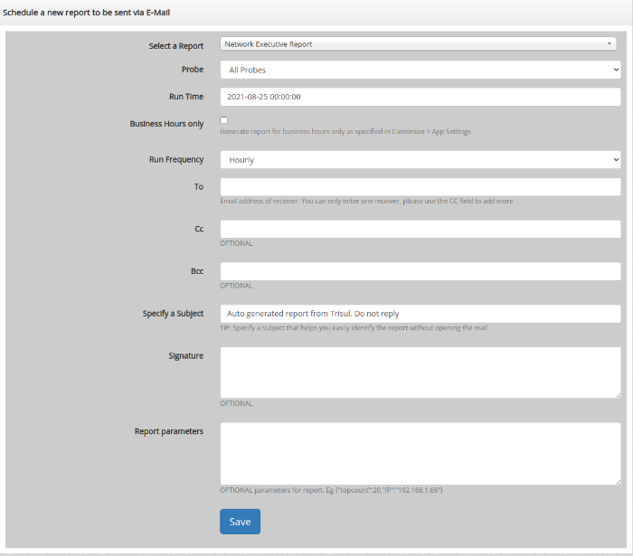
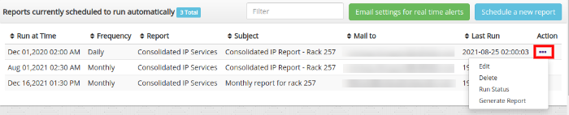

# Schedule email reports

You can have Trisul automatically email reports periodically.

## Report intervals

You may dispatch by email any of the supported report types at these intervals.

1. Hourly
2. Daily
3. Weekly
4. Monthly

## Schedule a new report

To schedule a new report

:::note navigation

Select Reports → Schedule

:::

1. A list of all reports scheduled will appear
2. Click **Schedule a new report**
3. Fill out these fields



Here is the table with the description of all available fields to schedule a new report.

| Field Name                   | Description                                                                                                                                                                                                                                                  |
| ---------------------------- | ------------------------------------------------------------------------------------------------------------------------------------------------------------------------------------------------------------------------------------------------------------ |
| Select a Report              | You can choose various type of reports                                                                                                                                                                                                                       |
| Probes                       | You can choose among different nodes if multiple probes are setup                                                                                                                                                                                            |
| Run Time                     | At the top of what time do you want to run the report. The actual run times of the reports also depends on the frequency. For example if you select “2011-12-20 10:20:00” for hourly report runs. The report will be generated at 10:20, 11:20, 12:20, etc.. |
| Business Hours               | Runs the report for business hours only                                                                                                                                                                                                                      |
| Run Frequency                | Select from Hourly,Daily,Weekly, or Monthly                                                                                                                                                                                                                  |
| To                           | Email address of receiver                                                                                                                                                                                                                                    |
| Cc                           | Recipient received a copy of the message.                                                                                                                                                                                                                    |
| Bcc                          | Recipients are invisible to all the other recipients of the message                                                                                                                                                                                          |
| Specify a Subject            | Subject of the report                                                                                                                                                                                                                                        |
| Signature                    | Signature of the sender                                                                                                                                                                                                                                      |
| Report parameters (optional) | Optional parameters, if present must be in valid `JSON` format. This parameter is only required for these three reports Endpoint Activity, Application Activity, Router and Interfaces                                                                       |

Once you schedule the report, all your scheduled reports will appear on the index page and you can toggle from there.



You can check if the report has been sent successfully to the 
destination mail address by clicking on the options button on the right 
corner and selecting the ‘Run Status’ option.


You have the PDF option to download the scheduled report manually.

## Report parameters

Some reports are generated for a particular entity such as a specific
 host or application. For these reports you need to tell Trisul about 
the entity via the *Report parameters* field. Currently there are three types of such reports.

### Parameters for the Endpoint Activity report

The *Endpoint activity report* expects you to specify a host.

1. Specify all common fields for a scheduled report
2. In addition enter report parameters as shown below

Say you want to schedule an endpoint report for host 192.168.1.151, enter the ip address in this format  
`{"IP":"192.168.1.151"}` You can also enter a host name instead of an IP like `{"IP":"dns00.unleashnetworks.com"}`

### Parameters for the Application Activity report

The *Application activity* report expects you to specify an application or port.

1. Specify all common fields for a scheduled report
2. In addition enter report parameters as shown below

Say you want to schedule an for the http app, use this format  
`{"port1":"http"}` You can also enter a port number `{"port1":"Port-80"}`

### Parameters for the Interface Activity report

Netflow only You can generate a report for any netflow interface.

1. Specify all common fields for a scheduled report
2. In addition enter report parameters as shown below

Say you want to schedule an report for interface with ifIndex 22 on router 192.168.1.1, use the following format  
`{"interface":"192.168.1.1_22"}`

## Enable email dispatching

After you have setup email, you need to enable the job that actually generates the report and sends out the email.

To enable this :

:::note navigation

Select Customize → App Settings

:::

Check the **Automatically email scheduled reports**

> Note: Ensure you have set up your [Email Settings](/docs/ug/reports/emailsettings)

## Troubleshooting

Are your reports not coming through ? Here are some possible reasons.

### Check if cron support is available in your system

As root type

```
crontab -l
```

### Check the logs

If you are not receiving the email reports, check the logs.

:::note navigation

Login as Admin → WebAdmin → View Logs  
Click on **Background tasks log**

:::

You can see if any errors are observed there.
