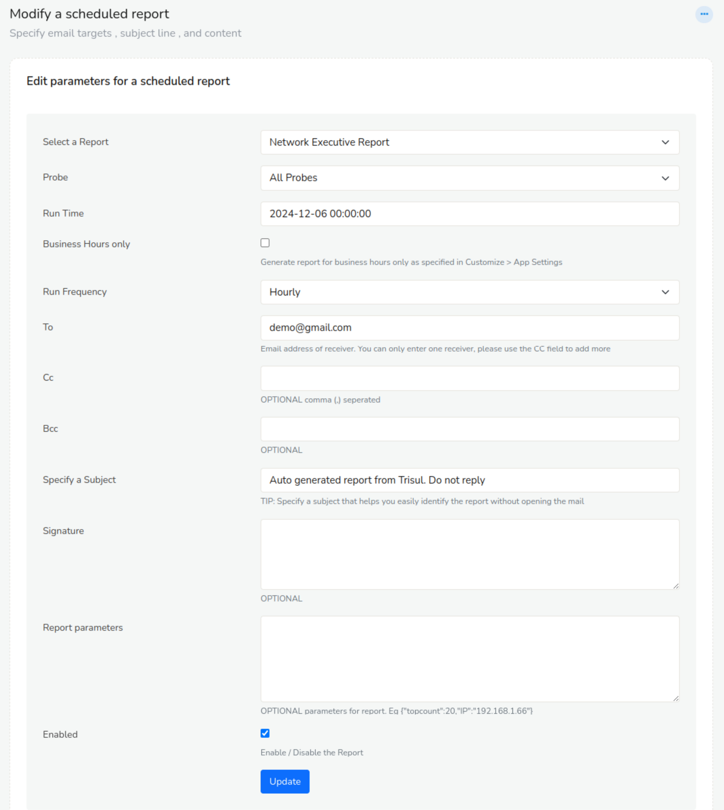
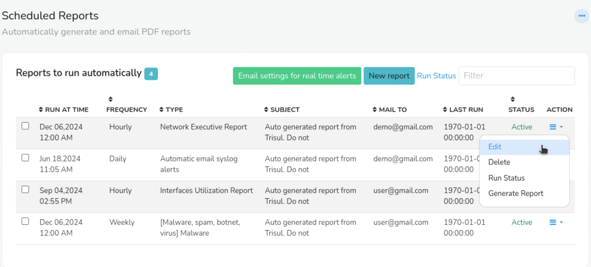
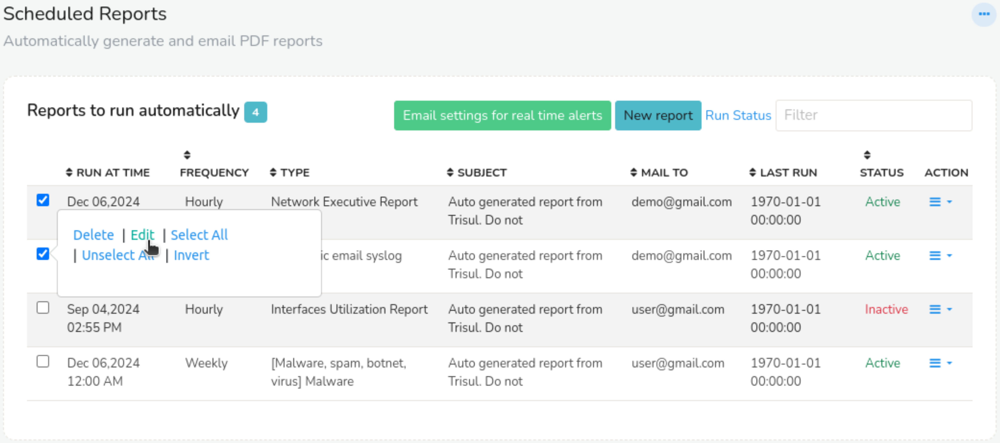

# Schedule Email Reports

You can have Trisul automatically email reports periodically.

## Report Intervals

You may dispatch by email any of the supported report types at these intervals.

1. Hourly
2. Daily
3. Weekly
4. Monthly

## Schedule a New Report

To schedule a new report

:::info navigation

:point_right: Login as `user` Go to Reports → Schedule or you can also   
:point_right: Login as `admin` Go to Context: Default &rarr; Admin Tasks &rarr; Schedule Email Reports

:::

1. A list of all reports scheduled will appear
2. Click **New report**
3. Fill out these fields



*Figure: Showing Schedule a New Email Report Configuration*

Here is the table with the description of all available fields to schedule a new report.

| Field Name                   | Description                                                                     |
| ---------------------------- | --------------------------------------------------------------------------------|
| Select a Report              | You can choose various type of reports                                          |
| Probes                       | You can choose among different nodes if multiple probes are setup               |
| Run Time                     | At the top of what time do you want to run the report. The actual run times of the reports also depends on the frequency. For example if you select “2011-12-20 10:20:00” for hourly report runs. The report will be generated at 10:20, 11:20, 12:20, etc..                                                       |
| Business Hours               | Runs the report for business hours only                                         |
| Run Frequency                | Select from Hourly,Daily,Weekly, or Monthly                                     |
| To                           | Email address of receiver                                                       |
| Cc                           | Recipient received a copy of the message.                                       |
| Bcc                          | Recipients are invisible to all the other recipients of the message             |
| Specify a Subject            | Subject of the report                                                           |
| Signature                    | Signature of the sender                                                         |
| Report parameters (optional) | Optional parameters, if present must be in valid `JSON` format. This parameter is only required for these three reports Endpoint Activity, Application Activity, Router and Interfaces             |
| Enabled                      | Keep this checkbox checked to generate reports on schedule and unchecked to temporarily disable scheduled reports                                                                            | 

Once you schedule the report, all your scheduled reports will appear on the index page and you can toggle from there.



*Figure: Showing List of Currently Scheduled Reports in Index Page*

The following is the list of options and their description of all scheduled reports you can see on the index page of scheduled reports.

| Options | Descriptions |
|---------|--------------|
| Run at Time | The scheduled time at which the report will be generated and sent. |
| Frequency | The frequency at which the report will be generated and sent, such as daily, weekly, or hourly. |
| Type | The type of report being generated, such as network executive report, automatic email syslog alerts reports etc. |
| Subject | The subject line of the email that will be sent with the report. |
| Mail to | The email address(es) to which the report will be sent. |
| Last Run | The date and time at which the report was last generated and sent. |
| Status | The current status of the scheduled report, such as active or inactive. |
| Action | The actions that can be taken on the scheduled report, such as "Edit", "Delete", or "Run Status". |

With the action button of the scheduled reprots, you can,

- **Edit** You can edit the parameters of the scheduled report one report at a time.  
- **Delete** You can delete the scheduled report.  
- **Run Status** You can check if the report has been sent successfully to the destination mail address.  
- **Generate Report** You can download the scheduled report manually.  


### Bulk Edit

To bulk edit scheduled reports select and click on the checkboxes on the left side against each scheduled report.

  
*Figure: Bulk Edit Options*

- **Delete** Permanently removes the selected scheduled reports. Use with caution, as deleted reports cannot be recovered.
- **Edit** Allows you to modify the parameters of the selected scheduled reports.
- **Select All** Selects all scheduled reports on the page, enabling bulk actions to be applied to all reports at once.
- **Unselect All** Deselects all scheduled reports on the page, allowing you to start the selection process again.
- **Invert** Toggles the selection of all scheduled reports on the page, selecting those that were previously unselected and vice versa.


## Report Parameters

Some reports are generated for a particular entity such as a specific
 host or application. For these reports you need to tell Trisul about 
the entity via the *Report parameters* field. Currently there are three types of such reports.

### Parameters for the Endpoint Activity Report

The *Endpoint activity report* expects you to specify a host.

1. Specify all common fields for a scheduled report
2. In addition enter report parameters as shown below

Say you want to schedule an endpoint report for host 192.168.1.151, enter the ip address in this format  
`{"IP":"192.168.1.151"}` You can also enter a host name instead of an IP like `{"IP":"dns00.unleashnetworks.com"}`

### Parameters for the Application Activity Report

The *Application activity* report expects you to specify an application or port.

1. Specify all common fields for a scheduled report
2. In addition enter report parameters as shown below

Say you want to schedule an for the http app, use this format  
`{"port1":"http"}` You can also enter a port number `{"port1":"Port-80"}`

### Parameters for the Interface Activity Report

Netflow only You can generate a report for any netflow interface.

1. Specify all common fields for a scheduled report
2. In addition enter report parameters as shown below

Say you want to schedule an report for interface with ifIndex 22 on router 192.168.1.1, use the following format  
`{"interface":"192.168.1.1_22"}`

## Enable Email Dispatching

After you have setup email, you need to enable the job that actually generates the report and sends out the email.

To enable this :

:::info navigation

:point_right: Select Customize → App Settings

:::

Check the **Automatically email scheduled reports**

> Note: Ensure you have set up your [Email Settings](/docs/ug/reports/emailsettings)

## Troubleshooting

Are your reports not coming through ? Here are some possible reasons.

### Check if cron support is available in your system

As root type

```
crontab -l
```

### Check the Logs

If you are not receiving the email reports, check the logs.

:::info navigation

:point_right: Login as Admin → WebAdmin → View Logs  
Click on **Background tasks log**

:::

You can see if any errors are observed there.

## Executive Network Report


The Executive Network Report provides a comprehensive overview of network activity and performance, including:

|Content| Description |
|--------|-------------|
| Bandwidth Utilization| Total bandwidth received and transmitted |
| Alerts | Notifications from threshold crossing alerts, , Flow tracker indicating analysis of network flows to identify trends and patterns, Badfellas for identification of suspicious or malicious hosts, and IDS indicating potential issues |
| Bandwidth Utilization Chart| Visual representation of total bandwidth usage|
| Top Internal Hosts | Most active internal hosts | 
| Top External Hosts | Most active external hosts|
| Top Applications | Most used applications |
| Top Network Layers | Most used network layers |
| Top HTTP URL Category | Most accessed URL categories |
| Top Country | Countries with the most network activity |

This report provides a concise and informative snapshot of network performance, security, and usage patterns.

Download Sample Report here : [Executive Network Report](images/execnwreport.pdf)