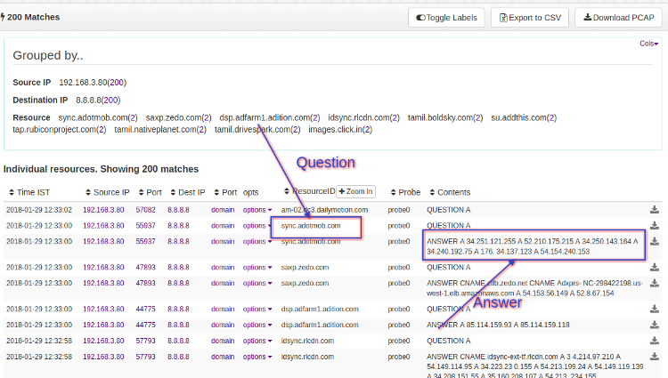
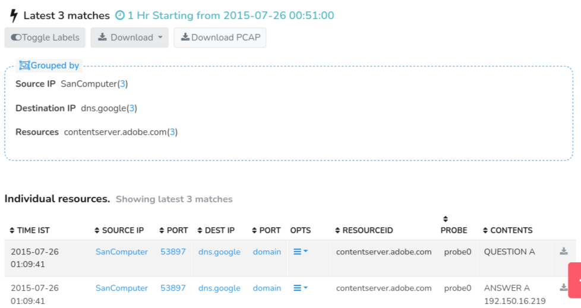

# DNS Resources
PCAP Mode Only
## Overview
DNS Resources resolves domain names into their corresponding IP addresses from DNS records. Doing so, you obtain the information on actual Domain name, Resource type, IP addresses, and other DNS records. This helps network forensics by providing detailed information about network activity. Example: example.com → 192.0.2.1

Trisul extracts domain names from *DNS Question and Answer records* on the
network. Even hosts that do not receive a reply or those in the
‘additional records’ section are pulled out.

  
*Figure: DNS Resources*

As shown in the figure, each question in the [*search results*](/docs/ug/resources/dns#search-results) has a corresponding answer in the form of a resolved IP address.

## Searching

:::info navigation
:point_right: Click on Resources &rarr; DNS Resources
:::

*Figure: Search Criteria Form for DNS Resources*

Open the Search Criteria box by clicking on [*Show Search Form*](/docs/ug/ui/elements#hide-show-search-form) and fill in the fields with the help of following field descriptions. Click on the [*Download Button*](/docs/ug/resources/oveview#download) to download only the contents as a text file.
| Fields               | Descriptions                                                                            |
|----------------------|-----------------------------------------------------------------------------------------|
| Time Frame           | Select a specific date and time range using the [Time Selector](/docs/ug/ui/elements#time-selector) to search for resources within that period                                                |
| IP Address           | Enter a single IP address to search for resources related to that IP                    |
| Exclude these IPs    | Enter one or more IP addresses to exclude from the search results                       |
| Regex Pattern        | Enter a regular expression (regex) pattern to search for resources matching that pattern|
| IP Pair              | Select two IP addresses to search for resources transferred between them                |
| Port                 | Enter a specific port number to search for resources transferred on that port           |
| Max Items            | Set a limit on the number of search results returned.                                   |
| Invert Regex Pattern | Check this box to search for resources that do NOT match the regex pattern.             |

There are additional search criteria that allows you to narrow down your search to specific network conversations, making it easier to find the resources you're looking for. Additional search criteria include,

| Fields                 | Descriptions                                                                            |
|------------------------|-----------------------------------------------------------------------------------------|
| Source IP Address      | Enter the IP address of the device that sent the network traffic                         |
| Destination IP Address | Enter the IP address of the device that received the network traffic                    |
| Source Port            | Enter the port number of the device that sent the network traffic                       |
| Destination Port       | Enter the port number of the device that received the network traffic                   |

### Search by a Single Perl Compatible Regex

You can search by a single regular expression or bulk substring matching. Enter a single regex in the Pattern box. It must be on a single line.

For example `v16.cache?.*youtube.com$` will match
`tc.v16.cache8.c.youtube.com` but not `v16.cache18.c.youtube.com`

### Multiple Patterns for Substring Matches

Enter a list of patterns one per line.

Use this if you want to search for hundreds of domains at once. This is a substring match so you cannot use any regexes.

## Search Results

For example, we've used a regular expression (regex) search for the string "adobe" and the results are displayed in the table below, showing all matching resources that contain the specified string.

*Figure: Sample DNS Search Result*

The first section of the search result contains a summary of "grouped by" information on Source IP, Destination IP, and Resources. Interactive functionalities on the search result include : [*Toggle Labels*](/docs/ug/ui/elements#toggle-labels), [*Download*](/docs/ug/ui/elements#download-button), and [*Download PCAP*](/docs/ug/ui/elements#download-pcap-button)

And the matching resources are displayed in the search result table with the [*Column Sorter*](/docs/ug/ui/elements#column-sorter) that include the following details.

| Column           | Description                                                                                 |
|------------------|---------------------------------------------------------------------------------------------|
| Time IST         | Displays the timestamp of when the resource was captured, in Indian Standard Time (IST) zone|
| Source IP        | Shows the IP address of the device that sent the network traffic.                           |
| Source Port      | Displays the port number used by the device that sent the network traffic.                  |
| Destination IP   | Shows the IP address of the device that received the network traffic.                       |
| Destination Port | Displays the port number used by the device that received the network traffic.              |
| [Options](/docs/ug/resources/dns#option-button)          | Provides additional actions or options for each resource, such as viewing details or downloading PCAP files                                                                                           |
| Resource ID      | A unique identifier assigned to each resource, used for reference and tracking.             |
| Probe            | Indicates the probe that captured the network traffic.                                      |
| Contents         | Displays a brief summary or preview of the resource's contents, such as a URL or domain name|

### Option Button

Click on “Options” button and find further drilldown options including:

  
*Figure: Option Button*

| Option                     | Description                                                                       |
|----------------------------|-----------------------------------------------------------------------------------|
| Resource details           | Displays detailed information about the resource, such as its type and contents.  |
| Locate Flow                | Finds and displays the network flow (conversation) that transferred the resource. |
| Download Certificate Chain | Downloads the SSL/TLS certificate chain associated with the resource, for further analysis.                                                                                                        |
| Quick PCAP View            | Displays a quick view of the PCAP (packet capture) file containing the resource   |
| Download PCAP              | Downloads the full PCAP file containing the resource                              |
| In this Conversation       | Displays all resources transferred within the same network conversation (flow)    |
| Involving Source IP        | Displays all resources transferred from or to the source IP address               |
| Involving Destination IP   | Displays all resources transferred from or to the destination IP address          |
