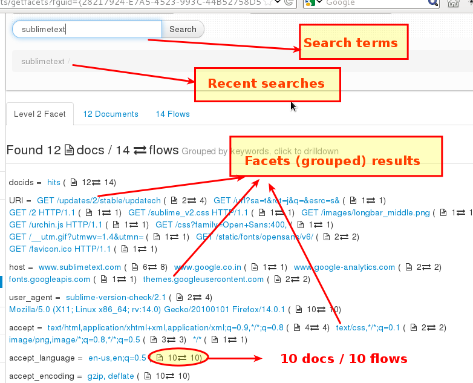
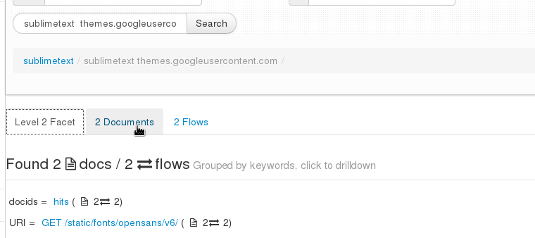
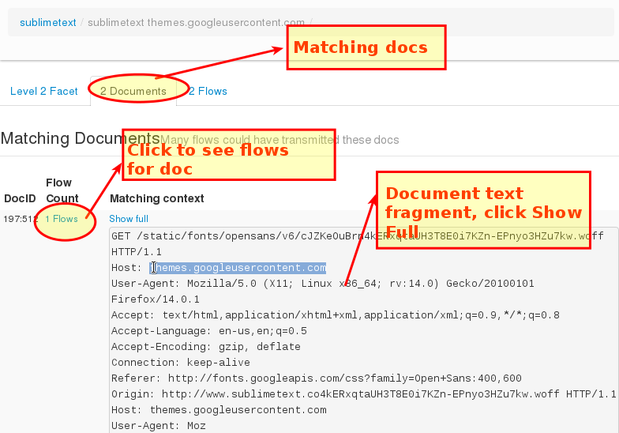
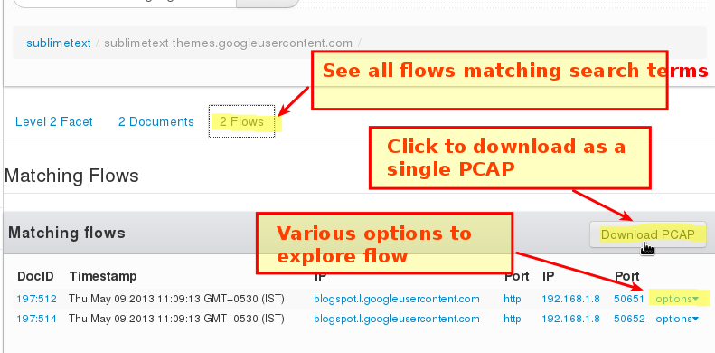

---

sidebar_position: 5
---

# Full Text Search
PCAP Mode Only  

Some resources extracted by Trisul are unstructured but are critical to
look up fast. These types of resources are stored in a Full Text Search
(FTS) index.

Currently the following FTS resources are supported.

1. **[SSL Certificate Chains](ftsssl)** - the full printed form
   with all extensions and attributes
2. **[HTTP Headers](ftshttp)** - all HTTP request and response
   headerss

## Documents and Attributes

Each FTS resource is treated as a **document** which needs to be
indexed. First a **stemmer** runs through the document and breaks it up
into tokens. These tokens are the strings which are added to the index.

Trisul also adds in some extra fields of its own called **attributes**.
These are used to provide grouped search results, also called
**facets**.

Documents are de-duplicated before processing to reduce the size of the
index, sometimes dramatically. Each document is also linked back to
**network flows** so you can pivot into other types of data.

## Search Features

### Maximum Number of Matches

If you use very broad or frequent terms it is easy to be overwhelmed by
matches in a FTS scenario. For example : If you look for *Verisign* in
*SSL Certs FTS* or *Apache* in a HTTP Header FTS field you are likely to
match every other document.

Trisul only returns a maximum of 500 matches. If you want more,

1. you simply have to narrow your search terms
2. look for a smaller time interval

### Faceted Results

Matching documents are presented along with grouped frequency of tags.
This is called faceting. You can click on a facet to add it to the
search box and narrow the search further.

### Flows

The FTS Index also stores flows that were involved in transferring the
document. This allow you to enter into the network side of things from
the document.

1. One document can be transferred by any number of network flows
2. One flow can transfer more than one document

## Using FTS Tools

> Enter keyword(s) into the box

### Using the Faceted Results

The following screenshot describes how the UI works.

1. Select a timeframe - the default is to search all the traffic today
2. Enter a search term and press Search..

Results are presented as shown below.

  
*Figure: Components of the FTS user interface, common to all FTS types*

#### Attributes

The results are grouped by frequency of appearance of attributes. In the
above example, **host**, **user_agent** are all attributes with Trisul
showing how many appearances of various types were seen. This helps
immensely to narrow down searches.

To continue the above example, if you click on an attribute say
**themes.googleusercontent.com** that is added into the search box and
the results are updated.

Notice we only have two documents matching in the screenshot below

  
*Figure: Results updated after adding attribute value to search*

#### Document Content

The primary object of interest is the document itself. Flip to the
Documents tab to see **unique** documents seen which match the keywords.

Notice the **Flow Count** column. This indicates the number of times
this unique document was seen. Clicking on it leads you to the flows
page.

  
*Figure: Fragment of document matching the keywords*

#### Flows

Each FTS document is transferred by a flow. The Flows tab gives you a
list of flows along with the document which was transferred by it.

> Use the flows tab to pivot into packets or other types of flow based
> investigation.

  
*Figure: Flows that transferred documents matching the FTS search*
