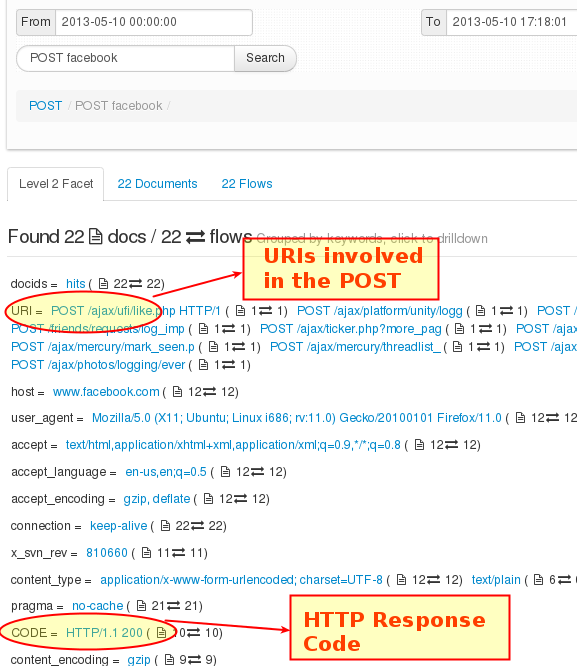
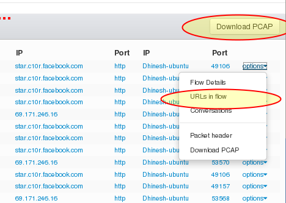

---

sidebar_position: 6
---

# HTTP Header FTS
<span class="badge badge--primary">PCAP Mode Only</span>  

All HTTP headers including requests (GET, POST,..etc) and responses
(HTTP OK, errors ) are stored in the FTS index.

## What is Stored ?

The entire HTTP request or response body is treated as a single
document. All fields are stored in the index except the following which
have high variability. You can generate reports by User-Agent, Server,
Content-Type, or any of the fields in the HTTP Header.

:::note The following HTTP fields are excluded from the index.  
Cookie, Set-Cookie, Date, Expires, Last-Modified,E-Tag, P3P, ETag,
Cache-Control, Keep-Alive,Age,Last-Modified, If-, Location,
Content-Length, Referer
:::

The following extra attributes are added by Trisul to aid some kinds of
useful queries

1. CODE - HTTP response code
2. URI - The full URL

#### Sample Document

A typical document looks like this

```
    POST /ajax/ufi/like.php HTTP/1.1
    Host: www.facebook.com
    User-Agent: Mozilla/5.0 (X11; Ubuntu; Linux i686; rv:11.0) Gecko/20100101 Firefox/11.0
    Accept: text/html,application/xhtml+xml,application/xml;q=0.9,*/*;q=0.8
    Accept-Language: en-us,en;q=0.5
    Accept-Encoding: gzip, deflate
    Connection: keep-alive
    X-SVN-Rev: 810660
    Content-Type: application/x-www-form-urlencoded; charset=UTF-8
    Referer: http://www.facebook.com/
    Content-Length: 368
```
## Using

:::info navigation
Select Resources &rarr; HTTP Header FTS
:::

Follow instructions in the [FTS](fts) documentation.

## Special Tips for HTTP Header FTS

#### Special Attributes

You should leverage the special attributes URI and CODE to narrow down
your search.

  
*Figure: Showing URI and CODE attributes*

#### Documents to Flows

Once you have sufficiently narrowed down your documents of interest.

- Switch to Flows
- Use the *Options* dropdown menu and the *URLs in flow* to switch to
  the URL normal index page.
- Use the *Download PCAP* button at the top to download all the flows
  shown at once

  
*Figure: Click on options to bring up pivoting options to other kinds of data*
