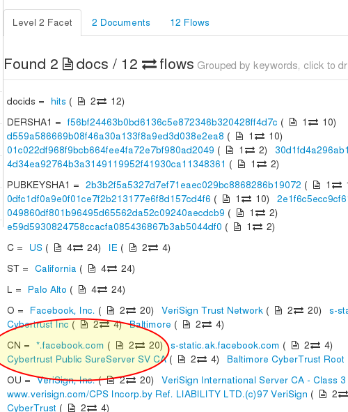

# SSL Certificates FTS

All SSL Certificate chains are stored in the full text index.

## What is stored ?

Every SSL/TLS server presents its credentials at the time of initial
handshake by transferring its certificate. In addition to its own
certificate, it also passes along a chain of certificates ending up in a
trusted root. Trisul decodes the X509v3 certificates and stores the
entire certificate chain, not just individual certificates as a separate
document. You can still search for individual certificates but the chain
is the document.

The entire certificate chain is the document.

In addition, Trisul stores the following extra fields in the FTS index

1. **chain_depth_x** - the number of certificates in the chain
2. **DERSHA1** - a hash of each ASN DER certificate in the chain
3. **PUBKEYSHA1** - a hash of the public key of each certificate. This
   is a hash of only the subjectPublicKey string and does not include
   the algorithm part. See
   [RFC3280](http://www.ietf.org/rfc/rfc3280.txt)

#### Sample document

    (.. cert 1 details..)
    SHA1:c5fdccbc7795b69dd60cea91aaa1711921d18726
    NAME:/1.3.6.1.4.1.311.60.2.1.3=IN/businessCategory=Government Entity/serialNumber=Government Entity/C=IN/ST=MAHARASHTRA/L=MUMBAI/O=STATE BANK OF INDIA/OU=INTERNET BANKING DEPARTMENT/OU=Terms of use at www.verisign.com/rpa (c)05/CN=www.onlinesbi.com
    Issuer: C=US, O=VeriSign, Inc., OU=VeriSign Trust Network, OU=Terms of use at https://www.verisign.com/rpa (c)06, CN=VeriSign Class 3 Extended Validation SSL SGC CA
    Validity
    Subject: 1.3.6.1.4.1.311.60.2.1.3=IN/businessCategory=Government Entity/serialNumber=Government Entity, C=IN, ST=MAHARASHTRA, L=MUMBAI, O=STATE BANK OF INDIA, OU=INTERNET BANKING DEPARTMENT, OU=Terms of use at www.verisign.com/rpa (c)05, CN=www.onlinesbi.com
    ...
    (followed by cert 2 details ..)
    ...
    ...
    (until the root cert..)

## Using

Select Resources -\> SSL Certificate FTS

Then follow instructions in the [FTS](fts.html) documentation.

SSL Certificates are also in the normal index. Use that to do a bulk
search for SHA1 hashes from intelligence feeds.

## Special tips for SSL Certificate FTS

#### Special attributes

Use the special attributes

1. chain_depth_x -\> Search for chain_depth_1 to locate possible self
   signed certificates
2. PUBKEY and DERSHA -\> Use them to search for particular
   certificates.
3. CN (Common Name) -\> a great place to start looking and for
   narrowing your queries

  
A sample faceted results, the common name field is a good place to start

