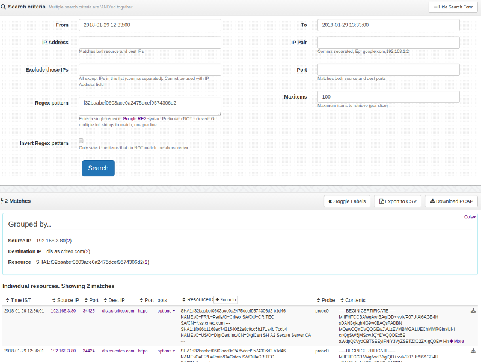

---
sidebar_position: 4
--- 

# SSL Certificates

Information contained in SSL certificates are now increasingly showing
up in intelligence indicators. Trisul indexes information in
certificates in two forms to aid two usage scenarios

|     |                  |                                                                  |
| --- | ---------------- | ---------------------------------------------------------------- |
| 1   | **Normal index** | The hash and subject information only for fast bulk lookups      |
| 2   | **FTS index**    | Arbitrary search of all fields in certificates to aid drilldowns |

In this section, we describe the usage of the normal index. See the
section on [FTS Index](ftsssl.html) for details about the FTS index.

For each SSL/TLS connection, Trisul stores in the normal index.

1. a SHA-1 hash of each DER encoded certificate in the chain
2. the subject attributes text

> Trisul uses heuristics to detect SSL/TLS on any port

## Sample

You can see three certificates in the chain leading up to the root CA,
in this case Verisign.

```
    SHA1:40603f9205eb5d28e6d77b858db3b2d857743774
    NAME:/C=US/ST=California/L=San Francisco/O=Salesforce.com, Inc./OU=Applications/CN=*.salesforce.com
    ---
    SHA1:5deb8f339e264c19f6686f5f8f32b54a4c46b476
    NAME:/C=US/O=VeriSign, Inc./OU=VeriSign Trust Network/OU=Terms of use at https://www.verisign.com/rpa (c)10/CN=VeriSign Class 3 Secure Server CA - G3
    ---
    SHA1:32f30882622b87cf8856c63db873df0853b4dd27
    NAME:/C=US/O=VeriSign, Inc./OU=VeriSign Trust Network/OU=(c) 2006 VeriSign, Inc. - For authorized use only/CN=VeriSign Class 3 Public Primary Certification Authority - G5
    ---
```

## Normal Index

  
SSL Resources

The whole resource is treated as a single string for query purposes.

### Searching

:::note navigation
Click on Resources -\> SSL Certs
:::

1. Open the Search Criteria box by clicking on “Show”
2. Tabs “Search by endpoints” or “Search by regex”

#### Search by endpoints

You can search by

1. IP
2. Exclude these IPS
3. Pair of IPs
4. Port
5. Timeframe
6. Regex Pattern
7. Invert Regex Pattren

#### Search by regex

You can search by

1. A single regex pattern on one line
2. A list of substrings each on a separate line 1

The main use of this tool in the context of SSL Certs is to allow you to
search for hundreds of matching hashes at once.

#### Multiple substring matches

> Use the *Search by regex* tab to compare your traffic against an intel
> feed of bad cert SHA-1 hashes.

Enter a list of patterns one per line.

The screenshot below shows how you can search for multiple hashes using
this tab.

  
Search Resources

#### A single perl compatible regex

Enter a single regex in the Pattern box. It must be on a single line.

### Search results

Matching resources are shown in a table.

Click on “Options” for further options.

1. Related flow(s) - find TCP/UDP flow that transferred the resource
2. Details - Resource details in a single page
3. Show Headers - PCAP headers in text and hexdump (first 50K bytes)
4. Download PCAP - PCAP containing the flow(s) that transferred the
   resource
5. Add to briefcase - Add to PCAP briefcase for later download

:::note navigation
Click on “Download PCAP” button to get a PCAP file with all resources
shown in table
:::
