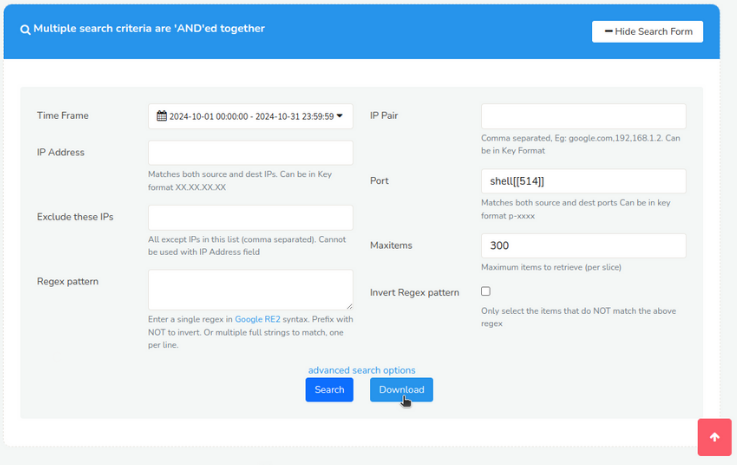
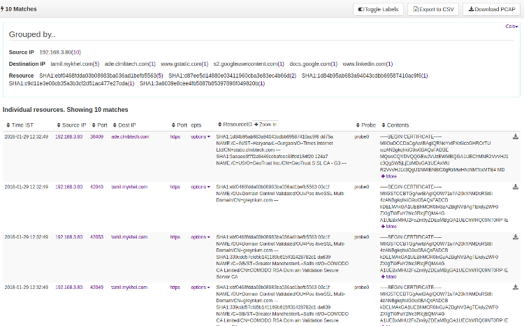
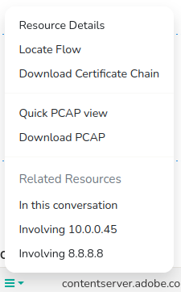

---

sidebar_position: 4
---

# SSL Resources
<span class="badge badge--primary">PCAP Mode Only</span>  

## Overview

Trisul's SSL resource tracking feature allows you to monitor and log SSL/TLS certificate information, enabling you to identify encrypted connections, verify certificate authenticity, and analyze certificate attributes. This helps network forensics by providing insights into encrypted network activity.   
Example: (example.com) → SSL Certificate (SHA-1 hash, subject, issuer, etc.)  

Information contained in SSL certificates are now increasingly showing
up in intelligence indicators. Trisul indexes information in
certificates in two forms to aid two usage scenarios

|     | Index            | Usage                                                            |
| --- | ---------------- | ---------------------------------------------------------------- |
| 1   | **Normal index** | The hash and subject information only for fast bulk lookups      |
| 2   | **FTS index**    | Arbitrary search of all fields in certificates to aid drilldowns |

In this section, we describe the usage of the normal index. See the
section on [SSL FTS Index](ftsssl) for details about the FTS index.

For each SSL/TLS connection, Trisul stores in the normal index.

1. A SHA-1 hash of each DER encoded certificate in the chain
2. The subject attributes text

> Trisul uses heuristics to detect SSL/TLS on any port

## Sample

You can see three certificates in the chain leading up to the root CA,
in this case Verisign.

```
    SHA1:40603f9205eb5d28e6d77b858db3b2d857743774
    NAME:/C=US/ST=California/L=San Francisco/O=Salesforce.com, Inc./OU=Applications/CN=*.salesforce.com
    ---
    SHA1:5deb8f339e264c19f6686f5f8f32b54a4c46b476
    NAME:/C=US/O=VeriSign, Inc./OU=VeriSign Trust Network/OU=Terms of use at https://www.verisign.com/rpa (c)10/CN=VeriSign Class 3 Secure Server CA - G3
    ---
    SHA1:32f30882622b87cf8856c63db873df0853b4dd27
    NAME:/C=US/O=VeriSign, Inc./OU=VeriSign Trust Network/OU=(c) 2006 VeriSign, Inc. - For authorized use only/CN=VeriSign Class 3 Public Primary Certification Authority - G5
    ---
```

## Normal Index

### Searching

:::info navigation
:point_right: Click on Resources &rarr; SSL Certs
:::


*Figure: Search Criteria Form for SSL Certificates*

Open the Search Criteria box by clicking on [*Show Search Form*](/docs/ug/ui/elements#hide-show-search-form) and fill in the fields with the help of following field descriptions. Click on the [*Download Button*](/docs/ug/resources/oveview#download) to download only the contents as a text file.
| Fields               | Descriptions                                                                            |
|----------------------|-----------------------------------------------------------------------------------------|
| Time Frame           | Select a specific date and time range using the [Time Selector](/docs/ug/ui/elements#time-selector)to search for resources within that period                                                |
| IP Address           | Enter a single IP address to search for resources related to that IP                    |
| Exclude these IPs    | Enter one or more IP addresses to exclude from the search results                       |
| Regex Pattern        | Enter a regular expression (regex) pattern to search for resources matching that pattern|
| IP Pair              | Select two IP addresses to search for resources transferred between them                |
| Port                 | Enter a specific port number to search for resources transferred on that port           |
| Max Items            | Set a limit on the number of search results returned.                                   |
| Invert Regex Pattern | Check this box to search for resources that do NOT match the regex pattern.             |

There are additional search criteria that allows you to narrow down your search to specific network conversations, making it easier to find the resources you're looking for. Additional search criteria include,

| Fields                 | Descriptions                                                                            |
|------------------------|-----------------------------------------------------------------------------------------|
| Source IP Address      | Enter the IP address of the device that sent the network traffic                         |
| Destination IP Address | Enter the IP address of the device that received the network traffic                    |
| Source Port            | Enter the port number of the device that sent the network traffic                       |
| Destination Port       | Enter the port number of the device that received the network traffic                   |

## Search Results


  
*Figure: SSL Resources*

The whole resource is treated as a single string for query purposes.


The first section of the search result contains a summary of "grouped by" information on Source IP, Destination IP, and Resources. Interactive functionalities on the search result include : [*Toggle Labels*](/docs/ug/ui/elements#toggle-labels), [*Download*](/docs/ug/ui/elements#download-button), and [*Download PCAP*](/docs/ug/ui/elements#download-pcap-button)

And the matching resources are displayed in the search result table with the [*Column Sorter*](/docs/ug/ui/elements#column-sorter) that include the following details.

| Column           | Description                                                                                 |
|------------------|---------------------------------------------------------------------------------------------|
| Time IST         | Displays the timestamp of when the resource was captured, in Indian Standard Time (IST) zone|
| Source IP        | Shows the IP address of the device that sent the network traffic.                           |
| Source Port      | Displays the port number used by the device that sent the network traffic.                  |
| Destination IP   | Shows the IP address of the device that received the network traffic.                       |
| Destination Port | Displays the port number used by the device that received the network traffic.              |
| [Options](/docs/ug/resources/dns#option-button)          | Provides additional actions or options for each resource, such as viewing details or downloading PCAP files                                                      |
| Resource ID      | A unique identifier assigned to each resource, used for reference and tracking.             |
| Probe            | Indicates the probe that captured the network traffic.                                      |
| Contents         | Displays a brief summary or preview of the resource's contents, such as a Certificate hash and subject information                                                                                          |

### Option Button

Click on “Options” button and find further drilldown options including:

  
*Figure: Option Button*

| Option                     | Description                                                                       |
|----------------------------|-----------------------------------------------------------------------------------|
| Resource details           | Displays detailed information about the resource, such as its type and contents.  |
| Locate Flow                | Finds and displays the network flow (conversation) that transferred the resource. |
| Download Certificate Chain | Downloads the SSL/TLS certificate chain associated with the resource, for further analysis.                                                                                                        |
| Quick PCAP View            | Displays a quick view of the PCAP (packet capture) file containing the resource   |
| Download PCAP              | Downloads the full PCAP file containing the resource                              |
| In this Conversation       | Displays all resources transferred within the same network conversation (flow)    |
| Involving Source IP        | Displays all resources transferred from or to the source IP address               |
| Involving Destination IP   | Displays all resources transferred from or to the destination IP address          |
