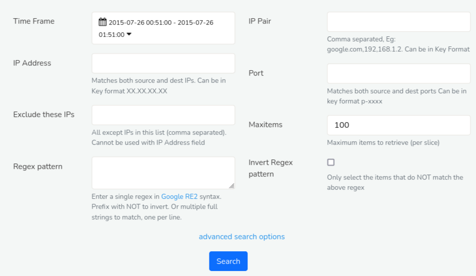

---

sidebar_position: 3
---

# URL Resources
PCAP Mode Only  

Trisul can log all HTTP URLs seen by reassembling HTTP packets.

This screen allows you to generate reports URLs based on the following

- Query by Source IP, Dest IP, and IP Pair
- Query by Port number (Trisul automatically detects HTTP traffic on all
  ports not just port 80)
- All IP except specified
- Regular Expressions for URL
- String match

  
*Figure: URL Resources*

### Using this Feature

#### Enable TCP Reassembly

Trisul needs to reassembly HTTP headers to pull out the URL information.
To enable this :

1. Locate the [Reassembly](/docs/ref/trisulconfig#reassembly)
   section in the trisulConfig.xml file
2. Set the *TCPFlowTrack* and *TCPReassembly* `Enabled` option to TRUE
3. Restart Trisul

##### View & Query URLs

:::info navigation
:point_right: Click on Resources &rarr; URL Resources to bring up the screen
:::

## Searching

:::info navigation
Click on Resources &rarr; DNS Resources
:::

*Figure: Search Criteria Form for URL Resources*

Open the Search Criteria box by clicking on [*Show Search Form*](/docs/ug/ui/elements#hide-show-search-form) and fill in the fields with the help of following field descriptions.
| Fields               | Descriptions                                                                            |
|----------------------|-----------------------------------------------------------------------------------------|
| Time Frame           | Select a specific date and time range using the [Time Selector](/docs/ug/ui/elements#time-selector)to search for resources within that period                                                |
| IP Address           | Enter a single IP address to search for resources related to that IP                    |
| Exclude these IPs    | Enter one or more IP addresses to exclude from the search results                       |
| Regex Pattern        | Enter a regular expression (regex) pattern to search for resources matching that pattern|
| IP Pair              | Select two IP addresses to search for resources transferred between them                |
| Port                 | Enter a specific port number to search for resources transferred on that port           |
| Max Items            | Set a limit on the number of search results returned.                                   |
| Invert Regex Pattern | Check this box to search for resources that do NOT match the regex pattern.             |

There are additional search criteria that allows you to narrow down your search to specific network conversations, making it easier to find the resources you're looking for. Additional search criteria include,

| Fields                 | Descriptions                                                                            |
|------------------------|-----------------------------------------------------------------------------------------|
| Source IP Address      | Enter the IP address of the device that sent the network traffic                         |
| Destination IP Address | Enter the IP address of the device that received the network traffic                    |
| Source Port            | Enter the port number of the device that sent the network traffic                       |
| Destination Port       | Enter the port number of the device that received the network traffic                   |

