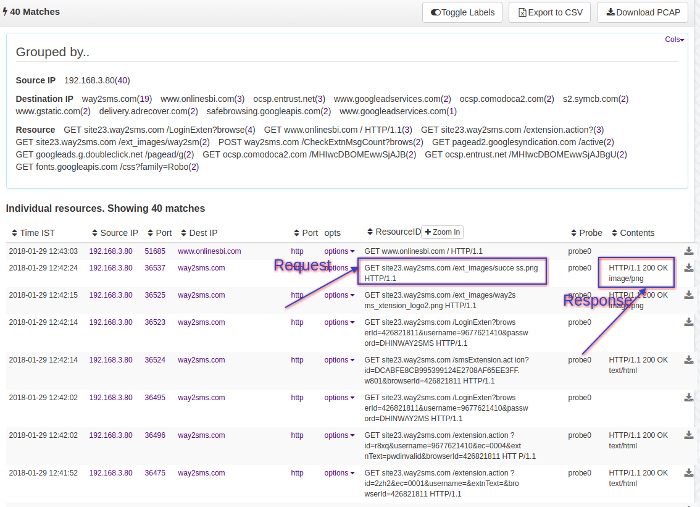

---

sidebar_position: 3
---

# URL Resources

Trisul can log all HTTP URLs seen by reassembling HTTP packets.

This screen allows you to generate reports URLs based on the following

- query by Source IP, Dest IP, and IP Pair
- query by Port number (Trisul automatically detects HTTP traffic on all
  ports not just port 80)
- all IP except specified
- Regular Expressions for URL
- String match

  
*Figure: URL Resources*

### Using this Feature

#### Enable TCP Reassembly

Trisul needs to reassembly HTTP headers to pull out the URL information.
To enable this :

1. Locate the [Reassembly](/docs/ref/trisulconfig#reassembly)
   section in the trisulConfig.xml file
2. Set the *TCPFlowTrack* and *TCPReassembly* `Enabled` option to TRUE
3. Restart Trisul

##### View & Query URLs

:::note navigation
Click on Resources —\> URL Resources to bring up the screen
:::

You can search by :

1. IP
2. Exclude these IPS
3. Pair of IPs
4. Port
5. Timeframe
6. Regex Pattern
7. Invert Regex Pattren

The results page have links to drilldown into flows, traffic, and
packets for every URL visited.

## Download as CSV

From the URL table shown click on “Download as CSV”
