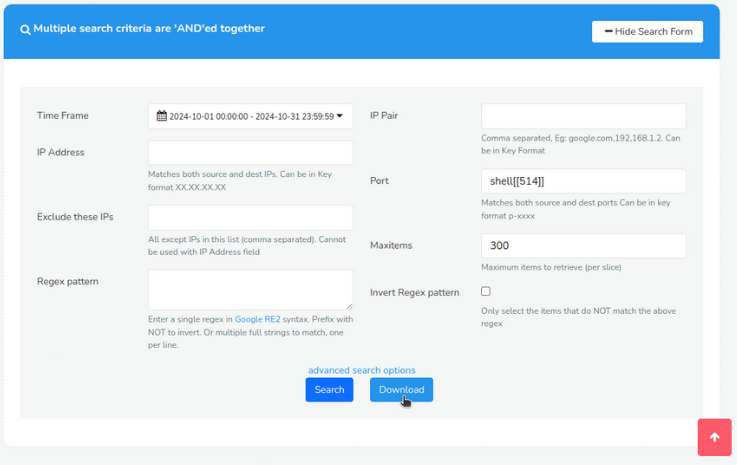
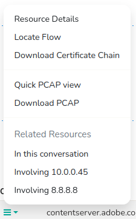

---

sidebar_position: 3
---

# URL Resources
PCAP Mode Only  
## Overview
Trisul's HTTP URL logging and reporting feature allows you to generate detailed reports on HTTP URLs seen by reassembling HTTP packets. With the reassembled packets, Trisul can log the website's URL, timestamps, and other details.  
Example: `www.example.com/index.html`

## Using this Feature

#### Enable TCP Reassembly

To enable Trisul to reassemble HTTP headers to pull out the URL information:

1. Locate the [Reassembly](/docs/ref/trisulconfig#reassembly)
   section in the trisulConfig.xml file
2. Set the *TCPFlowTrack* and *TCPReassembly* `Enabled` option to TRUE
3. Restart Trisul

## Searching

:::info navigation
:point_right: Click on Resources &rarr; URL Resources to bring up the screen
:::

*Figure: Search Criteria Form for URL Resources*

Open the Search Criteria box by clicking on [*Show Search Form*](/docs/ug/ui/elements#hide-show-search-form) and fill in the fields with the help of following field descriptions.
| Fields               | Descriptions                                                                            |
|----------------------|-----------------------------------------------------------------------------------------|
| Time Frame           | Select a specific date and time range using the [Time Selector](/docs/ug/ui/elements#time-selector) to search for resources within that period                                                |
| IP Address           | Enter a single IP address to search for resources related to that IP                    |
| Exclude these IPs    | Enter one or more IP addresses to exclude from the search results                       |
| Regex Pattern        | Enter a regular expression (regex) pattern to search for resources matching that pattern|
| IP Pair              | Select two IP addresses to search for resources transferred between them                |
| Port                 | Enter a specific port number to search for resources transferred on that port           |
| Max Items            | Set a limit on the number of search results returned.                                   |
| Invert Regex Pattern | Check this box to search for resources that do NOT match the regex pattern.             |

There are additional search criteria that allows you to narrow down your search to specific network conversations, making it easier to find the resources you're looking for. Additional search criteria include,

| Fields                 | Descriptions                                                                           |
|------------------------|----------------------------------------------------------------------------------------|
| Source IP Address      | Enter the IP address of the device that sent the network traffic                       |
| Destination IP Address | Enter the IP address of the device that received the network traffic                   |
| Source Port            | Enter the port number of the device that sent the network traffic                      |
| Destination Port       | Enter the port number of the device that received the network traffic                  |

## Search Result

In the figure below, each request in the search results has a corresponding response in the form of a HTTP URL.

  
*Figure: URL Resources*

The first section of the search result contains a summary of "grouped by" information on Source IP, Destination IP, and Resources.   
Interactive functionalities on the search result include : [*Toggle Labels*](/docs/ug/ui/elements#toggle-labels), [*Download*](/docs/ug/ui/elements#download-button), and [*Download PCAP*](/docs/ug/ui/elements#download-pcap-button)

And the matching resources are displayed in the search result table with the [*Column Sorter*](/docs/ug/ui/elements#column-sorter) that include the following details.

| Column           | Description                                                                                 |
|------------------|---------------------------------------------------------------------------------------------|
| Time IST         | Displays the timestamp of when the resource was captured, in Indian Standard Time (IST) zone|
| Source IP        | Shows the IP address of the device that sent the network traffic.                           |
| Source Port      | Displays the port number used by the device that sent the network traffic.                  |
| Destination IP   | Shows the IP address of the device that received the network traffic.                       |
| Destination Port | Displays the port number used by the device that received the network traffic.              |
| [Options](/docs/ug/resources/dns#option-button)          | Provides additional actions or options for each resource, such as viewing details or downloading PCAP files                                                      |
| Resource ID      | A unique identifier assigned to each resource, used for reference and tracking.             |
| Probe            | Indicates the probe that captured the network traffic.                                      |
| Contents         | Displays a brief summary or preview of the resource's contents, such as a HTTP URL, URL of the image etc |

### Option Button

Click on “Options” button and find further drilldown options including:

  
*Figure: Option Button*

| Option                     | Description                                                                       |
|----------------------------|-----------------------------------------------------------------------------------|
| Resource details           | Displays detailed information about the resource, such as its type and contents.  |
| Locate Flow                | Finds and displays the network flow (conversation) that transferred the resource. |
| Download Certificate Chain | Downloads the SSL/TLS certificate chain associated with the resource, for further analysis.                                                                                                        |
| Quick PCAP View            | Displays a quick view of the PCAP (packet capture) file containing the resource   |
| Download PCAP              | Downloads the full PCAP file containing the resource                              |
| In this Conversation       | Displays all resources transferred within the same network conversation (flow)    |
| Involving Source IP        | Displays all resources transferred from or to the source IP address               |
| Involving Destination IP   | Displays all resources transferred from or to the destination IP address          |
