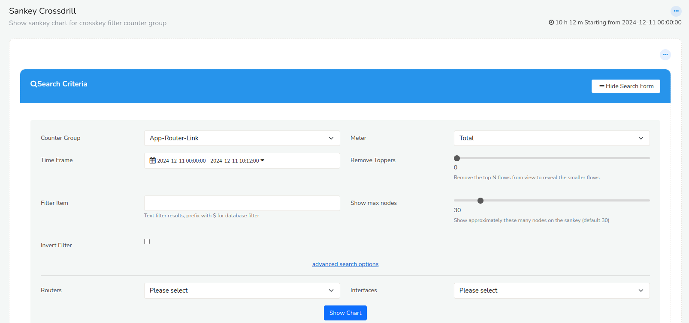
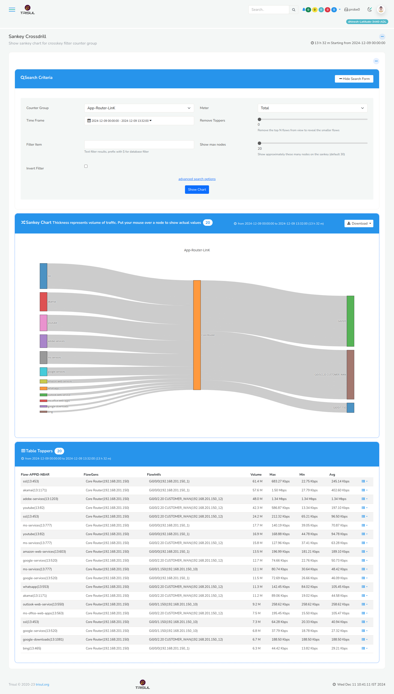
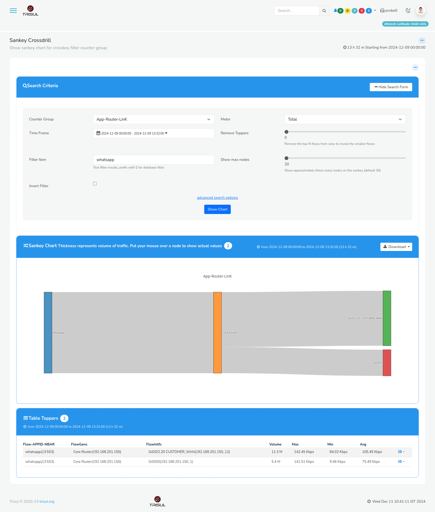

# Sankey Drilldown

The Sankey Drill Down App, can be downloaded from [TRISUL Apps](/docs/ag/webadmin/apps). This visualization tool illustrates the split of traffic for various applications, originating from specific routers and interfaces by providing a graphical representation of traffic distribution.

The specialized chart depicts the proportion of traffic allocated to different applications enable users to drill down into specific data points, facilitating in-depth analysis of traffic patterns.

Once downloaded the Sankey shall be available on the [Show All](/docs/ug/ui/dashmod_intro#view-a-dashboardall-dashboards) dashbaords. Fill in the fields to configure the sankey settings.

  
*Figure: Sankey Crossdrill Search Criteria Form*

| Field | Description |
|-------|-------------|
| Counter Group | Select the counter group to analyze. Counter groups categorize traffic based on specific criteria. |
| Time Frame | Choose the time frame for which you want to analyze traffic patterns. |
| Filter Item | Apply filters to narrow down the analysis based on specific items, such as application names|
| Meter | Select the metering option to measure traffic |
| Remove Toppers | Move the slider to left or right to exclude top traffic contributors from the analysis, allowing for a more detailed view of lesser contributors. |
| Show Max nodes | Move the slider to left or right to specify the maximum number of nodes to display in the Sankey diagram. |

**Advanced Search Options**

| Field | Description |
|-------|-------------|
| Routers | Select specific routers to include in the analysis. This helps in understanding traffic patterns across different network segments.|
| Interfaces | Choose the interfaces to analyze. This could be specific ports, VLANs, or other interface types. |

## The Sankey Cross Drilldown Chart : Component Breakdown

The Sankey Cross Drilldown Chart is a visualization tool that represents the traffic flow across different network components. The chart is divided into three main sections:

**Left Section**: Applications/App Labels

- Displays a list of applications or app labels that are generating traffic
- Each app label represents a specific source of traffic

**Center Section**: Router

Represents the router through which the traffic passes
Serves as the central hub, connecting applications to interfaces or links

**Right Section**: Interfaces/Links

Displays a list of interfaces or links through which the traffic passes
Each interface or link represents a specific path that traffic takes as it exits the router

  
*Figure: Sankey Crossdrill without Filter*

The Sankey Cross Drilldown Chart in a tabular format provides a more detailed and comprehensive view of the traffic flow across different network components. The table includes the following columns:

| Option | Description |
|-------|--------------|
| Flow-APP ID- NBAR | Displays the application ID and name, as identified by Network-Based Application Recognition (NBAR). This column provides insight into the specific applications generating traffic. |
| FlowGens | Represents the flow generators, which are the sources of traffic. This column helps identify the origins of traffic flows. | 
| FlowIntfs | Displays the flow interfaces, which are the paths through which traffic flows. This column provides information on the network interfaces involved in traffic transmission. |
| Volume | Shows the total volume of traffic, measured in bytes. This column provides a quantitative view of traffic flow.
| Max | Displays the maximum traffic value recorded during the analysis period. This column helps identify peak traffic levels. | 
| Min | Shows the minimum traffic value recorded during the analysis period. This column helps identify low traffic levels. |
| Avg | Displays the average traffic value recorded during the analysis period. This column provides a baseline view of typical traffic levels. |

  
*Figure: Sankey Crossdrill with Filter*