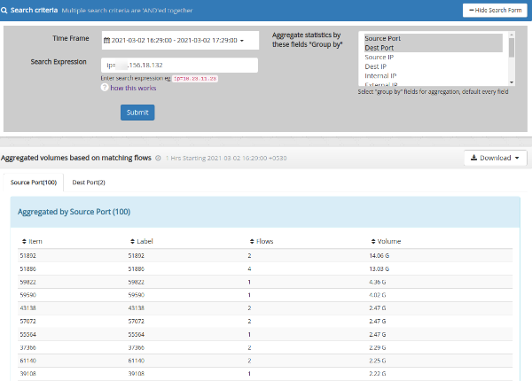

# Aggregate flows

Query for flows and show aggregated statistics for each tuple.

The results are presented in terms of

- a table for each parameter

> Also see the Explore Flows and Export Flows which work with individual flows.

  
*Aggregate flows*

## How to search for flows

:::note navigation

Select Tools -\>Explore Flows

:::

Use the same query mechanism as the [Export Flows](explore_flows.html) tool.

## Data displayed

Below the visualization you can find the following panels

### Activity details

Shows aggregated counts of

\- Source IPs

\- Destination IPs

\- Source Ports

\- Destination Ports

\- Internal IP

\- External IP

\- Internal Ports - ports used by the internal side. Use this to measure
server applications.

\- Protocols

\- Router

\- Interface In

\- Interface Out 

\- Flowtag

## Export to Excel

You can click on the “Export to XLSX” button to download the report into
an Excel spreadsheet containing the same information in a spreadsheet.

\- Aggregated Source and Destination IPs

\- Aggregated Source and Destination Ports

\- Aggregated Applications

\- Internal hosts

\- External hosts

\- Internal Ports - ports used by the internal side. Use this to measure
server applications.  

\- Protocols

The exported XLSX spreadsheet also has the raw byte counts you can use
to perform your own computations.
