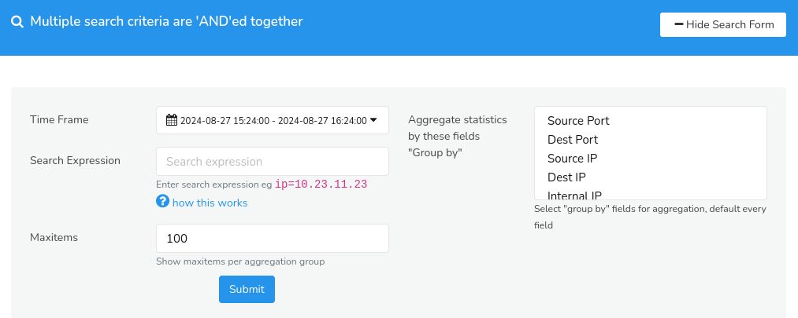
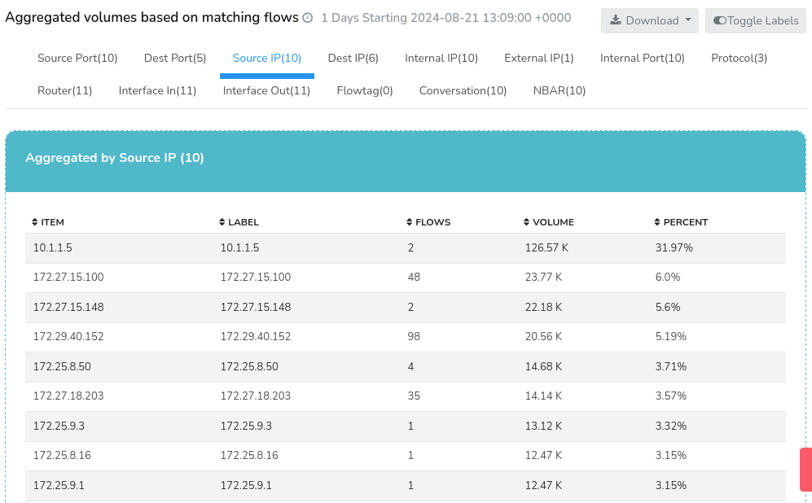

# Aggregate Flows

The Aggregate Flows tool enables you to query network flow data and displays summarized statistical information for each unique tuple. The output is presented in a tabular format, with separate tables for each parameter (tuples like source ip, source port, destination ip,etc) providing a comprehensive view of the aggregated data.

> Also see the Explore Flows and Export Flows which work with individual flows.

## How to Use

To access *Aggregate Flows*

:::info navigation

:point_right: Go to Tools&rarr; Select Aggregate Flows

:::

A search criteria form opens up where Multiple search criteria are 'AND'ed together to generate a search result for the targeted network flow data and can be toggled on or off using the [*Hide/ Show Search Form*](/docs/ug/ui/elements#hide-show-search-form) option.

  
*Figure: Aggregate flows*

You can begin your search in the *Aggregate Flows* form by populating the search criteria fields with the help of the following fields and their descriptions.

| Field                                             | Description                                                  |
|---------------------------------------------------|--------------------------------------------------------------|
| Time Frame                                        | Select a time range from the [Time Selector](/docs/ug/ui/elements#time-selector)                                                                                            |
| Search Expression                                 | Enter a search expression to filter the data and display only the relevant flows that match the specified conditions. Click on the question mark icon near the field name for a quick hint                                                                                                         |
| Max Items                                         | Specify the maximum number of items to display per aggregate group                                                                                                              |
| Aggregate statistics by these fields "Group by"   | Choose one or more fields from the list to group the network flow data by                                                                                                       |

Click *Submit*.

## Search Result

The search results are presented as a tabular display, with each tab representing a unique combination of the selected parameters. Each tab contains statistical data for the corresponding tuple, allowing for individual analysis as seen in the figure below.

*Figure: Aggregate Flows- Search Result*

- The [*Toggle Labels*](/docs/ug/ui/elements#toggle-labels) button enables the display of resolved names for the tuple parameters, providing an alternative view of the data. 
- The [*Download*](/docs/ug/ui/elements#download-button) button allows for the export of the resulting data in a suitable format, facilitating further analysis and reporting.

### Data Displayed

Each tabs on the resulting tabular data are individual search results that are "grouped by" corresponding to the specific parameters selected by you in the *search criteria* form. 

| Tabs                      | Data                                                                                 |
|---------------------------|--------------------------------------------------------------------------------------|
| Source IP 				| The IP address of the device that initiated the network connection.                  |
| Destination IP            | The IP address of the device that received the network connection.                   |
| Source Port               | The port number used by the source device to initiate the connection.                |
| Destination Port          | The port number used by the destination device to receive the connection.            |
| Internal IP               | The IP address of the internal device or network.                                    |
| External IP 				| The IP address of the external device or network.                                    |
| Internal Ports            | The port numbers used by internal applications or services.                          |
| Protocols 			    | The network protocol used for communication (e.g., TCP, UDP, ICMP).                  |
| Routers 					| The router device handling the network flow.                                         |
| Interface In 				| The incoming network interface receiving the flow.                                   |
| Interface Out 			| The outgoing network interface sending the flow.                                     |
| Flow Tag  				| A custom tag or label assigned to the flow for filtering or analysis.                |
| Conversation              | A unique identifier for the conversation or session between the source and destination devices.                                                                                               |
| NBAR                      | The application service associated with the network flow.                            |

These data sets provide a comprehensive view of network activity, facilitating in-depth analysis and insights for each tuple with the following details.
- **Item**: The specific value of the tuple field being analyzed (e.g., source IP address, destination port number, etc.).
- **Label**: A human-readable label or description associated with the item, if available (e.g., hostname, application name, etc.).
- **Flows**: The aggregate count of network flows matching the tuple.
- **Volume**: The total amount of data (in kilobytes) transferred in the flows matching the tuple.
- **Percent**: The percentage of total flows or volume represented by the tuple, enabling identification of dominant or anomalous patterns.
- **Router**: The router device handling the flows for the specific tuple, providing context for network topology and traffic routing.

Each field in the tuple tab is sortable, enabling users to rearrange data in ascending or descending order by clicking the adjacent arrow(up/down) button, for flexible data analysis and visualization.