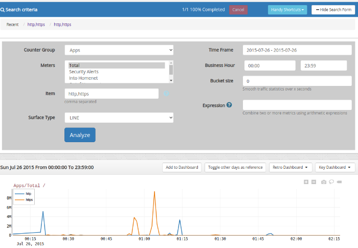

# Long Term Traffic

> **Purpose** : Show long term traffic trends of aparticular item.

View traffic trends for a particular item. You can specify a time window
and a number of days. Trisul draws charts one below the other, aligned
by time. This allows you to view daily, hourly, patterns in traffic for
that item.

## How to Use

:::note navigation

To access select Tools -\> Long term traffic

:::

| Field         | Description                                                                                                                                |
| ------------- | ------------------------------------------------------------------------------------------------------------------------------------------ |
| Key           | *Key + Counter Group* identifies what item you want to see                                                                                 |
| CounterGroup  | *Key + Counter Group* identifies what item you want to see                                                                                 |
| Meters        | Multiple select box allows you to see many meters on the same chart                                                                        |
| Time Frame    | You can select the desired Number of days by dragging from one date to another and also select the desired time using the custom time menu |
| Item          | IP for Hosts, http,https for Apps counter-groups                                                                                           |
| Business Hour | You can specify the business time for accurate statistics                                                                                  |
| Bucket size   | Smooth traffic statistics over x seconds eg 60                                                                                             |
| Surface Type  | Select a chart surface type. Tip : Choose `LINETABLE` if you want to see a box with `MAX/MIN/AVG` below chart                              |
| Expression    | Combines two or more metrics unsing arithmetic expressions                                                                                 |

  
*Figure: Long Term Traffic*
