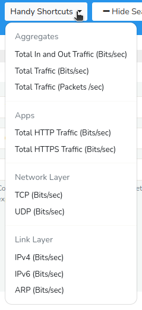

# Long Term Traffic

The Long Term Traffic Tool in Trisul allows you to analyze and visualize network traffic patterns of a particular item over extended periods, typically weeks, months, or even years. This feature is also available on the [Module templates](/docs/ug/ui/module_templates#key-traffic) if you would like to monitor long term traffic of a particular item on a regular basis.

## How to Use
To use long term traffic tool,

:::info navigation

:point_right: Go to Tools &rarr; Select Long Term Traffic

:::

The following *search criteria* window opens up with a [*Hide/ Show Search Form*](/docs/ug/ui/elements#hide-show-search-form) option.

  
*Figure: Long Term Traffic*

You can begin your search in the *Long term traffic* form by populating the search criteria fields with the help of the following fields and their descriptions.

### Search Criteria

| Field                                               | Description                                                 |
| ----------------------------------------------------| ----------------------------------------------------------- |
| CounterGroup                                        | Select a counter group to define the type of traffic data to display(example, ASN, Hosts, Apps, etc.)                                                                            |
| Meters                                              | Choose a meter to focus on specific aspects of network traffic                                                                                                             |
| Item                                                | Select an item to specify the entity for which you want to display traffic data (example, a specific IP address, port, protocol)                                               |
| Surface Type                                        | Select the type of chart to display. Tip : Choose `LINETABLE` if you want to see a box with `MAX/MIN/AVG` below chart                                                            |
| [Time Frame](/docs/ug/ui/elements#time-selector)    | Define the time range for the chart                         |
| Business Hour                                       | You can specify the business hours for accurate statistics  |
| Expression                                          | Combines two or more metrics unsing arithmetic expressions. Click on the question mark icon near the field name for a quick hint                                                |

Once filling all the fields, click *Analyze*.

### Handy Shortcuts

The *Handy Shortcuts* option, located on the upper right side of the top bar, provides readymade templates for frequently used analyses of long-term traffic data for a specific item, serving as a convenient tool for quick insights. 

  
*Figure: Handy Shortcuts*

Instead of filling in all the fields for the search criteria, you can also simply choose from one of the options from the *handy shortcuts* and click *Analyze*.   

## Search Result

Upon submitting the *search criteria* form after clicking the *analyze* button, the system generates a visual representation of the search results in the chart format selected by you.  

*Figure: Long Term Traffic Search Result*

A series of charts will be generated, with each chart representing a discrete daily dataset, resulting in a collection of individual charts, one for each day within the specified time frame(example, for 25 days), thereby providing a sequential visual representation of the data.

Using the [legend table](/docs/ug/ui/charts#legend-table) and [Chart Interaction Controls](//docs/ug/ui/charts#chart-interaction-controls), you can drill down into the intra-day data, facilitating a more detailed temporal analysis and exploration of the search result.

