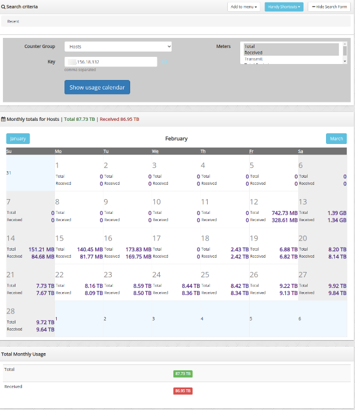

# Monthly Charts

You can now display daily totals for any meters for any item on a
calendar. For example you can show on a monthly calendar

- Total Bytes / In  

- Total Bytes / Out  

- Total Connection  

- Total Alerts

for a Host like shadyguy.mycompany.com

## How to Use

:::note navigation

To access select Tools-\>Monthly Chart

:::

##### Search Criteria

| Field        | Description                                                                 |
| ------------ | --------------------------------------------------------------------------- |
| CounterGroup | Counter Group name                                                          |
| Meters       | Meter within the counter group                                              |
| Key          | Usage list for item (eg Hosts <u>meter</u> 192.168.1.8 or Apps+meter+ ssh ) |

##### Example

  
*Figure: Daily usage calendar for an internal IP*
