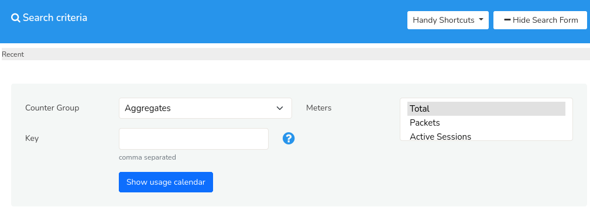
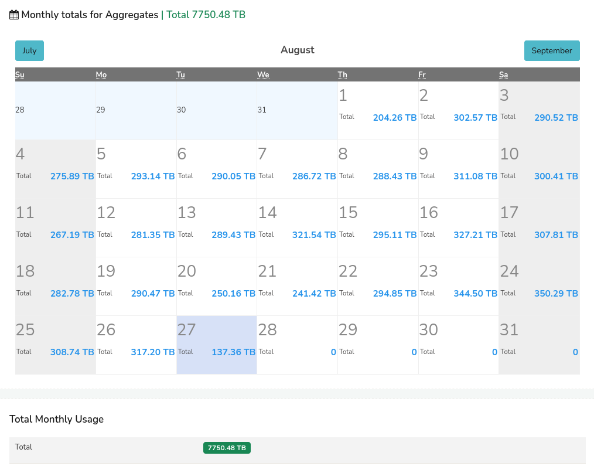
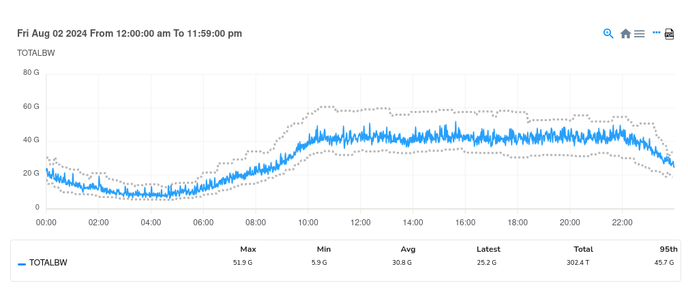

# Monthly Charts

*Monthly charts* in Trisul are calendar-based data visualization where you can visualize daily aggregated network traffic data for specific meters and items on a calendar interface.  
You can get a monthly overview of key metrics, such as:
- Total Bytes In
- Total Bytes Out
- Total Connections
- Total Alerts for a particular host, facilitating a concise and intuitive examination of daily totals within a monthly context.

## How to Use

To access *Monthly Charts*,

:::info navigation

Go to Tools-> Select Monthly Chart

:::
The search criteria window opens up with a toggle option to [*show/ hide form*](/docs/ug/ui/elements#hide-show-search-form). 

*Figure: Monthly Charts Search Criteria*

You can fill in the form with the help of the following fields and their description to specify their search criteria. 

### Search Criteria

| Field        | Description                                                                                      |
| ------------ | ------------------------------------------------------------------------------------------------ |
| CounterGroup | Select the counter group to define the category of data to be displayed in the monthly chart.    |
| Meters       | Choose the meters within the countergroup to display in the monthly chart.                       |
| Key          | Specify the keys to filter the data based on specific attributes or identifiers related to the counter group                                                                                                     |

Once you have filled in all the details, click *Show Usage Calendar*.

>Note: You can select multiple meters for any key or multiple keys for any meter. But multiple keys for multiple meters is not supported. By doing so, only the first key specified by you will be considered.

### Handy Shortcuts

The *Handy Shortcuts* option, located on the upper right side of the top bar, provides readymade templates for frequently used generation of *monthly charts* data for a specific item, serving as a convenient tool for quick insights. 

  
*Figure: Handy Shortcuts*

Instead of filling in all the fields for the search criteria, you can also simply choose from one of the options from the *handy shortcuts* and click *Analyze*.   

## Search Result

Once you have submitted the form by clicking *Show Usage Calendar* the following search result showing a calendar based visualization gets generated with the specified search criteria.

### Monthly Chart Visualization

*Figure: Monthly Chart*  

The generated monthly chart displays aggregated data for each day of the month, providing a calendar-based visualization of targeted metrics. Each day's data point on the chart represents the cumulative value for that specific day.

### Drill-Down Capability

Users can click on individual data points (of a particular day) within the monthly chart to access a detailed, day-specific chart, showcasing the trends and patterns of the selected metric for that particular day. 

*Figure: Monthly Chart - Trend visualization of a selected data (of one particlar day) from the calendar*

The trend for the selected time frame is depicted in a graphical format, as illustrated in the figure above, showcasing the fluctuations in the data over the one day period.

