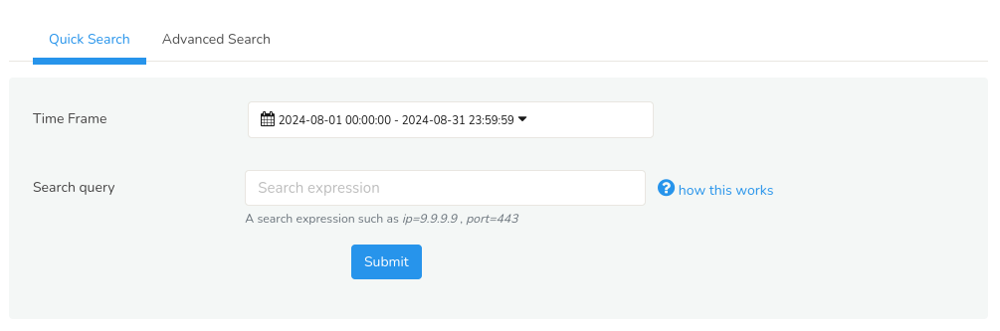
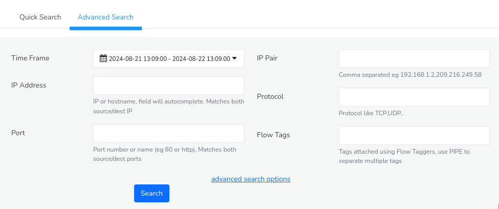
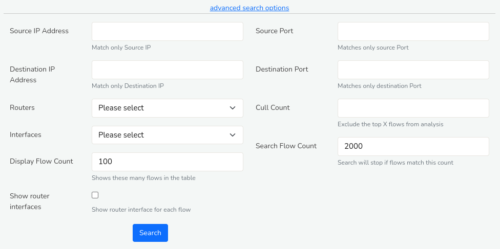
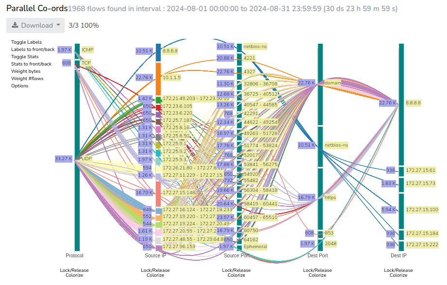
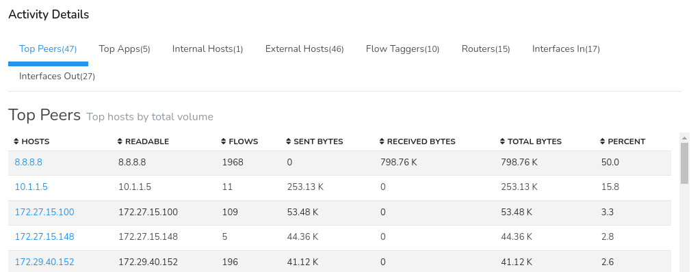
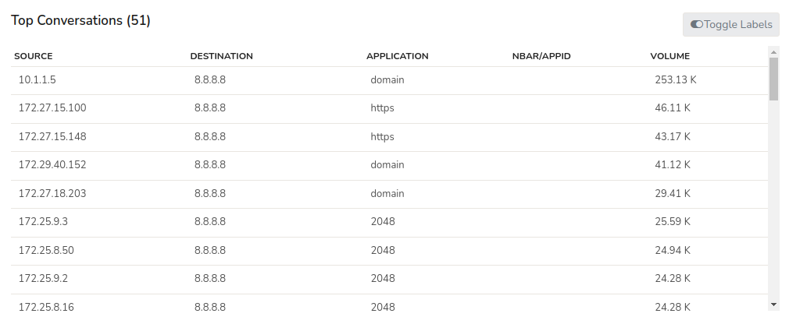
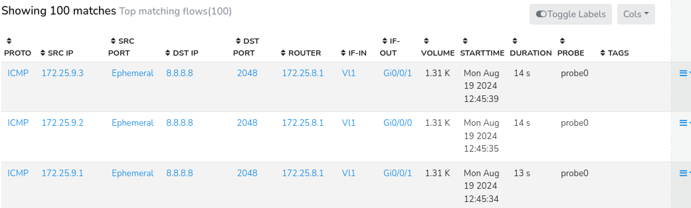
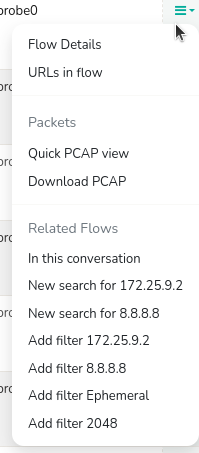

---

sidebar_position: 1
---

# Explore Flows

*Explore Flows* is a powerful, fast, and general-purpose search tool designed for in-depth inspection and analysis of network traffic flows. This comprehensive feature enables users to scrutinize individual network flows, examine packet-level and netflow data, and identify potential security threats or performance issues.  

## How to Search for Flows
Search Criteria in Trisul allows you to specify filters and conditions to narrow down network traffic data and focus on specific aspects of interest.

To specify a search criteria to explore flows,

:::info navigation

Go to Tools-> Explore Flows

:::

You have two ways to enter the search criteria

1. [**Quick search**](/docs/ug/tools/explore_flows#quick-search-enter-search-terms-directly) a search expression directly like
   `destip=twitter.com,port=ssh`
2. [**Advanced search**](/docs/ug/tools/explore_flows#advanced-search--use-a-form) use a form to enter individual fields

### Quick Search: Enter Search Terms Directly

Quick Search allows for quick filtering of network traffic data that includes only two essential fields. Suitable for straightforward searches. 

  
*Figure: Quick Search*

With quick search you can explore flows simply in two steps.  
**Step 1**: Select a time frame from the [*Time Selector*](/docs/ug/ui/elements#time-selector) to narrow down the flow data to the relevant time interval.  
**Step 2**: Just enter *Search query* in the form of search expression like *field=value,field=value,...* The supported fields include *srcip,destip,ip,net16,n2t24*. The complete list of supported fields can be obtained by clicking on the question mark icon against the *Search query* field.

Some common examples of search expressions are :

| Field                                                  | Description                                            |
| ------------------------------------------------------ | ------------------------------------------------------ |
| `srcip=208.219.88.129,destip=119.10.181.22`            | All flows between two ips                              |
| `ip=208.219.88.129`                                    | Match both source and destination ip                   |
| `port=5700`                                            | Port 5700                                              |
| `proto=gre,ip=208.219.88.129`                          | GRE protocol and IP                                    |
| `tag=UA`                                               | Flow tag has UA (Ukraine) if you’ve set up Flow Taggers|
| `net24=208.219.88`                                     | All flows in the /24 subnet                            |
| `net16=208.219,port=smtp`                              | All smtp flows in the /16 subnet                       |
| `ippair=192.168.1.8,59.92.15.145 (pipe separated IPs)` | All flows between the two IP pairs                     |
| `router=10.0.17.180`                                   | All router flows                                       |
| `ifin=1872`                                            | All the ingress flows in an Netflow Interface          |
| `ifout=1872`                                           | All the egress flows in a Netflow Interface.Combine with `router=` or specify router along with the interface in interface key format such as `ifout=10.0.17.180_1872` to see egress flows.                                                                                                 |
| `interface=1872`                               	     | All flows in an Interface                              |

### Advanced Search : Use a Form

Flip to the Advanced Search tab suitable for in-depth analysis. Offers a wide range of search criteria enabling complex searches with multiple conditions. 

Fill in the following fields for a flexible search.

*Figure: Advanced Search*

| Field                  | Description                                                          |
| ---------------------- | -------------------------------------------------------------------- |
| IP Address             | Enter an IP or host name                                             |
| Port                   | Enter an application name or port number *"Port-80 or http example"* |
| IP Pair                | Enter two IPs separated by a comma eg 192.168.1.2,209.216.249.58     |
| Protocol               | TCP UDP GRE IPSEC etc                                                |
| Flow Tags              | Enter the tag name                                                   |

Click on the *advanced search options* in the *advanced search* to get more search criteria including the following fields.

  
*Figure: Advanced Search Options*

| Field                  | Description                                                          |
|------------------------|----------------------------------------------------------------------|
| Source IP Address      | Enter the source IP eg 192.168.1.2                                   |
| Destination IP Address | Enter the Destination IP eg 209.216.249.58                           |
| Routers                | Select a router from the list of available routers                   |
| Interface              | Select an interface from the list of availbale interfaces            |	
| Display Flow Count     | Displays only specified number of flows eg 500                       |
| Source Port            | Enter the value of the source port                                   |
| Destination Port       | Enter the value of Destination port                                  |
| Cull Count             | Leave out the top ‘n’ flows from analysis                            |
| Search Flow Count      | Stops search if flows match this count eg 2000                       |
| Show Router Interfaces | Shows router interfaces for each flow                                |

## Explore Flows: Results Summary

The Search results for Flows are presented in terms of,

1) [**Parallel Co-ords**](/docs/ug/tools/explore_flows#using-the-interactive-visualization): An interactive visualization based on parallel co-ordinates
2) [**Activity Details**](/docs/ug/tools/explore_flows#activity-details): A summary of hosts and application by upload/download, peers
3) [**Top Conversations**](/docs/ug/tools/explore_flows#top-conversations): A table showing top conversations
4) [**Top 100 Matching Flows**](/docs/ug/tools/explore_flows#top-matching-flows): A table of raw flows

> Only the first matching *Max Flows (default 10K)* are retrieved. Please narrow down your query to within this limit. Also see the [Export Flows](/docs/ug/tools/export_flows) and [Aggregate Flows](/docs/ug/tools/aggregate_flows) tools which work with larger matches and provide different functionality.

### Using the Interactive Visualization

Trisul features a streaming flow visualization based on the popular
parallel co-ordinates paradigm. Search results are automatically
streamed into the viz.

*Figure: Parallel Co-ords- Visualization of flow data*

This is how you interpret the visualization

1. Each vertical axis represents a tuple
2. Within each vertical axis the height of each bar is proportional to
   a particular aggregate value
3. By default, the height of each bar is proportional to the volume of
   data through that item
4. Trisul uses an intelligent logic to display thousands of items on
   each vertical line
5. The most important ones, picked out by an algorithm, get their own
   bar
6. The other items considered less important are grouped together
7. Each line represents a flow with some or all control points through
   groups
8. Flows are colorized by groups in a control tuple

Available controls include,

| Feature              | Location                 | Description                                                  |
| ---------------------| ------------------------ | ------------------------------------------------------------ |
| Toggle Labels        | Top left                 | Show or hide labels                                          |
| Labels to front/back | Top left                 | Position labels on the backside of the lines so you can view the flows better                                                                                                 |
| Toggle Stats         | Top Left                 | Show or hide Statistics                                      |
| Stats to front/back  | Top left                 | Position Stats on the backside of the lines so you can view the flows better                                                                                                     |
| Weight Bytes         | Top Left                 | Expands the flow details                                     |
| Weight Flows         | Top Left                 | Collapses the flow details                                   |
| Options              | Top Left                 | Select the data items to display on the Parallel Co-ords     |
| Lock/Release         | Below each vertical axis | Click on release under a vertical axis to ignore the corresponding tuple                                                                                              |
| Colorize             | Below each vertical axis | Flows are colorized by source ip. You can change it to get a dramatically different view by looking at different angles                                                       |

#### Export as Report

You can click on the “Download” button to download the report into a PDF or XLSX to Excel spreadsheet. The downloaded report contains,

- Parallel Co-ords
- Top Peers
- Top Apps
- Internal Hosts
- External Hosts
- Flow Taggers
- Routers
- Interfaces In
- Interfaces Out
- Top Conversations
- Top Matching Flows (100)

### Activity Details

This section provides an overview of the network activity related to a searched IP address, including top communication partners, applications, internal and external hosts, flow tags, routers, and network interfaces used for incoming and outgoing traffic. 

*Figure: Different tabs of flow activity details*

1. **Top peers**: Peers (hosts) involved at either end of the flow. Shows the top IP addresses that have communicated with the searched IP address. This helps identify frequent communication partners.
2. **Top Applications**:  Displays the most commonly used applications or protocols (e.g., HTTP, FTP, SSH) associated with the searched IP address.
3. **Internal hosts**: Lists internal IP addresses that have communicated with the searched IP address.
4. **External hosts**: Shows external IP addresses that have communicated with the searched IP address.
5. **Flow taggers**: Displays tags or labels assigned to flows related to the searched IP address, helping identify specific types of traffic. (see [Flow Taggers](/docs/ug/flow/tagger) )
6. **Routers**: Shows the routers through which traffic to/from the searched IP address has passed.
7. **Interfaces In**: Displays the network interfaces (e.g., Ethernet, Wi-Fi) used for incoming traffic related to the searched IP address.
8. **Interfaces Out**: Displays the network interfaces (e.g., Ethernet, Wi-Fi) used for outgoing traffic related to the searched IP address.

### Top Conversations

A conversation represents a set of related flows between two devices (example, a series of requests and responses). *Top Conversations* shows the most significant network conversations involving the searched IP address. 

*Figure: Top Conversations*

This section displays the top conversations that involve the searched IP address, including:
- Source IP
- Destination IP
- Application
- NBAR/APPID if any
- Volume

You can click on the Toggle button on the upper right hand side to show or hide labels in the search results table.

### Top Matching Flows

A flow represents a single connection or session between two devices (example, a client-server interaction). Top Matching Flows contains a table of top raw flows (by volume) that matched your criteria. 

*Figure: Top 100 Matching Flows*

This section shows the top flows that involve the searched IP address, including:
| Columns            | Description                                                                                |
|--------------------|--------------------------------------------------------------------------------------------|
| Protocol           | The network protocol used for the flow (example, TCP, UDP, ICMP, etc.)                     |
| Source IP          | The IP address of the device that initiated the connection                                 |
| Source Port        | The port number used by the source device to establish the connection                      |
| Destination IP     | The IP address of the device that received the connection                                  |
| Destination Port   | The port number used by the destination device to receive the connection                   |
| Router             | The router or network device that forwarded the traffic                                    |
| Interface In       | The network interface on the router where the traffic entered                              |
| Interface Out      | The network interface on the router where the traffic exited                               |
| Volume             | The total amount of data transferred in bytes (or bits) for the flow                       |
| Start Time         | The timestamp when the flow started                                                        |
| Duration           | The length of time the flow was active                                                     |
| Probe              | The probe or sensor that collected the network traffic data                                |
| Tags               | Custom tags applied to the flow for filtering, categorization, or analysis (example, "malware", "file-transfer", etc.)                                                                                 |

#### Flow Options

You can drill down further in the following manner by clicking on the *Options* button on the right hand side against each flow.

*Figure: Options for each Top flow*

| Feature                          |  Description                                        |
| -------------------------------- | ----------------------------------------------------|
| Flow details                     | More details about the flow                         |
| URLs in flow                     | URL resources for this flow (HTTP only)             |
| Quick PCAP view                  | View first 50K bytes of PCAP in hex and text format |
| Download PCAP                    | Download all the flows shown as a single PCAP       |
| In this conversation             | Get all flows between these two hosts               |
| New search for Src IP            | Get all flows from and to the Source IP             |
| New search for Dest IP           | Get all flows from and to the Dest IP               |
| Add filter Src IP                | Filters flows only from source IP                   |
| Add filter Dest IP               | Filters flows only from destination Ip              |
| Add filter Src Port              | Filters flows only from source port                 |
| Add filter Dest port(http,https) | Filters flows only from destination port            |

## Per Hop Flow Analysis

By instrumenting your traffic analysis layer to collect packets from
various points in your network, you can debug connection problems.

The following diagram shows two Trisul-Probes collecting data from two
locations in the network

1. probe-FW : collects packets from the firewall
2. probe-LB : collects from load balancer

  
*Figure: Instrument from different spots*

Now when you search for flows in Explore Flows, you will see the same
from two vantage points. This helps you spot connection problems in the
link between the two points. You can compare the TCP State, Round Trip
Time, Number of packets, retransmissions as observed by the probes. The
display is shown as below.

  
*Figure: View flow hops, notice the table rows and the diagram*

### How to Enable

This feature is automatically enabled when the system detects identical
flows from multiple probes.

Trisul scans the search results, reassembles the flows, and presents
them in a Hop-by-hop format. You can visually analyze the flow details
instantly.

This display is shown in the following cases

1. the same flow identified by tuples is seen from more than one probe
2. there are a maximum of 10 flows matching, for a maximum of 10 probes
