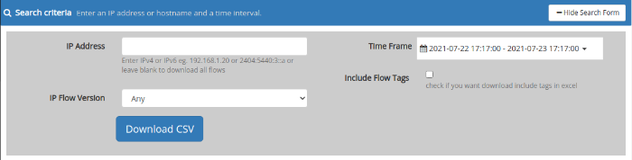

# Export flows

Export raw flows for an IP to a CSV File that can be imported into
Excel.

  
*Export IP Flows-Search Form*

#### Use cases

1. Compliance -quering by subscriber IP
2. Large scale workload - this tool creates the CSV file on the server
   , then downloads the file to the client.

## How to export flows by IP

:::note navigation

Select Tools -\>Export Flows

:::

### Search Criteria

1. **IP** this tool only allows exporting flows by IP as a special
   optimization
2. **Flow Tags** this option enables tagging internal and external ip
   and for nat ip.

## Using

Enter an IP address or hostname , select a time frame, and then press
the “Export to CSV” button
