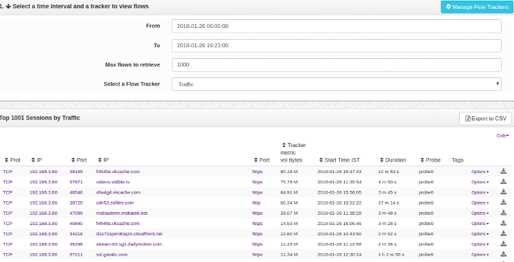

# Flow Trackers

Flow trackers are special filters to monitor top flows matching a set
criteria.

You can select any of the built in or custom flow trackers to view the
top flows in that tracker over the past 1 hour.

see [Flow Trackers](/docs/ug/flow/tracker.html) for more

  
*Flow trackers*

## How to use

:::note navigation

To access select Tools -\> Show all-\> Flow Tracker

:::

Any flow tracker you create will also show up in this list.

| Name            | Description                                                 |
| --------------- | ----------------------------------------------------------- |
| Traffic         | Show me top flows by total volume                           |
| Long lived      | Flows by duration                                           |
| Transferred out | Flows transferring maximum data OUT of my home network      |
| Transferred in  | Flows transferring maximum data INTO my home network        |
| Local Traffic   | Local traffic flows (both ends are within my home networks) |
| FilterFailed    | Flows that are not your standard http/https/pop/etc         |
