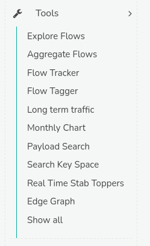

# Analysis Tools Reference

import DocCardList from '@theme/DocCardList';

Trisul offers a suite of tools, which are specialized utilities designed to analyze, process, and act upon network data, including packets, flows, and logs. These tools serve various purposes, such as extracting insights, detecting issues, and taking actions.

The following tools have already been comprehensively documented, providing detailed information on their functionalities and configurations. Click on any tool to explore them. 

- [:memo: Flow Tracker](/docs/ug/flow/tracker)
- [:memo: Flow Tagger](/docs/ug/flow/tagger)
- [:memo: Real Time Stab Toppers](/docs/ug/cg/stabber#real-time-stabber-toppers)
- [:memo: Edge Graph](/docs/ug/edges/)  

Moving forward this guide will explore the remaining undocumented tools within the Trisul platform. 

<DocCardList />

To access the complete toolset, navigate to the main menu in Trisul, where you will find the *Tools* option. Clicking on this option will reveal a dropdown menu listing all available tools as in the figure.    
    
*Figure: Tools*

