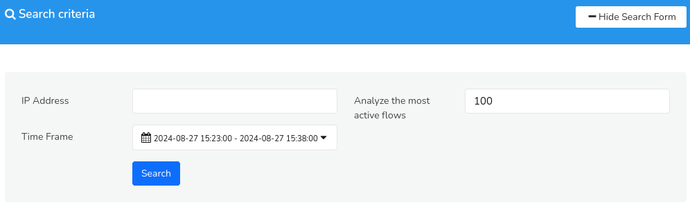

# Investigate IP Activity

Use this tool to analyze host activity over a timeframe. Trisul will look at traffic, flows, and alerts and produce a number of charts and tables summarizing the activity.

  
*Figure: Investigate IP*

## How to Use

:::note navigation

To access select Tools-> Investigate IP Activity

:::

##### Search Criteria

| Field                   | Description                                                                  |
| ----------------------- | ---------------------------------------------------------------------------- |
| IP Address              | Enter an IP or host name                                                     |
| From                    | From time                                                                    |
| To                      | To time                                                                      |
| Analyze the most active | Use the top 100 flows by volume to produce the conversation and peers report |
