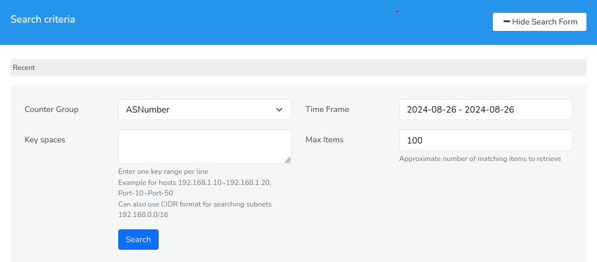
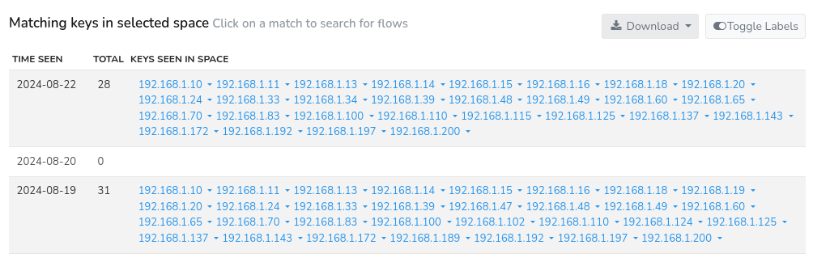
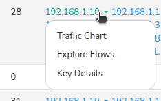

# Search Key Space

The *Search Key Space* tool allows you to search for activity for a range of keys lying within a certain lexicographic key space. The most useful application of this is to search for all activity within arbitrary IP network blocks.

> This tool is most used to search for activity within multiple IP blocks
> of known malicious traffic.

For example, Imagine you're a detective trying to catch the bad guys on the internet. You know they're hiding in certain areas (like specific IP addresses), but you don't know exactly where. The *Search Key Space* tool is like a superpower that helps you search for clues (activity) in those areas.  

## Using the Key Space Search Tool

To access Trisul's *Search Key Space* tool,
:::info navigation

Select Tools -> Click Search Key Space

:::
The following *Search criteria* form opens up with the [*Hide/ Show Search Form*](/docs/ug/ui/elements#hide-show-search-form) option.

*Figure: Search Key Space Tool*

You can begin your search in the *Search Key Space* form by populating the search criteria fields with the help of following fields and their descriptions.

| Field                                              | Description													|
|----------------------------------------------------|--------------------------------------------------------------|
| Counter Group                                      | Selects the metrics to analyze 								|
| [Time Frame](/docs/ug/ui/elements#time-selector)   | Defines the time period of retrieval							|
| Max items 					               	     | Limits the number of results returned 						|
| [Key Space](/docs/ug/tools/keyspace#key-space-list)| Specifies the search scope such as IP address ranges  	    |

Once providing all these search criteria, Click Search.

#### Key Space List

- **Specifying Key Space**  
  - To define a key space, use the format `key_from~key_to`, where the tilde (~) character separates the start and end values.  
For example: `192.168.1.10~192.168.1.200`.
Note that both `key_from` and `key_to` values are inclusive in the search.   
  - You can also use CIDR format for searching subnets like `192.168.0.0/16` This includes all IP addresses with the first 2 octets (192.168) and any values for the last 2 octets (0.0 to 255.255)
- **Entering Multiple Key Ranges**  
To search across multiple key ranges, enter each range on a new line.   
For example:   
`192.168.1.10~192.168.1.200`  
`192.168.2.100~192.168.2.250`  
This format allows you to specify multiple key ranges for a single search query.
- **Keys Other Than IP Addresses**  
You can enter any arbitrary key.  
For example, you can enter the keyspace `P~Z` in the country counter group to pull up activity for country codes
between PA and ZZ.

## Results

The results will be generated for the search criteria immediately upon *Search Key Space* form submission. The maximum number of unique matches for each day specified by you are displayed as output as in the below sample.

  
*Figure: All activity is flagged per day. Click to bring up list of flows.*

The search result displays the matching keys in selected space with the following data.

| Columns             | Description                                                                      |
|---------------------|----------------------------------------------------------------------------------|
| Time Seen           | The timestamp when the key was last seen i.e., most recent activity of the key   |
| Total               | The total number of keys present within the specified criteria                   |
| Keys Seen in Space  | A list of unique keys that were found within the specified search space.         |

You can further perform a number of functions and analysis from the search result including,

- [**Download**](/docs/ug/ui/elements#download-button)  
You can the download the result in three easy formats by clicking on the *Download* button at the upper right hand side.
- [**Toggle Labels**](/docs/ug/ui/elements#toggle-labels)  
Enable the *Toggle Labels* button on the upper right hand side if you would like to display the labels on the search result or in the downloaded file.

## Keys Drilldown
From the search results, you can delve deeper into individual keys by clicking on any key from the *Keys Seen in Space* list.

  
*Figure: Drilldown options for each key in Key Space list*

This reveals a set of options to further explore each key including,

**[Traffic Chart](/docs/ug/cg/retrotools#show-traffic-chart-for-an-item)**  
Displays a graphical representation of traffic volume and trends associated with the selected key, providing a visual understanding of its activity patterns.  
**[Explore Flows](/docs/ug/tools/explore_flows)**   
Presents a detailed view of network flows related to the key, offering insights into communication patterns, protocols, and endpoints. (Available for host and port keys only)  
**[Key Details](/docs/ug/ui/key_dashboard)**   
Shows comprehensive metadata and attributes associated with the key, including its properties, behavior, and context.

