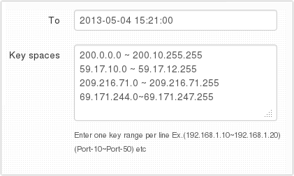
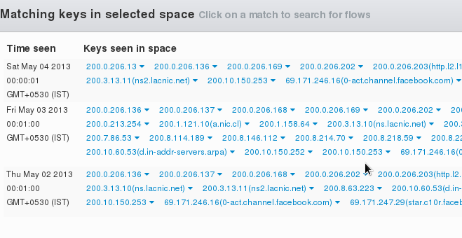

# Search Key Space

The Search Key Space tool allows you search for activity for all keys
lying within a certain lexicographic key space. The most useful
application of this is to search for all activity within arbitrary IP
network blocks.

> This tool is most used to search for activity within multiple IP blocks
> of known malicious traffic.

## Using the Key Space Search tool

:::note navigation

Select Tools -\> Search Key Space

:::

1. Select a time frame
2. Select a counter group  
3. Select Hosts if you are looking for netblock matches
4. Enter a list of non-overlapping key spaces

#### Key space list

The key space is entered as `key-from~key_to` Note that is a tilde
character not a hyphen. Multiple key ranges can be entered one per line.

#### Keys other than IP addresses

You can enter any arbitrary key. For example you can enter the keyspace
`P~Z` in the country counter group to pull up activity for country codes
between PA and ZZ.

## Results

1. The top 25 unique matches each day are shown separately.
2. If the keys are hosts or ports, you can pull up the flows
3. For all keys you can cut through to the key dashboard to access
   other tools

Top 25 matches per day is a reasonable limit
for human analysis. If you see a lot of matches you may want to narrow
the key space and try again.

  
*All activity is flagged per day. Click to bring up list of flows.*
