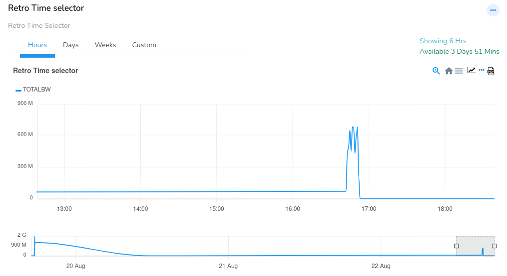
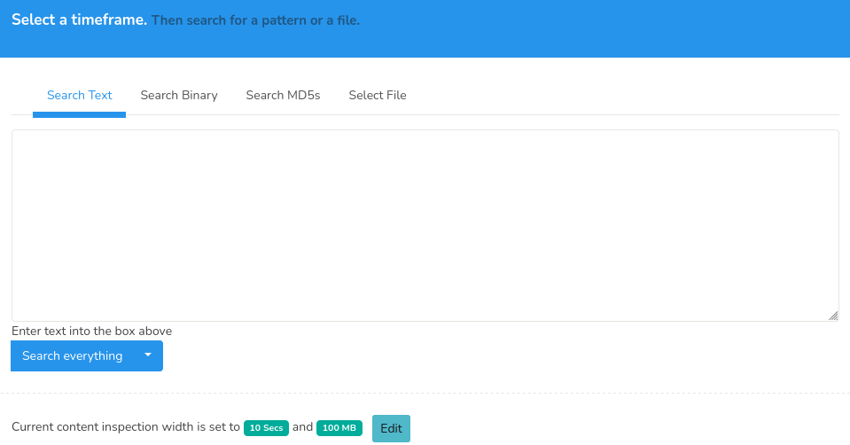
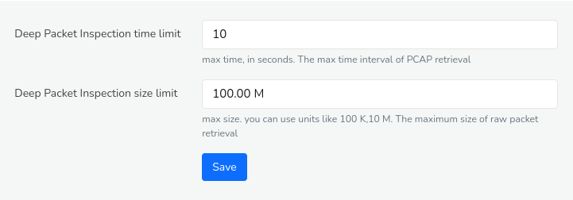
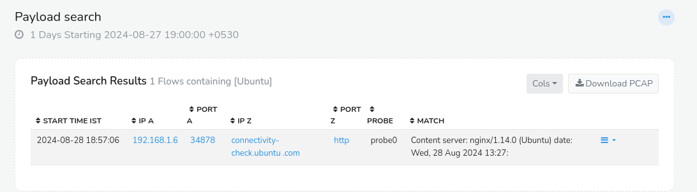
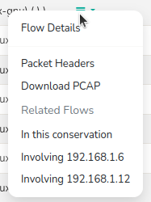

# Payload Search
PCAP Mode Only  

The *Payload Search* Tool is a feature in Trisul that enables searching of network traffic for specific patterns, leveraging full packet capture capabilities. This section provides a comprehensive guide to using the *Payload Search* Tool, including its search capabilities and functionality.

The search capabilities of the *Payload Search* tool includes searching for,

1. Text patterns UTF-8 and Unicode also supported
2. Binary
3. MD5s
4. File content

### How This Works

> Make sure you have full packet capture and flow tracking enabled in the [trisulConfig.xml](/docs/ref/trisulconfig) file

Trisul will reassemble and check all TCP streams in both directions for
a match. If HTTP compression and chunked encoding are used, they are
also factored in. Finally Trisul will show you a list of flows that
match along with a highlighted context.

## How to Use

To access *Payload Search*,

:::note navigation

:point_right: Go to Tools &rarr; Select Payload Search

:::

This opens up page with *Retro Time Selector* and a box of tabs for *Search Criteria* where you can define a time range and search for specific data.

### Retro Time Selector

The *Retro Time Selector* module provides a graphical representation of aggregate bandwidth (*TOTALBW*) utilization over user-defined time intervals. 

*Figure: Retro Time Selector for Payload Search*

This feature enables users to visually inspect and select specific time ranges within the chart, with pre-configured options for hourly, daily, and weekly analyses, as well as customizable date ranges via selection from tabs.

### Search Criteria

The Payload Search Tool enables searching for specific data within network packet payloads, allowing for the identification of text strings, binary data, MD5 hashes, and file content.

*Figure: Payload Search*

You can use the *payload search* form to search for a pattern or a file with the help of the following fields and their description.

| Field         | Description                                                                     |
| ------------- | ------------------------------------------------------------------------------- |
| Search Text   | Enter a text string. Can be ASCII, Unicode, UTF-8.                              |
| Search Binary | Enter binary into the box as a series of HEX characters. Eg, 80 A0 A1 88 01 01 .. (whitespaces are ignored)                                                                          |
| Search MD5s   | Enter a list of content MD5 hashes. One MD5 per line, (whitespaces are ignored) |
| Select File   | Upload a file and search for matches                                            |

Click **Search Everything**, you will be shown a list of flows that match. You can also click on the small down arrow icon on the *Search Everything* button which allows you to search the firt 1 MB of each flow.

### Content Inspection Width Configuration

The *Content Inspection Width* parameter defines the limits for deep packet inspection (DPI) in terms of:
Deep Packet Inspection Time Limit: The maximum duration for which DPI is performed on a packet stream.
Deep Packet Inspection Size Limit: The maximum payload size (in KB,MB) that is inspected.

You can find the *Content Inspection Width* at the bottom of the *Payload Search* form with an *Edit* button as in this figure.

  
*Figure: Content Inspection Width*

You can click *Edit* button at the bottom of the *Payload Search* form. This will take you  to the *Web Trisul* page for configuration.

*Figure: Configure Content Inspection Width*

Once providing the DPI time limit and size limit, click *Save*

Configuring Content Inspection Width is beneficial when working with large PCAP files that span extended periods or contain vast amounts of data. By adjusting these limits, users can optimize DPI performance and focus on relevant packet content and reduce processing overhead.

## Search Result

Upon executing a search query, the *Payload Search* Tool displays a list of matching network flows. 

 
*Figure: Payload Search- Search Result*

The search result data includes the following details.

| Column         | Description                                                                                |
|----------------|--------------------------------------------------------------------------------------------|
| START TIME IST | The timestamp (in Indian Standard Time) when the match was found                           |
| IP A           | The source IP address of the network packet that matched the search criteria               |
| PORT A         | The source port number of the network packet that matched the search criteria              |
| IP Z           | The destination IP address of the network packet that matched the search criteria          |
| PORT Z         | The destination port number of the network packet that matched the search criteria         |
| PROBE          | The name of the probe that captured the network traffic containing the match               |
| MATCH          | A snippet of the payload that matched the search criteria, providing context for the match |                 

Each column in the search result table are sortable, enabling users to rearrange data in ascending or descending order by clicking the adjacent arrow(up/down) button, for flexible data analysis and visualization.

### Column Button

The **Column button** on the upper right-hand corner of the search result table serves as a dropdown menu, that allows you to select and customize the columns displayed in the search results. You can choose from a range of available column options, thereby tailoring the display to include only the most relevant information for your specific needs.

### Download PCAP button

Users can then select the [**Download PCAP**](/docs/ug/ui/elements#download-pcap-button) option to retrieve the associated packet capture file for further detailed examination using specialized tools and offline investigation.

### Drilldown Options

By clicking on the drilldown button corresponding to each matching packet in the search results. You can access additional detailed information and perform further functions.

  
*Figure: Drilldown Options for Payload Search Result*

The drilldown options include the following details.

| Option                   | Description                                                                         |
|--------------------------|-------------------------------------------------------------------------------------|
| Flow Details             | Displays comprehensive metadata about the network flow, including endpoints, flow stats, timing, and netflow.
| Packet Headers           | Shows the raw packet headers for the selected flow in strings, hexdump and Tshark   |
| Download PCAP            | Allows you to download the PCAP for the selected flow
| In this Conversation     | Displays all flows involving conversation of the original matching flow, providing context on other network activity related to this IP address.                                                    |
| Involving SOurce IP      | Displays all flows involving the source IP address of the original matching flow, providing context on other network activity related to this IP address.                                          |
| Involving Destination IP | Displays all flows involving the destination IP address of the original matching flow, providing context on other network activity related to this IP address.                                    |

## API Access

Using the [Trisul Remote Protocol](/docs/trp/) you can even automate the whole process.
