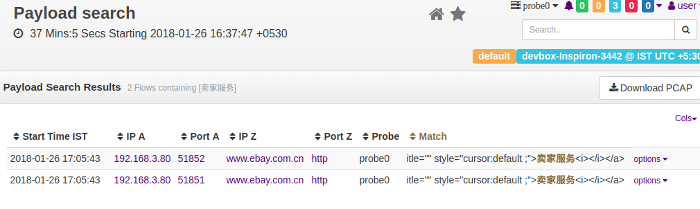

# Payload Search

If you have full packet capture enabled, you can search your network
traffic for patterns. Trisul gives you a point and click interface that
makes it dead simple and intuitive.

You can search for

1. Text patternsUTF-8 and Unicode also
   supported
2. Binary
3. MD5s
4. Select a file

  
*Figure. Search for text, binary, or files within HTTP traffic.*

### How this works

> Make sure you have full packet capture and flow tracking enabled in the [trisulConfig.xml](/docs/ref/trisulconfig) file

Trisul will reassemble and check all TCP streams in both directions for
a match. If HTTP compression and chunked encoding are used, they are
also factored in. Finally Trisul will show you a list of flows that
match along with a highlighted context.

:::note For maximum benefit, you
need to use *Payload Search* in conjunction with a network forensic
reconstruction tool like Unsniff Network Analyzer. Wireshark can also
help in a limited way here.

:::

## How to use

:::note navigation

To access select Tools -\> Payload Search

:::

First select a time frame from the top panel. Then enter the search
criteria

#### Search Criteria

You can enter text, binary, or select a file from your local drive.

| Field         | Description                                                                     |
| ------------- | ------------------------------------------------------------------------------- |
| Search Text   | Enter a text string. Can be ASCII, Unicode, UTF-8.                              |
| Search Binary | Enter hex. White space and newlines are ignored.                                |
| Search MD5s   | Enter a list of content MD5 hashes. One MD5 per line, (whitespaces are ignored) |
| Select File   | Upload a file and search for matches                                            |

Press **Find**, you will be shown a list of flows that match.

#### Flow list

You are shown a list of matching flows along with the pattern
highlighted. This gives you some context about the pattern, so you can
decide if that particular match if worth investigating further.

- You can then click on the “Get packets in PCAP format”.

You can then open the PCAP file in a deep forensics tool like Unsniff
for further analysis.

### API Access

Using the [Trisul Remote Protocol](/docs/trp/) you can even automate the whole process.
