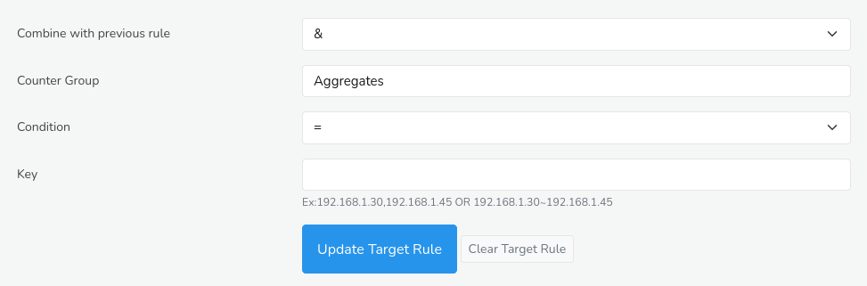

# Rule Builder

The Rule Builder is a powerful tool designed to help you create, manage, and deploy custom rules for various applications, including flow taggers, custom metering,etc. With the Rule Builder, you can define specific  conditions to identify and act upon relevant data for streamlining your analysis.

## Trisul Rule Format

See [Trisul Filter Format](/docs/ref/trisul_filter_format#format) section for more details

## How to Use

:::info navigation

:point_right: Go to Tools &rarr; Select Rule Builder

:::

*Figure: Rule Builder*

You can fill in the *Rule Builder* form to build your rule with the help of the following options and their descriptions.

| Options                          | Description                                                                   |
| -------------------------------- | ----------------------------------------------------------------------------- |
| Combine with previous expression | Whether to AND or OR this expression with what is already in the *Tagger Rule* box above. You can ignore for simple expressions                                                                   |
| Counter Group                    | Select a counter group which you want to match                                |
| Condition                        | Select EQUALS or NOT EQUALS, this operator applies to the key field           |
| Key                              | Keys to match from the counter group selected. The text below the box has examples of key formats. You can specify multiple keys by using commas                                             |

Once you have filled in the required fields, click the *Update Target Rule* button to generate a rule string in Trisul filter format. This output will be displayed in the designated output box right below the *Rule Builder*, where it can be copied and pasted into your desired application.
