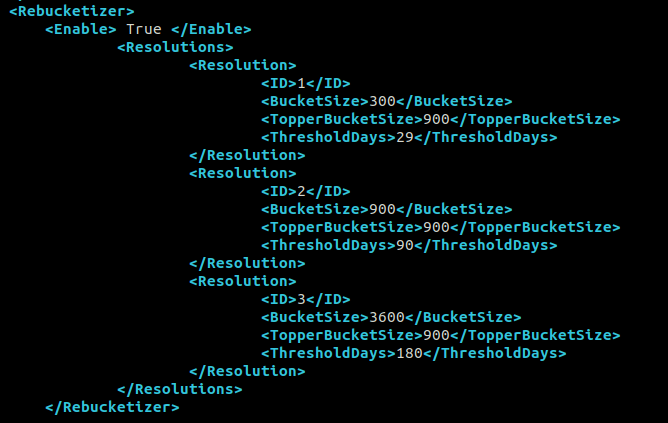

# The Bucketizer

## Overview

The Trisul Bucketizer tool is a performance optimization feature that enables Trisul to efficiently handle high-resolution time series data. It achieves this by:
Maintaining Multiple Resolutions of Data.


## Functionality

Trisul stores time series data at multiple resolutions, including:
- High-resolution data (example, 1-minute intervals): Detailed data suitable for short-term analysis.
- Lower-resolution data (example, 5-minute, 15-minute intervals): Aggregated data suitable for long-term analysis.

When querying large time windows, Trisul automatically switches to lower-resolution data.

##Configuration

The Bucketizer tool can be configured using the following parameters:

  
*Figure: Sample of Bucketizer Configuration*

**Configuration Parameters**

**BucketSize**: The bucket size in seconds.
**TopperBucketSize**: The Topper bucket size in seconds.
**ThresholdDays**: The number of days to count in that bucket size before switching to a lower resolution.

**Example Configuration**
```
<BucketSize>300</BucketSize>
<TopperBucketSize>900</TopperBucketSize>
<ThresholdDays>29</ThresholdDays>
```
This configuration sets the bucket size to 5 minutes (300 seconds) and switches to a lower resolution after 30 days.

**Parameters Reference** 

|Parameter | Description |	Default Value |
|----------|-------------|----------------|
|BucketSize	| Bucket size in seconds |	300 |
|TopperBucketSize |	Topper bucket size in seconds |	900 |
| ThresholdDays |	Number of days to count before switching to lower resolution |	29 |