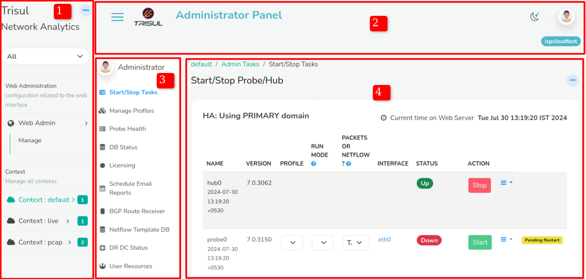
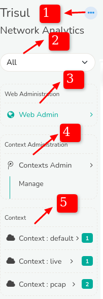
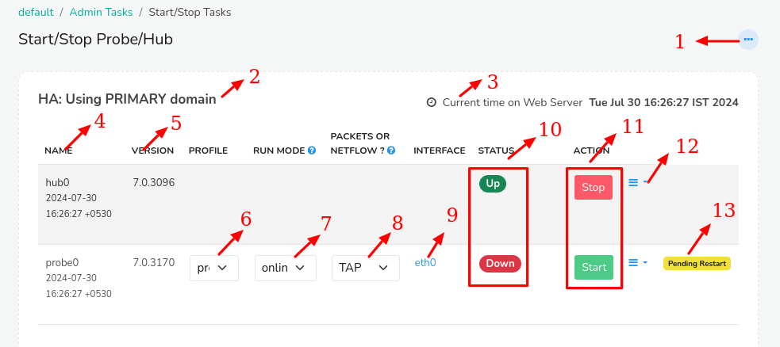
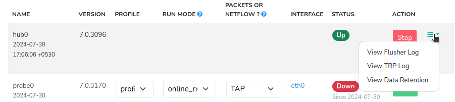
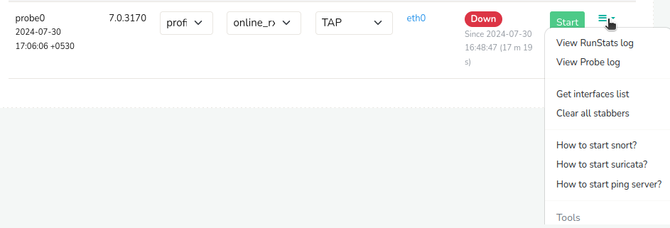

# Admin Layout

When you login as admin you will see the admin layout which is different from the user layout.

The Admin panel consists of the following elements,

1) ## Admin Menu
   
   
   
   1) The three dots on the top right corner of the context menu is the **shortcut menu** where you can quickly navigate to home, users, settings, and apps from any page.
   
   2) The **Tenants toggle** dropdown helps you switch between different contexts.
   
   3) Clicking on **Web Admin** you can manage admin settings, manage users, and manage UI settings.
   
   4) By clicking on the **Context Manager** menu, it allows you to change context names and descriptions only.
   
   5) Clicking on **Context Menu** helps you manage each context separately. By default it is set in Context:default but you can add more contexts to this menu. 

2) ## Top Panel
   
   The top panel of admin layout is similar to the [top panel](/docs/ug/ui/userlayout#top-panel-details) of the user layout.

3) ## Manage Menu
   
   The manage menu is the expansion of the menu items clicked from Admin menu that shows up sub menus of that particular menu item.

4) ## Start/Stop Tasks
   
      
   
   1) Click on the three dots on the top right corner of the start/stop tasks and click Set as home if you would like to set this as your home page.
   
   2) On the top left you can see the name of the domain trisul is running on
   
   3) Adjacent to the domain name on the right, the current time on the web server is displayed.
   
   4) Name of the tasks say hub/probe are given in the table. By default it is hub0 and probe0 for primary.
   
   5) You can check if you are running a recent version by checking on the version name in the second column of the table
   
   6) Clicking on the profile drop down shows a list of profiles under probe0. By default it is profile0.
   
   7) The run mode drop down list shows the packet capture algorithms used by the probe. Even in Netflow mode Trisul uses packet capture.
   
   8) You can switch between netflow mode or packet capture mode by clicking on the drop down list and set it.
   
   9) Shows the interface name. eth0 is the interface name for probe0 by default.
   
   10) You can check the status of hub0 and probe0 and start/stop the tasks clicking on start/stop.
   
   11) If you click the three lines againts the hub0 it will show you the following menu
       
       
       
       If you click on the three lines against the probe0 it will show the following menu
       
       
