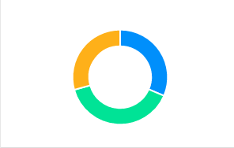
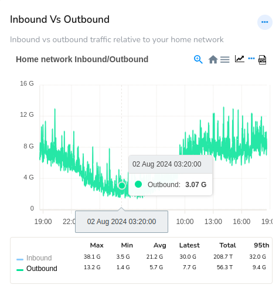

# Chart and Chart Interactions

Trisul supports a number of intuitive chart surfaces that render the statistical data in a rich interactive way. And you can drilldown on the chart using [*Chart Interaction Controls*](/docs/ug/ui/charts#chart-interaction-controls) and [*Legend Table*](/docs/ug/ui/charts#legend-table). Many modules allow you to select a chart surface and enable you to view the data at that particular point of time.

## Trisul Chart Surfaces

These are some of the intuitive chart surfaces in Trisul. 

|                                    |     |                               |
| ---------------------------------- | --- | ----------------------------- |
| PIE                                |     | MRTG                          |
|          |     |    |
| STACKEDAREA                        |     | LINE                          |
|  |     |    |
| SQUARELINE                         |     | BUBBLE                        |
|   |     |  |
| BAR                                |     | AREA                          |
|          |     |    |
|                                    |     |                               |

## Chart Engagements
Here are some chart UI engagements with charts that enable you to engage with charts, and gain deeper insights and data analyses:
- **Zoom In**: Drill down to a specific data point or range for a more detailed view  
- **Zoom Out**: View the broader data landscape to understand trends and patterns
- **Hover**: Display additional information or context on [Tooltips](/docs/ug/ui/charts#tooltip) when hovering over a data point  
- **Pan**: Move the chart view to focus on a specific data range or trend  
- **Highlight**: Click and select an area on the chart to highlight which views the detailed view of the highlighted area for high resolution insights.

## Chart UI Elements

There are a number of interactive functionalities that are available for the charts to drilldown for further data analyses.

*Figure: Chart Elements*

1) [Ellipsis Menu](/docs/ug/ui/charts#ellipsis-menu)
2) [Chart Interaction Control Icons](/docs/ug/ui/charts#chart-interaction-controls)
3) [Tool Tip](/docs/ug/ui/charts#tooltip) 
4) [Legend Table](/docs/ug/ui/charts#legend-table)

### Ellipsis Menu

Ellipsis Menu is a three dots button at the upper right hand side of the Chart module. It serves as a convenient way to access additional customizations and functionalities without cluttering the Chart interface. Click on the Ellipsis menu to: 

**Customize**: Tailor the chart's appearance and settings to suit your needs.  
**View Historical Data**: Access and view past historical data points and trends.  
**Remove from Dashboard**: Delete the selected chart module from your current dashboard layout.  
**Disable**: Temporarily deactivate the chart, preserving its settings for future reactivation.

*Figure: Ellipsis Menu of a Chart Module*

### Chart Interaction Controls

*Chart Interaction Controls* are small icons that appear atop search results or modules that contain the visual graphics like charts. These icons provide a visual interface to facilitate interactive functionalities, thereby allowing you to engage with the chart data and perform various operations to extract deeper insights.

These are the *Chart Interaction Control* icons that can be found in various modules across the platform.

*Figure: Chart Interaction Control Icons*

Below you can find the *CHart Interaction Control* icons explained from right to left of the sample image.
- **PDF**- Click on the PDF icon on the top right corner of the module to download the chart data in PDF.

- **Key Dashboard**- Click on the Key Dashboard icon to view and edit the Key details of this module

- **Live SNMP**- To view the Live data i.e., until the latest one minute click Live SNMP icon and it gets refreshed every 10 seconds. This icon is not available on all modules rather on relevant ones.

- **Menu**- Click on the three lines icon and select from the list of download options SVG, PNG and CSV to donwload in that particular format

- **Home**- Click on the home icon to reset zoom.

### Tooltip

Hover your mouse over an item such as a PIE slice or line graph and get a tooltip with values at different intervals as shown in the figure.

*Figure: Showing Tooltip in a Graph Module*

### Legend Table

*Legend tables* are interactive chart legends where you can click on a chart item in the legend area to toggle its visibility, showing or hiding the corresponding data series in the chart.

|  |
| --------------------------- |

*Figure: Showing Legend Table in a Module*

Example: In the above chart, both Inbound and Outbound items are initially enabled. Clicking on either item in the legend will hide or show its associated data as shown in the charts below.

|  |  |
| ----------------------- | ----------------------- |
| *Click on Inbound: Only Inbound data is showing* | *Click on Outbound: Only Outbound data is showing* |

*Figure: Showing Hide/Unhide data from Chart using Legend Table Meters*

**Auto Refresh Statistical Summaries**  
Charts are updated automatically via Ajax calls, ensuring real-time data visualization.  
*Legend Table* Includes statistical summaries for each network traffic search result, such as:
- Max
- Min
- Average
- Total
- 95th percentile

### Retro Charts

*Retro Charts* in Trisul retrieves graphical representation of past historical analysis data, that enables you to selectively retrieve and visualize historical network traffic patterns and trends within a specified temporal range.

1) Click on the [*ellipsis menu*](/docs/ug/ui/charts#ellipsis-menu) from any chart and click *View historical* to view the retro chart of that particular module

*Figure: View Historical Option from Module Toolbar*

2) Select a [time frame](/docs/ug/ui/elements#time-selector) and view the retro chart for that particular past time period.

  

*Figure: Retro Chart with Time Frame*

The retro charts are even more interactive :  

- Click and select an area  

- Zoom into a selection  

- Pan left and right  

- Use the selected time interval to perform drill down retro analysis

### Range Slider 

A *Range Slider* in a chart module allows you to view a broader time range providing context and helping identify trends on a bigger picture. 

*Figure: Range Slider*

So you can select a specific time period by dragging the slider handles to choose a precise time interval, focusing on a specific segment of data. And the chart updates to display only the selected time period, allowing for detailed analysis.

### Retro Tabs
The *Retro Tabs* feature provides a user interface element that enables users to segment and display temporal data in various time-based categories.

*Figure: Retro Tabs*

The time-based tabs include:

  **Hours** Tab: Displays data aggregated at an hourly granularity, showcasing intra-day trends and patterns.  
  **Days** Tab: Presents data on a daily basis, highlighting day-to-day variations and longer-term trends.  
  **Weeks** Tab: Segments data into weekly intervals, facilitating analysis of week-over-week patterns and seasonality.  
  **Custom** Tab: Redirects users to the [Time Selector](/docs/ug/ui/elements#time-selector), allowing for flexible, user-defined time ranges and custom data segmentation.

By selecting a Retro Tab, users can effortlessly switch between different time-based views of their data, and visualize how their data changes and evolves over time.

### PCAP Availability 
PCAP Mode Only

The chart features a visual indicator to denote the availability of PCAP (Packet Capture) data during specific time periods. This indicator is displayed as a light yellow color overlay on the chart, highlighting the time ranges where PCAP data is available.

*Figure: The Light Yellow Color Indicating PCAP Availability*

>**Interpretation**:  
>Time periods with a light yellow overlay indicate that PCAP data is available for that specific interval.  
>The absence of the light yellow overlay indicates that PCAP data is not available for that time period.

