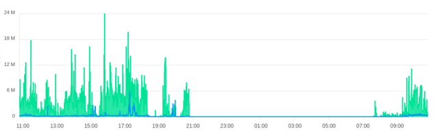
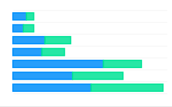
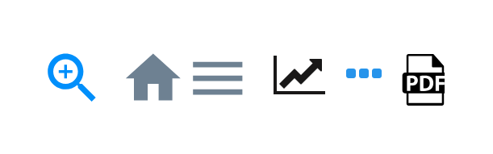
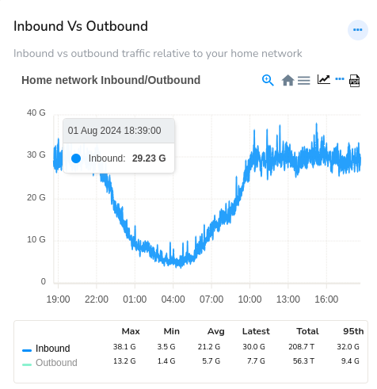

# Chart and Chart Interactions

Trisul supports a number of intuitive chart surfaces that render the statistical data in a rich interactive way. And you can drilldown on the chart using module icons and legend table. Many modules allow you to select a chart surface and enables you to view the data at that particular point of time.

## Trisul Chart Surfaces

These are some of the intuitive chart surfaces in Trisul. 

|                                    |     |                               |
| ---------------------------------- | --- | ----------------------------- |
| PIE                                |     | MRTG                          |
|          |     |    |
| STACKEDAREA                        |     | LINE                          |
|  |     |    |
| SQUARELINE                         |     | BUBBLE                        |
|   |     |  |
| BAR                                |     | AREA                          |
|          |     |    |
|                                    |     |                               |

## Chart UI Elements

There are a number of interactive functionalities that are available for the charts to drilldown for further data analyses.

*Figure: Chart Elements*

1) [Chart Interaction Control Icons](/docs/ug/ui/charts#chart-interaction-controls)
2) [Legend Table](/docs/ug/ui/charts#legend-table)
3) [Tool Tip](/docs/ug/ui/charts#tooltip) 

## Chart Engagements
Here are some chart UI engagements with charts that enable you to engage with charts, and gain deeper insights and data analyses:
- **Zoom In**: Drill down to a specific data point or range for a more detailed view  
- **Zoom Out**: View the broader data landscape to understand trends and patterns
- **Hover**: Display additional information or context on [Tooltips](/docs/ug/ui/charts#tooltip) when hovering over a data point  
- **Pan**: Move the chart view to focus on a specific data range or trend  
- **Highlight**: Click and select an area on the chart to highlight which views the detailed view of the highlighted area for high resolution insights.

### Chart Interaction Controls

*Chart Interaction Controls* are small icons that appear atop search results or modules that contain the visual graphics like charts. These icons provide a visual interface to facilitate interactive functionalities, thereby allowing you to engage with the chart data and perform various operations to extract deeper insights.

These are the *Chart Interaction Control* icons that can be found in various modules across the platform.

*Figure: Chart Interaction Control Icons*

Below you can find the *CHart Interaction Control* icons explained from right to left of the sample image.
- **PDF**- Click on the PDF icon on the top righ corner of the module to download the chart data in PDF.

- **Key Dashboard**- Click on the Key Dashboard icon to view and edit the Key details of this module

- **Live SNMP**- To view the Live data i.e., until the latest one minute click Live SNMP icon and it gets refreshed every 10 seconds. This icon is not available on all modules rather on relevant ones.

- **Menu**- Click on the three lines icon and select from the list of download options SVG, PNG and CSV to donwload in that particular format

- **Home**- Click on the home icon to reset zoom.

### Legend Table

*Legend tables* are interactive chart legends where you can click on a chart item in the legend area to toggle its visibility, showing or hiding the corresponding data series in the chart.

|  |
| --------------------------- |

*Figure: Showing Legend Table in a Module*

Example: In the chart, both Inbound and Outbound items are initially enabled. Clicking on either item in the legend will hide or show its associated data.

|  |  |
| ----------------------- | ----------------------- |

*Figure: Showing Hide/Unhide data from Chart using Legend Table Meters*

**Expand Legend**  
Click to view a detailed legend, providing additional information.

**Auto Refresh**  
Charts are updated automatically via Ajax calls, ensuring real-time data visualization.  
*Legend Table* Includes statistical summaries for each network traffic search result, such as:
- Max
- Min
- Average
- Total
- 95th percentile

### Tooltip

Hover your mouse over an item such as a PIE slice or line graph and get a tooltip with values at different intervals.

*Figure: Showing Tooltip in a Graph Module*

### Retro Charts

Retro Charts in Trisul retrieves graphical representation of past historical analysis data, that enables you to selectively retrieve and visualize historical network traffic patterns and trends within a specified temporal range.

1) Click on any of the module toolbar and click *View historical* to view the retro chart of that particular module

*Figure: View Historical Option from Module Toolbar*

2) Select a [time frame](/docs/ug/ui/elements#time-selector) and view the retro chart for that particular past time period.

  

*Figure: Retro Chart with Time Frame*

The retro charts are even more interactive :  

- Click and select an area  

- Zoom into a selection  

- Pan left and right  

- Use the selected time interval to perform drill down retro analysis
