# Dashboards

In the ["Introduction to Dashboards and Modules"](/docs/ug/ui/dashmod_intro) section, we’ve already covered what a dashboard is, how to view one, and how to use the dashboard-level menu options.

## What You Can Do with Dashboards

This section shows you all the ways you can use and customize dashboards in Trisul. You’ll learn how to switch between different views, add or remove modules, move them around, change what each module shows, create your own dashboards from scratch, and share them with others.

### Toggle between views

:::info navigation
:point_right: Go to Dashboard &rarr; Show All
:::

Click on the **toggle button** on the upper right corner to switch between list view and tiles view of the dashboards.

| List view | Tiles view |
|-----------|------------|
|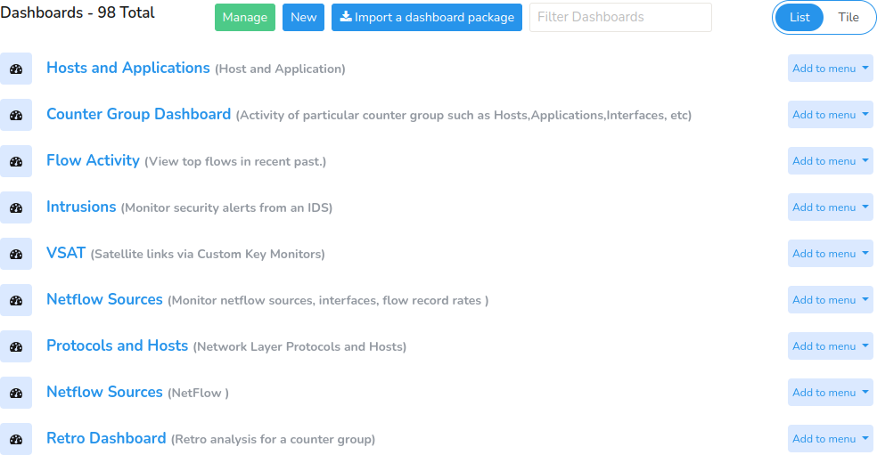 | 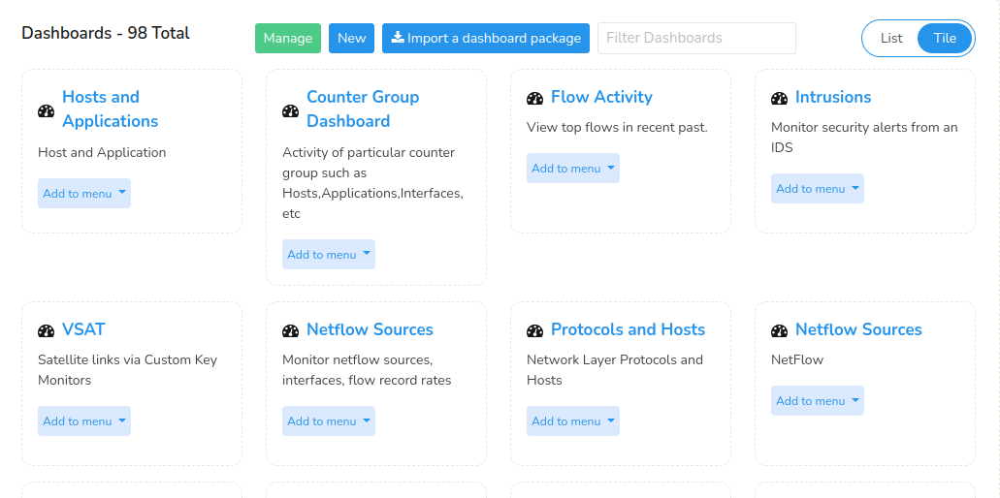 |
|Displays items in a vertical list format for easy scrolling and comparison. | Presents items as clickable tiles for a visually oriented browsing experience. |

### Add a Dashboard

To create a dashboard,

:::info path
:point_right: Go to Dashboard&rarr; Show all&rarr; New

:::

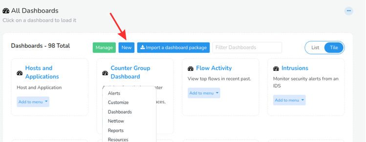

*Figure: All Dashboards*

Once you click the **New** button, a **Create a new dashboard** window opens up (like in the figure below) with the following fields.

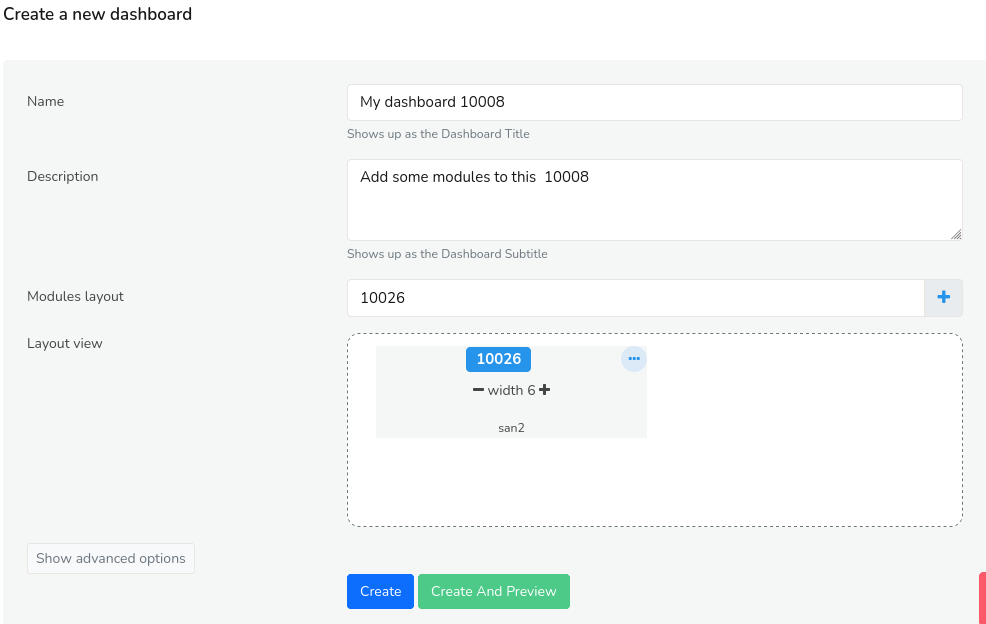

*Figure: Customize a Dashboard*

| Fields         | Description                                                              |
| -------------- | ------------------------------------------------------------------------ |
| Name           | Enter the name of the dashboard                                          |
| Description    | Enter a short description of the dashboard                               |
| Modules Layout | Click on the Plus icon and select from the list of modules you would like to add to this dashboard                                                                                   |
| Layout View    | You can view the layout of the added modules as it appears on the dashboard here. You can also rearrange by clicking dragging to the desired position and adjust the width of each modules. |

Once you have filled all the fields, Click Create.

You have now succesfully created a new dashboard!

#### Advanced Options

To configure advanced settings while creating a dashboard, click the **Show Advanced Options** button.

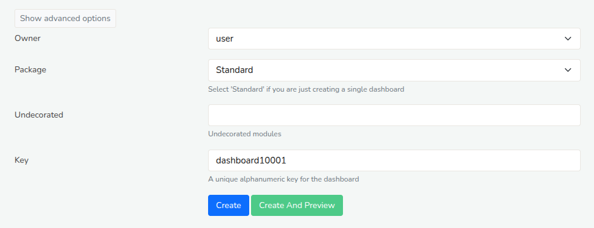  
*Figure: Showing Advanced Options in Creating a Dashboard*

Fill in the following fields to configure the advanced settings.

| Fields         | Description                                                              |
| -------------- | ------------------------------------------------------------------------ |
| Owner          | Specifies which user or user group has edit and view privileges for the dashboard.|
| Package        | A collection or group the dashboard belongs to, used for organizing dashboards. |
| Undecorated    | If enabled, displays the dashboard only with data without titles, borders, or other UI elements.  |
| Key            | A unique identifier used to reference the dashboard programmatically.    |

Once you have filled all the fields, Click Create/Create and Preview.

You have now succesfully created a new dashboard with advanced configurations!

### Explore a Newly Added Dashboard

Once you create a new dashboard, you’ll be taken to the dashboard panel where your added modules are displayed. Here, you can start viewing and monitoring the metrics for each module. The dashboard shows graphical charts for the selected meters, along with the following elements.

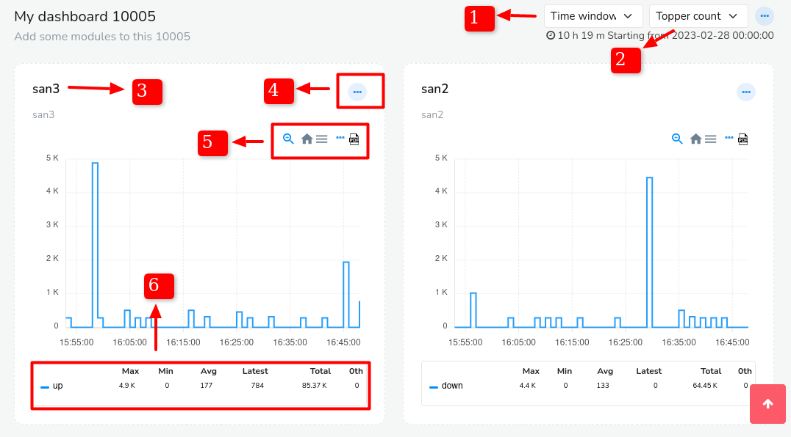

*Figure: Dashboard Components*

1) #### [Time Selector](/docs/ug/ui/elements#time-selector)
   
   You can set the time window for the selected dashboard from 5 mins to any desirable time by choosing a custom time and date.

2) #### Topper Count
   
   You can choose from 5 to 500 topper counts for the current dashboard.

3) #### Module Name and Description
   
   Displays the name of the module and a short description

4) #### Module Toolbar
   
   Displays the description of the module.

5) #### Chart Interaction Control Icons
   
   The [Chart interaction controls](/docs/ug/ui/charts#chart-interaction-controls) are useful in traversing the graphical chart in detail.

6) #### Legend Table
   
   This table gives you a quick output of values including Max, Min, Avg, Latest, Total and 0th Percentile. If you have added more than one metrics the same will be reflected for each metrics differentiated by color.

### How to Add a Dashboard to the Menu

:::info navigation

:point_right: Dashboards&rarr; Show All

:::

Click the **Add to Menu** button on the dashboard you want to make easily accessible from the main menu.

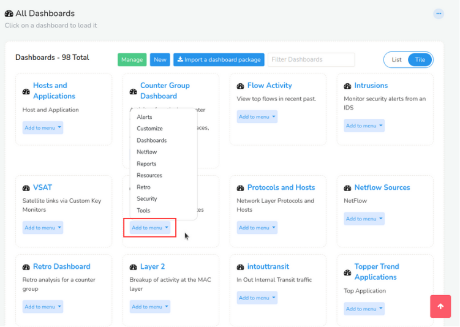

*Figure: Add a Dashboard to Menu*

That’s it! The dashboard is now part of the main menu, and you can quickly access it anytime with just one click.

### How to Remove a Dashboard From the Menu

:::info navigation

:point_right: Go to Customize&rarr; UI&rarr; Menu Manager
:::

There will be a list of all dashboards. 

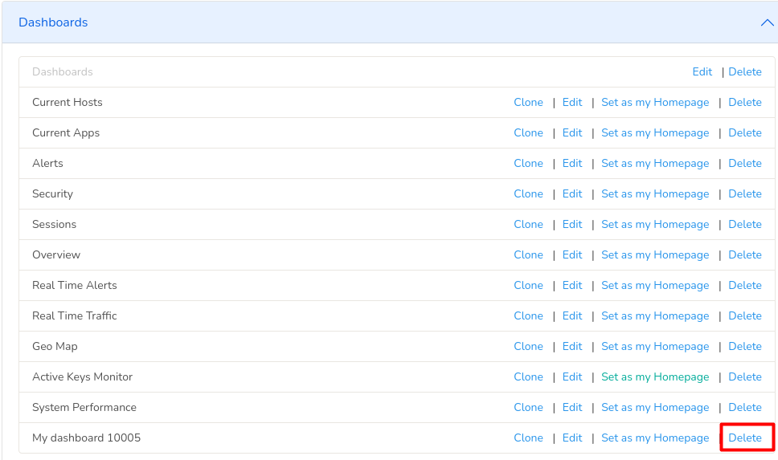

*Figure: Remove a Dashboard from the Menu*

Find the dashboard you would like to remove from the menu and Click **Delete**. This will only remove the dashboard from the menu and your dashboard itself will not be deleted.

### How to Edit a Dashboard

To edit a Dashboard, from the list of dashboards go to the dashboard you would like to edit. And click on the [Dashboard Menu](/docs/ug/ui/dashmod_intro#dashboard-menu-button) button, the **ellipsis icon** on the top right corner of the dashboard and click **Customize**.

### How to Export a Dashboard

You can also share the dashboard across different contexts by clicking **Export to JSON** option. 

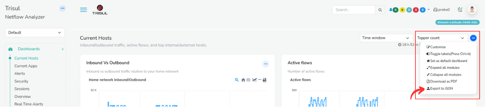   
*Figure: Export a Dashboard*  

Click on the [Dashboard Menu](/docs/ug/ui/dashmod_intro#dashboard-menu-button) button, the **ellipsis icon** on the top right corner on any dashboard and from the dropdown menu click **Export to JSON**. This will let you download the dashboard in JSON format.

### How to Delete/Clone/Export a Dashboard

To delete a dashboard, 

:::info path

:point_right: Go to Dashboards&rarr; Show all&rarr; Manage

:::

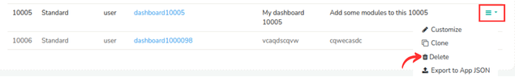

*Figure: Delete/Clone/Export a Dashboard*

From the list of dashboards, click on the **hamburger icon** on the right side against the dashboard you would like to delete. and click **Delete**. Your Dashboard is now deleted.

From the same menu, click **Clone** in case you need to take a copy of the dashboard before deleting the dashboard.

### How to Import a Dashboard

To import a dashboard,

:::info path

:point_right: Go to Dashboards&rarr; Show all&rarr; Import a dashboard package

:::

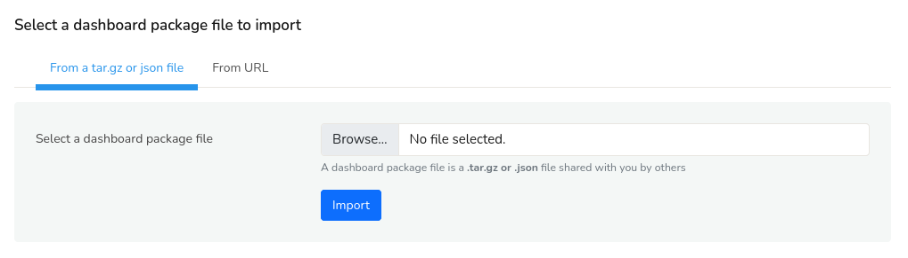

*Figure: Import a Dashboard*

You can bring in a saved dashboard by importing it as a `tar.gz` or `json` file. These files contain the layout, modules, and settings of the dashboard. If you have a link to the dashboard instead of a file, click the **From URL** tab next to the **From a tar.gz or json file** to import it directly from the internet.