# Dashboards

Dashboards provide a way to organize and monitor network data by bringing related **modules** into a single view.

This page explains how to create, configure, customize, manage, import, and export dashboards.

> **Before you begin:** If you are new to Trisul dashboards and modules, see [Introduction to Dashboards and Modules](/docs/ug/ui/dashmod_intro) to understand how dashboards and modules work together.

## Dashboard Management Workflow  

A typical dashboard workflow is:  

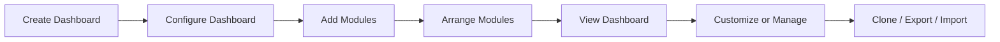
```mermaid
flowchart LR
    A[Create Dashboard] --> B[Configure Dashboard]
    B --> C[Add Modules]
    C --> D[Arrange Modules]
    D --> E[View Dashboard]
    E --> F[Customize or Manage]
    F --> G[Clone / Export / Import]
```

You do not need to follow every step for every dashboard. For example, you can open an existing dashboard and customize it without creating a new one.

## View Dashboards  

Trisul provides multiple ways to view the dashboards available to your account.

### Switch Between Dashboard Views  

You can view dashboards as a list or as tiles.  

From the Menu, go to:  

:::info Navigation  
👉 Dashboards → Show all  
:::

Click on the **toggle button** on the upper right corner to switch between list view and tiles view of the dashboards.

| List view | Tiles view |
|-----------|------------|
|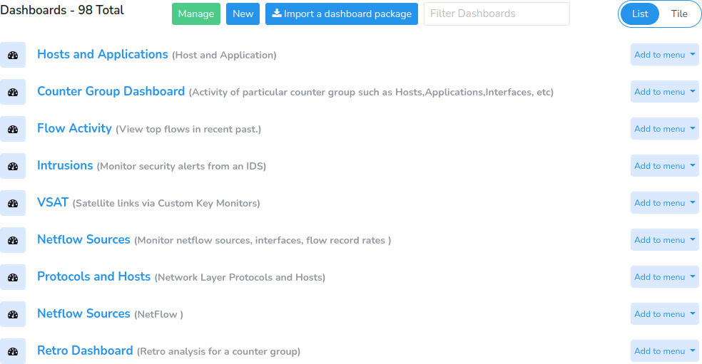 | 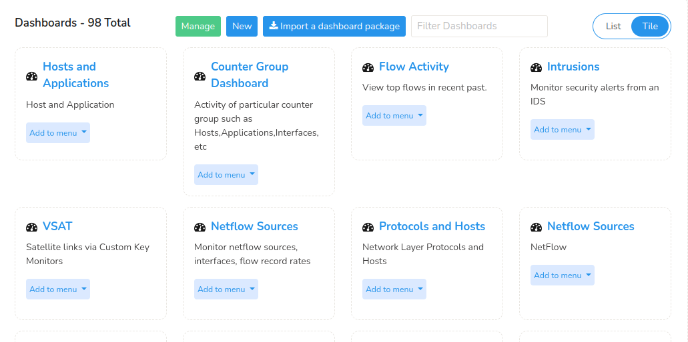 |
|Displays items in a vertical list format for easy scrolling and comparison. | Presents items as clickable tiles for a visually oriented browsing experience. |

### Dashboard Menu Options

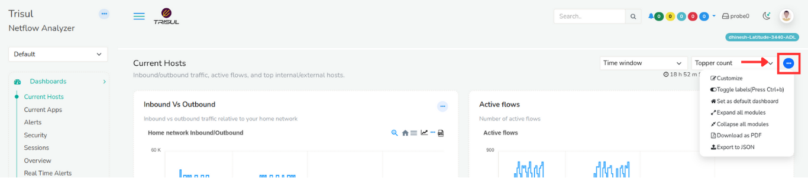  
*Figure: Dashboard level menu options*

The following operations can be performed using the dashboard menu options:

| Operation                | Description                                                    |
| ------------------------ | -------------------------------------------------------------- |
| Customize                | Personalize the dashboard by rearranging modules, changing the layout, or editing dashboard parameters such as name and description. |
| Toggle labels            | Show or hide the title and descriptive labels of each module. Hiding labels gives a cleaner look, while showing them provides more context and detail.                     |
| Set as default dashboard | Save the current dashboard as your default home page. It will automatically load when you log in next time.                                               |
| Expand all modules       | Expand all collapsed modules on the dashboard to display full details at once.                  |
| Collapse all modules     | Collapse all expanded modules to create a compact, less cluttered view.                 |
| Download as PDF          | Export the current dashboard view as a PDF file for reporting or sharing.                                   |
| Export to JSON           | Export the dashboard configuration and data in JSON format, useful for backups or importing elsewhere. |

## Create a Dashboard

You can create a new dashboard and populate it with the modules required for your monitoring or analysis needs.

To create a dashboard,

:::info path
:point_right: Go to Dashboard&rarr; Show all&rarr; New

:::

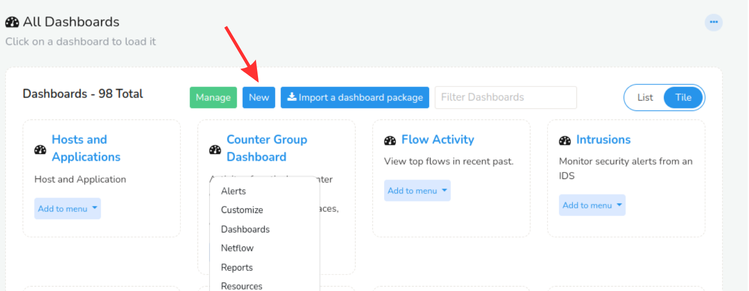

*Figure: All Dashboards*

Once you click the **New** button, a **Create a new dashboard** window opens up (like in the figure below) with the following fields.

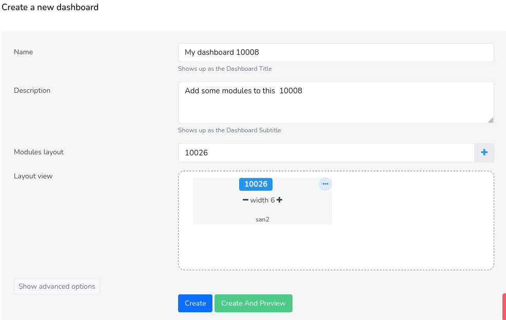

*Figure: Customize a Dashboard*

When creating a dashboard, you can configure properties that determine how the dashboard is identified, displayed, and managed.

| Fields         | Description                                                              |
| -------------- | ------------------------------------------------------------------------ |
| Name           | Name used to identify the dashboard. Choose a name that describes the purpose of the dashboard.                                        |
| Description    | Optional description explaining what the dashboard is intended to show or monitor.                               |
| Modules Layout | Click on the Plus icon and select from the list of modules you would like to add to this dashboard                                                                                   |
| Layout View    | You can view the layout of the added modules as it appears on the dashboard here. You can also rearrange by clicking dragging to the desired position and adjust the width of each modules. |

Once you have filled all the fields, Click Create.

You have now succesfully created a new dashboard!

#### Advanced Options

To configure advanced settings while creating a dashboard, click the **Show Advanced Options** button.

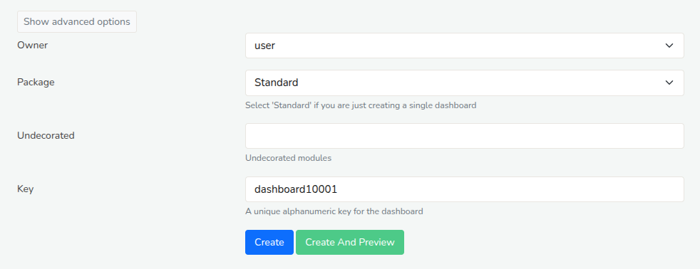  
*Figure: Showing Advanced Options in Creating a Dashboard*

Fill in the following fields to configure the advanced settings.

| Fields         | Description                                                              |
| -------------- | ------------------------------------------------------------------------ |
| Owner          | Specifies the user or user group associated with the dashboard and its access permissions.|
| Package        | Choose Standard if your dashboard uses built-in features. Choose a Plugin Package if it comes from an added Trisul App. |
| Undecorated    | If enabled, displays the dashboard only with data without titles, borders, or other UI elements.  |
| Key            | A unique identifier used to reference the dashboard programmatically.    |

Once you have filled all the fields, Click Create/Create and Preview.

You have now succesfully created a new dashboard with advanced configurations!

### Add Modules to a Dashboard

A dashboard becomes useful when it contains modules that provide the required network information.
When configuring a dashboard, you can select the modules that should appear on it.

:::info Navigation
👉 In the dashboard configuration, use the Add Module (+) option to select a module.
:::

Select the required module from the available module templates.

>Important: Adding a module to a dashboard does not create a new module. The dashboard uses an existing module definition. For information about creating and configuring modules, see Modules.

Once modules are added, they can be arranged within the dashboard layout.
For information about the relationship between dashboards and modules, see Introduction to Dashboards and Modules.

### Arrange Modules

Modules are placed into defined positions within the dashboard.
The dashboard layout determines where each module is displayed and how much space it occupies.  

When arranging modules, consider the purpose of the dashboard:  
    • Place high-priority metrics where they can be seen immediately.   
    • Group related modules together.   
    • Use wider positions for modules that require more horizontal space.   
    • Avoid placing too many unrelated modules in the same dashboard.   

Trisul automatically adjusts the dashboard layout when positions are empty.
For example, if a position does not contain a module, Trisul does not render an empty placeholder for that position. Other modules can adjust to use the available space.

### Explore a Dashboard

After creating or opening a dashboard, the dashboard displays the configured modules and their associated network data.  

A typical dashboard can contain:  
    • Charts showing traffic trends.   
    • Tables showing hosts, applications, or other network entities.   
    • Current or real-time network statistics.   
    • Controls for changing the time range or view.   
    • Module-level controls for further analysis.   
    
The exact controls displayed depend on the modules included in the dashboard.  

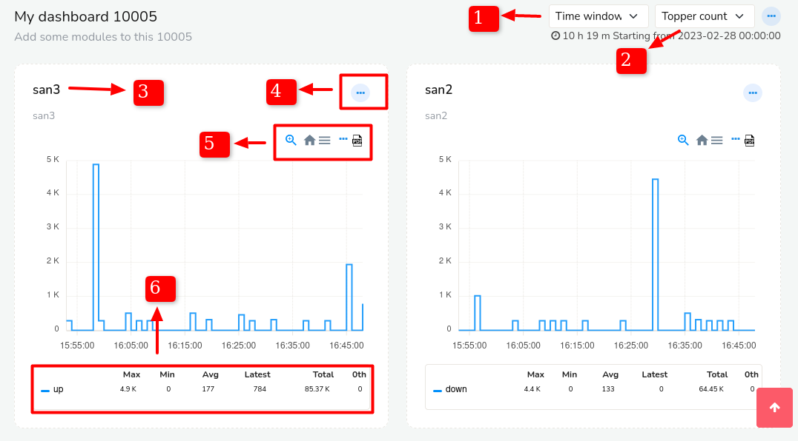  

*Figure: Dashboard Components*

### Dashboard Controls

1) #### [Time Selector](/docs/ug/ui/elements#time-selector)

    The Time Selector controls the time range used by modules that support time-based data.
    You can select a predefined time interval or specify a custom time range.
    Changing the time range allows you to examine network activity over a different period without changing the dashboard itself.
    >Note: Not all modules use the selected time range. Modules that display current or non-time-series information may not be affected by the time selector.
   
    You can set the time window for the selected dashboard from 5 mins to any desirable time by choosing a custom time and date.

2) #### Topper Count

    The Topper Count determines how many top entries are displayed by modules that present ranked data.
    For example, a module showing the top hosts can use the Topper Count to determine how many hosts are displayed.
    Increasing the count provides a broader view of the ranked data, while reducing it focuses the view on the highest-ranked entries.
    You can choose from 5 to 500 topper counts for the current dashboard.

3) #### Module Name and Description
   
    Each module can display a name and description that identify the information it presents.
    The name provides a quick identification of the module, while the description provides additional context.
    You can use the dashboard's label controls to show or hide these labels when required.

4) #### Module Toolbar
   
    Individual modules may provide controls for interacting with or analyzing their data.
    Depending on the module, these controls can include options to:
    • Change the displayed view. 
    • Expand or collapse the module. 
    • Drill down into the underlying data. 
    • Export or download displayed information. 
    • Access additional module-specific actions. 
    The available controls depend on the module type.
    For details about individual module capabilities, see Modules.

5) #### Chart Interaction

    Charts can provide interactive controls for examining the displayed data.
    Depending on the chart, you may be able to:
    • Select or highlight data. 
    • Zoom into a time range. 
    • Examine individual data points. 
    • Change the displayed view. 
    The available interactions depend on the module.

    For details about the chart interactions in a module, see [Charts]((/docs/ug/ui/charts)).
   

6) #### Legend and Data Table
   
    Some modules display a legend or table alongside a chart. This table gives you a quick output of values including Max, Min, Avg, Latest, Total and 0th Percentile. These provide the underlying values represented by the visual elements and can help you identify the specific hosts, applications, traffic categories, or other entities represented in the chart.

### How to Add a Dashboard to the Menu

A dashboard can be added to the main menu so that users can access it directly from the navigation menu.

:::info navigation

:point_right: Dashboards&rarr; Show All

:::

Click the **Add to Menu** button on the dashboard you want to make easily accessible from the main menu.

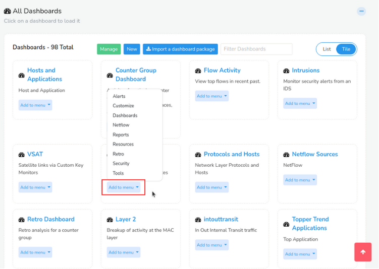

*Figure: Add a Dashboard to Menu*

That’s it! The dashboard is now part of the main menu, and you can quickly access it anytime with just one click.

### How to Remove a Dashboard From the Menu

If a dashboard is no longer required in the main navigation, you can remove it from the menu without deleting the dashboard itself. To remove a dashboard from the main menu:

:::info navigation

:point_right: Go to Customize&rarr; UI&rarr; Menu Manager
:::

There will be a list of all dashboards. 

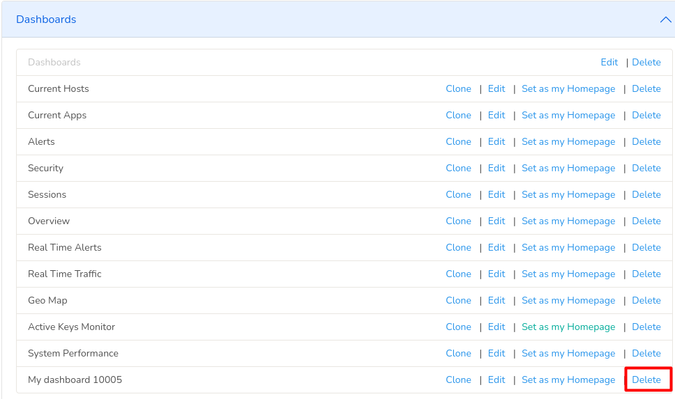

*Figure: Remove a Dashboard from the Menu*

Find the dashboard you would like to remove from the menu and Click **Delete**. This will only remove the dashboard from the menu and your dashboard itself will not be deleted.

### How to Edit a Dashboard

To edit a Dashboard, from the list of dashboards go to the dashboard you would like to edit. And click on the [Dashboard Menu](/docs/ug/ui/dashmod_intro#dashboard-menu-button) button, the **ellipsis icon** on the top right corner of the dashboard and click **Customize**.

### How to Export a Dashboard

You can also share the dashboard across different contexts by clicking **Export to JSON** option. 

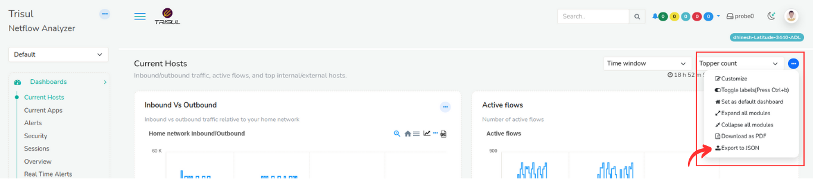   
*Figure: Export a Dashboard*  

Click on the [Dashboard Menu](/docs/ug/ui/dashmod_intro#dashboard-menu-button) button, the **ellipsis icon** on the top right corner on any dashboard and from the dropdown menu click **Export to JSON**. This will let you download the dashboard in JSON format.

### How to Delete/Clone/Export a Dashboard

To delete a dashboard, 

:::info path

:point_right: Go to Dashboards&rarr; Show all&rarr; Manage

:::

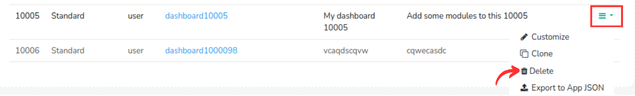

*Figure: Delete/Clone/Export a Dashboard*

From the list of dashboards, click on the **hamburger icon** on the right side against the dashboard you would like to delete. and click **Delete**. Your Dashboard is now deleted.

From the same menu, click **Clone** in case you need to take a copy of the dashboard before deleting the dashboard.

### How to Import a Dashboard

A dashboard configuration exported from Trisul can be imported into another environment where dashboard import is supported.
Importing is useful when you want to reuse an existing dashboard configuration instead of creating the dashboard manually.

To import a dashboard,

:::info path

:point_right: Go to Dashboards&rarr; Show all&rarr; Import a dashboard package

:::

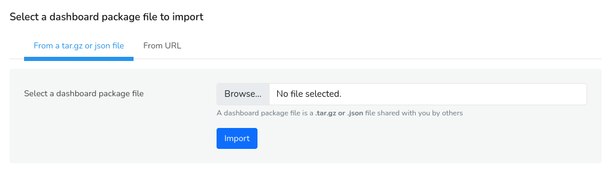

*Figure: Import a Dashboard*

You can bring in a saved dashboard by importing it as a `tar.gz` or `json` file. These files contain the layout, modules, and settings of the dashboard. If you have a link to the dashboard instead of a file, click the **From URL** tab next to the **From a tar.gz or json file** to import it directly from the internet.