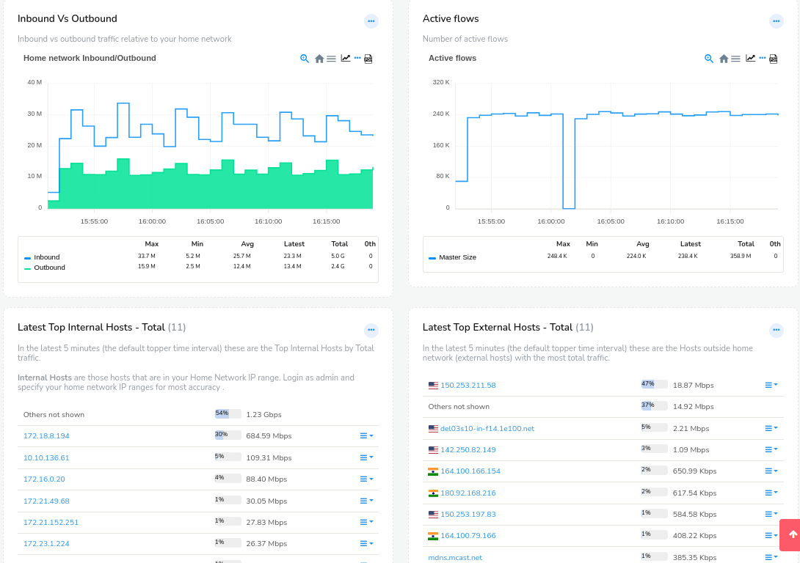
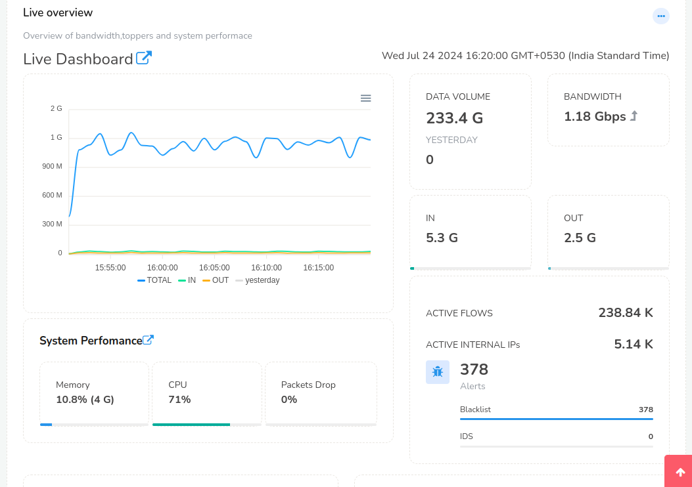
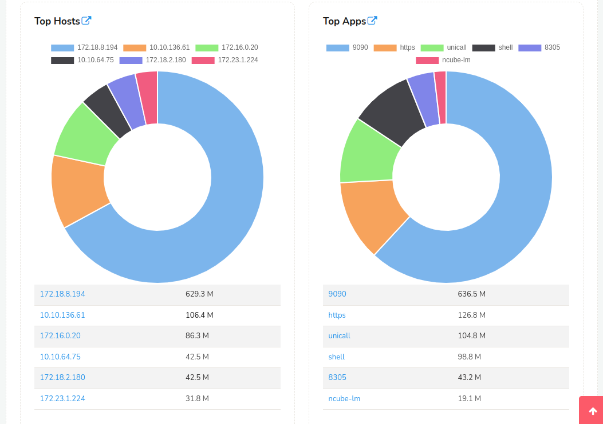
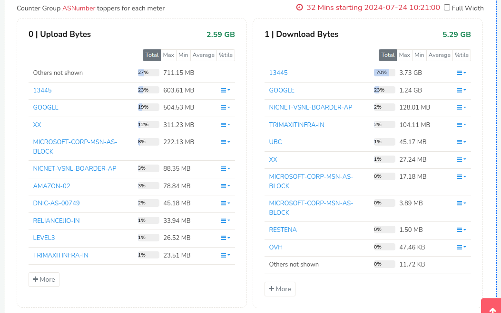
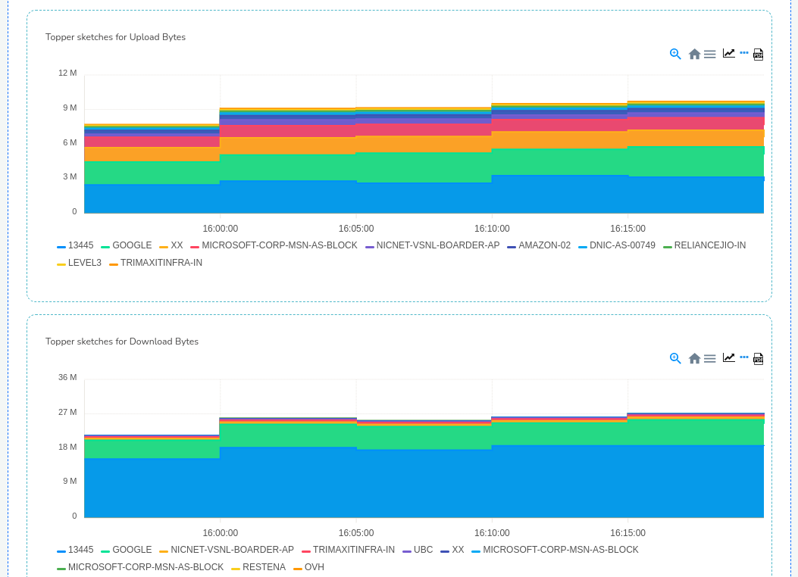
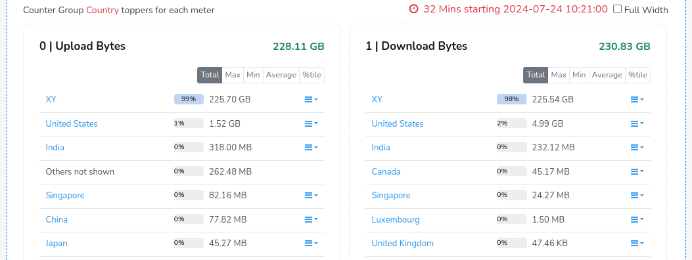
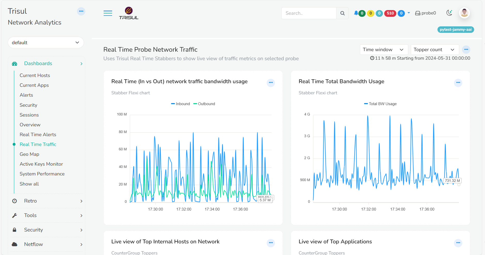

# Default dashboards

Trisul ships with a bunch of default dashboards which you will be seeing
as soon as you first log in. This page describes each of them.

:::note navigation

Select *Dashboards-> Show All* to see all Live Dashboards

:::

## Current Hosts

A live view of current host activity. Internal hosts are shown on the
left side and the external hosts on the right side. Hosts are
automatically classified as internal or external based on the [Home
Networks](/docs/ug/webadmin/home_networks). Under the screenshot you can find a description of each module.

*Current active internal and external hosts dashboard*

The Hosts dashboard consists of the following modules

| Module Title                            | Description                                                                                                                             |
| --------------------------------------- | --------------------------------------------------------------------------------------------------------------------------------------- |
| Inbound Vs Outbound                     | Inbound vs outbound traffic relative to your home network                                                                               |
| Active Flows                            | Number of active flows in the past T hours                                                                                              |
| Latest Top Internal Hosts - Total       | The Top Internal Hosts by Total traffic in the latest 5 minutes                                                                         |
| Latest Top External Hosts - Total       | Hosts outside home network (external hosts) with the most total traffic in the latest 5 minutes                                         |
| Latest Top Internal Hosts - IN          | Top Internal Hosts by with most received traffic (downloaders) in the latest time interval (5 minutes by default)                       |
| Latest Top External Hosts - IN          | Top External Hosts by with most received traffic (downloaders) in the latest time interval (5 minutes by default)                       |
| Latest Top Internal Hosts - OUT         | Top Internal Hosts by most sent traffic (uploaders) in the latest topper interval (Default 5 minutes)                                   |
| Latest Top External Hosts - OUT         | Top External hosts sending most traffic to your network in the latest topper interval (Default 5 minutes)                               |
| Latest Top Internal Hosts - Connections | Top Ithe Internal hosts maintaining the most number of active TCP and UDP connections in the latest 5 minutes (default topper interval) |
| Latest Top External Hosts - Connections | the External hosts with most number of connections in the latest 5 minutes (the default topper interval)                                |

## Current Apps

The Apps dashboards show a live view of the applications currently
active in your network. The left column contains the current bandwidth
being used by each application and the right column contains the total
transferred over the past 6 hours. You can change the time interval
using the time window dropwdown.

The modules in it are

| Module Title                         | Description                                                                                                       |
| ------------------------------------ | ----------------------------------------------------------------------------------------------------------------- |
| Application Trends                   | Top applications into and out of your network. This is a trend report that only shows the toppers traffic trends. |
| Current Top Apps - List              | Bandwidth used by the Top-K applications - total traffic                                                          |
| Current Apps by conns                | Top applications by concurrent connections count. These are IP connections - UDP/TCP/ICMP etc                     |
| Apps into network                    | Bandwidth used by Top-N applications downloading data into your home network                                      |
| Apps Outof Network                   | Bandwidth used by Top-N application uploading data out of your home network                                       |
| Apps by volume in past 1 Hr          | Volume (GB) transferred by top-K apps                                                                             |
| Apps by connections in past 1 Hr     | Apps by connections over the time                                                                                 |
| Apps by volume incoming in past 1 Hr | Volume of data (GB) per App downloading data into your home network                                               |
| Apps by volume outgoing in past 1 Hr | Volume of data (GB) per App uploading data out of your home network                                               |

------------------------------------------------------------------------

## Live network summary dashboard

Automatically updated overview of network summary activites.

Monitor the following live in easy charts with Click Through to more
drilldown.

1. total 24-hr bandwidth with yesterdays chart for comparison
2. alert counts, total volume
3. topper hosts, apps, external hosts
4. system performance,
5. security alert trends

  
*Live 1-min network traffic and security summary*

Shows Top Internal Hosts, External Hosts, and Apps in 1-min real time.

  
*Live charts with Application usage*

------------------------------------------------------------------------

### Modules in the Live Overview dashboard

A top level overview of network activity.

| Module                     | Description                              |
| -------------------------- | ---------------------------------------- |
| Total Bandwidth Seen       | Total Bandwidth currently being used     |
| Trisul Server Health       | Probe database and system status         |
| Current Top Host Chart     | Top host by total traffic in a pie chart |
| Current Top Host-List View | Top hosts by total traffic               |
| Current Top Apps Chart     | Top Apps by total traffic in a pie chart |
| Current Top Apps-List View | Top Apps by total traffic                |

## Security

A view of network activity from a security viewpoint. This dashboard is
most useful when you have connected Trisul to an [IDS feed](/docs/howto/setup_ids_alerts).

| Module                       | Description                                                                                                                                                           |
| ---------------------------- | --------------------------------------------------------------------------------------------------------------------------------------------------------------------- |
| Alert Types                  | A trend of recent alert types seen over a time interval                                                                                                               |
| Alert Types and volumes      | An experimental bubble visualization of alert activity                                                                                                                |
| Total Bandwidth Seen         | Total bandwidth for reference purposes                                                                                                                                |
| Alert Activity               | Alert volume (alert/min) seen                                                                                                                                         |
| Intrusion Detection Alerts   | Top IDS alerts as detected by Snort/Suricata                                                                                                                          |
| Aggregated Alerts            | Number of IDS alerts seen in the time period aggregated by alert type                                                                                                 |
| TCP Activity                 | Number of TCP, SYN/SYN ACK, per minute seen over the time interval                                                                                                    |
| ARP Flood Activity           | ARP bandwidth seen over time                                                                                                                                          |
| ICMP Flood Activity          | ICMP activity over time. A flood can be detected as an abnormal spike                                                                                                 |
| Recently Fired Alert Types   | Alert types seen in the most recent interval                                                                                                                          |
| Recently Fired Alert Classes | Alert classes seen in the most recent interval. This maps to the alert classification as done by Snort.                                                               |
| Recent Attackers             | A list of top hosts from which IDS alerts have originated as attacks.                                                                                                 |
| Recent Victim Host           | A list of hosts which IDS alerts indicate have been victims of attacks. Note that this does not mean they were breached, but only that the hosts were being attacked. |
| TCP Originators              | Top TCP connections originators                                                                                                                                       |
| TCP Targets                  | Top TCP targets                                                                                                                                                       |

## Sessions

Shows most significant currently active IP flows. This is based on [Flow
Trackers](/docs/ug/tools/flow_tracker) a special type of streaming analytics snapshot used in Trisul. The following classes of flows are displayed.

| Module               | Description                                                                                                                                                                                                                               |
| -------------------- | ----------------------------------------------------------------------------------------------------------------------------------------------------------------------------------------------------------------------------------------- |
| Top Flows by Volume  | Top N flows transferring most number of bytes                                                                                                                                                                                             |
| Top OUT flows        | Top N flows uploading data out of your home network                                                                                                                                                                                       |
| Top Long Lived Flows | Top N long duration flows. This could indicate remote desktops, SSH logins, that are not transferring much data but are nevertheless suspects for exfiltration.                                                                           |
| Top IN flows         | Downloading data into your home network                                                                                                                                                                                                   |
| Top TCP Upload flows | Top TCP Flows uploading data out your home network. The difference between this and the *Top UPLOAD Flows* is this group measure actual Payload transferred via TCP , the first one includes all payloads+ retransmissons+TCP/IP headers. |
| Top DOWNLOAD flows   | Top TCP Flows downloading data into your home network. Payload based                                                                                                                                                                      |

Flows tracked include TCP/UDP/GRE/IPSEC/ and all flows at IP Layer.

------------------------------------------------------------------------

## ASN Monitoring

Monitor traffic by ASN. Helps you with planning peering relationships
with Autonomous Systems at Gateway points.

:::note navigation

Select *Retro Counters* select a Time Interval and then select “AS
Number” from the dropdown

:::

### Monitor Total volume per AS

  
*Showing Total Traffic to and From AS*

### Monitor Time series traffic profile per AS

  
*Showing Timeseries Traffic profiles per Autonomous System at Gateways*

The Autonomous System traffic is monitored using two mechanisms

***From packets***  
using a built in database of AS IP Prefixes

***From netflow***  
from border routers peering AS BGP information

------------------------------------------------------------------------

## Country Location based Traffic monitoring

Monitor traffic uploaded and download on a per-Country basis. The
Country Code can also be added to every single flow using [Automatic
Flow Taggers](/docs/ug/flow/tagger) The included statistics are Top-K, Time Series Traffic Profile for planning and trending, and Bottom-K for outlier and security applications. You can even map the traffic down to the City/County level.

### Traffic upload and download

Keep track of which countries give most traffic , flows, Top-N, Bottom-N
and Time series trending supported.

  
*Showing Top-N country traffic by upload and download*

## Real Time Alerts

A real time visualization of IDS alert activity. Note this is true
realtime using WebSockets PUSH. The dashboard is described in detail in
[IDS Alert Stabber](/docs/ug/alerts/ids_stabber)

Real Time Stabbers are a Trisul feature that allow the Trisul Probe
network to directly push events on to the browser.

| Module                 | Description                                                                           |
| ---------------------- | ------------------------------------------------------------------------------------- |
| Options Toolbar        | Allows you to select options for Pivot (which field to pivot), Timeframe, and Scaling |
| Bubbles by Signature   | An interactive visualization showing alert activity over time                         |
| Alerts as they come in | Recently pushed raw alerts                                                            |
| Aggregated alerts      | Alerts types aggregated by time                                                       |

## Real Time Traffic

A real time 1-second view of network traffic. This dashboard uses the
underlying Real Time Stabbers framework. The stats are pushed directly
to the browser from the Probe network, so the data is typically 1-2
seconds real time.

  
*Watch a live situation of network traffic*

| Module             | Description                                                                                                 |
| ------------------ | ----------------------------------------------------------------------------------------------------------- |
| IN/OUT bandwidth   | Real time In vs Out network bandwidth usage. In/Out are relative to the *Home Network* you have configured. |
| Total Bandwidth    | Total bandwidth seen                                                                                        |
| Top Internal Hosts | Currently active Internal Hosts                                                                             |
| Top Applications   | Currently active top applications                                                                           |

### Real time stabbers

You can watch any metric , Top-K, or Flows in real time using the [Real
Time Stabbers (read more)](/docs/ug/cg/stabber)

------------------------------------------------------------------------

## Active Keys Monitor

A live view of the number of active keys in all counter groups. The
purpose of this dashboard is to give you a one-page idea of the
*cardinality* of your network from various different angles. For example: Do you know how many external hosts you have active over time?

For each counter group the following information is displayed

| Module      | Description                                                                                       |
| ----------- | ------------------------------------------------------------------------------------------------- |
| Name        | Counter group name. Clicking will take you to the “Long Term Charts” page showing the active keys |
| Sparkline   | Number of active unique keys over the past 24 hrs . Use this to detect any abnormalities          |
| Active Keys | Total number of keys currently active                                                             |
| New Keys    | New Keys seen in last time interval                                                               |
| Water marks | Hi and Lo Water marks for the counter group                                                       |

## System Performance

A very important dashboard to help you keep tabs of your Trisul Probe
performance. The metrics shown here are not related to the network but
to the Trisul Probes themselves.

| Module               | Description                                                                                                                                                                                                          |
| -------------------- | -------------------------------------------------------------------------------------------------------------------------------------------------------------------------------------------------------------------- |
| Global Flush Time    | How much time it took for a streaming snapshot interval to finish. You may see “GlobalFlush-1” “GlobalFlush-0” etc. These represent the number of parallel streaming pipelines we have.                              |
| Memory Usage         | Memory used by the system and the memory used by Trisul Probe instance                                                                                                                                               |
| Packets Dropped      | Packets dropped by each front-end parallel streaming pipeline. For example : Each AF_PACKET fanout would instantiate a separate parallel streaming engine. The total packets dropped is a sum of all the items shown |
| Packets processed    | Number of packets processed by each streaming frontend pipeline                                                                                                                                                      |
| Packets drop percent | Represents the total dropped packets/total packets processed                                                                                                                                                         |
| Disk I/O             | Read and Write I/O rates. When you have the Packet Ring enabled this can be useful measure disk load                                                                                                                 |
| Disk Bandwidth       | A very useful statistic. Tells you at how much Mbps is the data throughput to disk. In a steady state with full packets enabled, a 100Mbps traffic monitor would also result in a 100Mbps disk bandwidth             |

## More dashboards

There are dozens of other dashboards like this and you can create your
own. Clicking on the “Show All” menu item brings up a list of all
dashboards. You can check them out one by one.

The intent of this page is to give you an idea of the default dashboards
we have pinned to the menu out of the box.

See also [Some interesting dashboards](interesting_dashboards)
