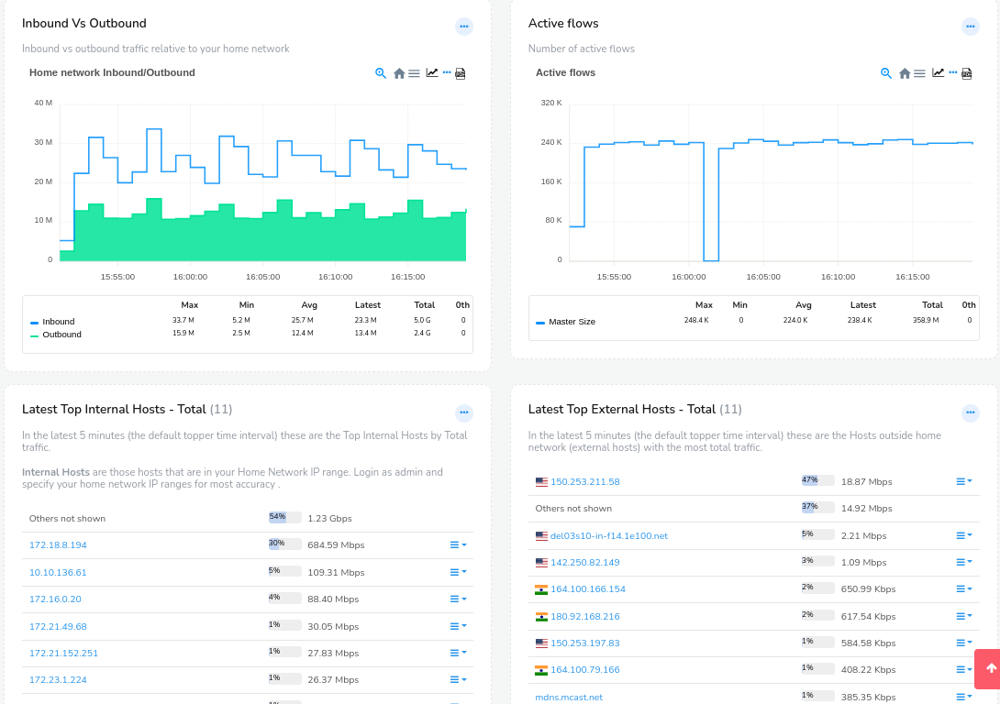

# Default Dashboards

Trisul ships with a bunch of default dashboards which you will be seeing
as soon as you first log in. This page describes each of them.

:::info navigation

:point_right: Select *Dashboards&rarr; Show All* to see all Live Dashboards

:::

## Current Hosts

The **Current Hosts** dashboard gives you a live view of the devices and external systems currently communicating with your network.  

It helps answer some of the most basic questions about network activity:  

- How much traffic is coming into and leaving my network?  
- Which devices are using the most traffic?  
- Which external systems are communicating with my network?  
- Which devices are receiving or sending the most data?  
- Which systems are making the most network connections?  

This makes the **Current Hosts** a useful starting point when you want to quickly understand what is happening on the network or identify something that needs further investigation.

Internal hosts are shown separately from external hosts. Trisul determines whether a host is internal or external based on your configured Home Networks.

*Figure: Current active internal and external hosts dashboard*

## Understanding the terms used in this dashboard

:::info terminologies used

Before looking at the modules, it is useful to understand the terms used throughout this dashboard:

- **[Home Network](/docs/guide/learntrisul/terminology#home-network)** refers to the network that Trisul is monitoring as your own network.
- **[Internal Hosts](/docs/guide/learntrisul/terminology#internal-hosts)** are hosts that belong to your home network.
- **[External Hosts](/docs/guide/learntrisul/terminology#external-hosts)** are hosts outside your home network that communicate with it.
- **[Inbound, Outbound, and Transit Traffic](/docs/guide/learntrisul/terminology#inbound--outbound--transit-traffic)** describes the direction in which traffic moves in relation to your home network.

:::

The modules on this dashboard use these two groups to show where traffic is coming from, where it is going, and which hosts are most active.

> **Note:** The information displayed in the modules depends on the selected **Time window** and **Topper count**.

---

The Hosts dashboard consists of the following modules

| Module     | What does it show?  | What question does it answer?     | When would I use it?   |
| ---------- | ------------------- | --------------------------------- | ---------------------- |
| **Inbound Vs Outbound**                     | Compares traffic coming **into** and going **out of** your home network over the selected time period.                                                           | **Is more traffic coming into my network or going out?**                    | Use it to quickly understand the overall direction of network traffic and spot periods when traffic suddenly increases or decreases.                                                                       |
| **Active Flows**                            | Shows the number of network flows that are currently active. A flow represents communication between endpoints, such as a device accessing a website or service. | **How active is my network right now?**                                     | Use it to understand how much communication is taking place. A sudden increase in active flows can indicate an unusual increase in network activity and can be a starting point for further investigation. |
| **Latest Top Internal Hosts - Total**       | Ranks internal hosts by their **total traffic** during the selected interval.                                                                                    | **Which devices on my network are using the most traffic overall?**         | Use it to identify devices responsible for the largest amount of network traffic.     |
| **Latest Top External Hosts - Total**       | Ranks external hosts outside your home network by the **total traffic exchanged** with your network.                                                             | **Which outside systems are exchanging the most traffic with my network?**  | Use it to identify the websites, servers, cloud services, or other external systems accounting for the largest share of your traffic.                                                                      |
| **Latest Top Internal Hosts - IN**          | Ranks internal hosts by the amount of **incoming traffic they receive**.                                                                                         | **Which devices on my network are receiving the most traffic?**             | Use it to identify devices downloading or receiving unusually large amounts of data.  |
| **Latest Top External Hosts - IN**          | Ranks external hosts by the amount of traffic they **send into your network**.                                                                                   | **Which outside systems are sending the most traffic to my network?**       | Use it to identify where incoming traffic is coming from and investigate an external source sending unusually large amounts of data.                                                                       |
| **Latest Top Internal Hosts - OUT**         | Ranks internal hosts by the amount of **outgoing traffic they send**.                                                                                            | **Which devices on my network are sending the most traffic?**               | Use it to identify devices uploading or sending unusually large amounts of data.      |
| **Latest Top External Hosts - OUT**         | Ranks external hosts by the amount of traffic they **receive from your network**.                                                                                | **Which outside systems are receiving the most traffic from my network?**   | Use it to understand where your outgoing traffic is going and identify external destinations receiving unusually large amounts of data.                                                                    |
| **Latest Top Internal Hosts - Connections** | Ranks internal hosts by their **number of network connections**.                                                                                                 | **Which devices on my network are making the most connections?**            | Use it when you are interested in communication frequency rather than traffic volume. A device can make many connections while transferring relatively little data.                                        |
| **Latest Top External Hosts - Connections** | Ranks external hosts by the **number of network connections** with your network.                                                                                 | **Which outside systems does my network communicate with most frequently?** | Use it to identify external systems that your devices connect to repeatedly, even when the amount of data exchanged is relatively small.                                                                   |

| If you want to know...                                                | Look at...      |
| --------------------------------------------------------------------- | ---------------- |
| Is traffic coming into or going out of my network?                    | **Inbound Vs Outbound**                     |
| How active is my network right now?                                   | **Active Flows**                            |
| Which internal device is using the most traffic?                      | **Latest Top Internal Hosts - Total**       |
| Which external system is exchanging the most traffic with my network? | **Latest Top External Hosts - Total**       |
| Which internal device is receiving the most data?                     | **Latest Top Internal Hosts - IN**          |
| Where is my incoming traffic coming from?                             | **Latest Top External Hosts - IN**          |
| Which internal device is sending the most data?                       | **Latest Top Internal Hosts - OUT**         |
| Where is my outgoing traffic going?                                   | **Latest Top External Hosts - OUT**         |
| Which internal device has the most connections?                       | **Latest Top Internal Hosts - Connections** |
| Which external system does my network connect to most frequently?     | **Latest Top External Hosts - Connections** |

:memo: See [Counter Groups reference](/docs/guide/counter-groups/hosts) for more details about these and other metrics

## Current Apps

The Current Apps dashboard shows which applications are active on your network and how much traffic and network activity they generate.

It helps you answer questions such as:

- Which applications are using the most traffic?
- Which applications are communicating most frequently?
- Which applications are receiving the most data?
- Which applications are sending the most data?
- How is application traffic changing over time?

This makes Current Apps useful for quickly understanding how network traffic is being used by applications and for identifying applications that may need further investigation.

## Understanding the terms used in this dashboard

:::info Terminologies used

Before looking at the modules, it is useful to understand the terms used throughout this dashboard:

- **[Application](/docs/guide/learntrisul/terminology#application)**

- **[Home Network](/docs/guide/learntrisul/terminology#home-network)**

- **[Internal Hosts](/docs/guide/learntrisul/terminology#internal-hosts)**

- **[External Hosts](/docs/guide/learntrisul/terminology#external-hosts)**

- **[Inbound, Outbound, and Transit Traffic](/docs/guide/learntrisul/terminology#inbound--outbound--transit-traffic)**

:::

> **Note:** The information displayed in the modules depends on the selected **Time window** and **Topper count**.

---

The modules in it are

| Module       | What does it show?    | What question does it answer?      | When would I use it?  |
| ------------ | --------------------- | ---------------------------------- | --------------------- |
| **Application Trends**      | Shows traffic trends for the top applications, separately for traffic coming **into** and going **out of** your network.        | **How is application traffic changing over time?**                     | Use it when you want to see whether an application's traffic is increasing, decreasing, or changing during the selected period.                      |
| **Current Top Apps - List** | Ranks the top applications by the amount of traffic they are generating during the selected interval.      | **Which applications are generating the most traffic?**                | Use it when you want a quick view of which applications account for the largest share of current network traffic.           |
| **Current Apps by conns**   | Ranks applications by the number of concurrent network connections associated with them.     | **Which applications are communicating most frequently?**              | Use it when you want to identify applications creating many connections. This can reveal activity that may not be obvious from traffic volume alone. |
| **Apps into network**       | Shows the applications receiving the most traffic **into your home network**.                 | **Which applications are bringing the most traffic into my network?**  | Use it when you want to identify which applications are responsible for the largest amounts of incoming traffic.                                     |
| **Apps out of network**     | Shows the applications sending the most traffic **out of your home network**.              | **Which applications are sending the most traffic out of my network?** | Use it when you want to identify applications responsible for large amounts of outgoing traffic and investigate where that traffic is going.         |
| **Apps by volume**          | Ranks applications by the **total amount of data transferred** during the selected period, regardless of direction. It also provides statistics such as maximum, minimum, average, and percentage where available. | **Which applications have transferred the most data overall?**         | Use it when you want to compare applications based on total traffic volume rather than traffic direction.           |
| **Apps by connections**     | Ranks applications by the **number of network connections** during the selected period, with additional connection statistics where available.            | **Which applications have the most connections overall?**              | Use it when you want to compare applications based on how frequently they communicate rather than how much data they transfer.                       |
| **Apps by volume incoming** | Ranks applications by the **total amount of incoming data** they received during the selected period.   | **Which applications have received the most data?**          | Use it when you want to identify applications receiving unusually large amounts of data from outside your network.                                   |
| **Apps by volume outgoing** | Ranks applications by the **total amount of outgoing data** they generated during the selected period.      | **Which applications have sent the most data?**                        | Use it when you want to identify applications sending unusually large amounts of data outside your network.        |

If you already know what you are looking for, use this table to go directly to the relevant module.

| If you want to know...                                     | Look at...                  |
| ---------------------------------------------------------- | --------------------------- |
| How is application traffic changing over time?             | **Application Trends**      |
| Which applications are using the most traffic right now?   | **Current Top Apps - List** |
| Which applications are making the most connections?        | **Current Apps by conns**   |
| Which applications are receiving the most traffic?         | **Apps into network**       |
| Which applications are sending the most traffic?           | **Apps out of network**     |
| Which applications have transferred the most data overall? | **Apps by volume**          |
| Which applications have the most connections overall?      | **Apps by connections**     |
| Which applications have received the most data?            | **Apps by volume incoming** |
| Which applications have sent the most data?                | **Apps by volume outgoing** |

#### Drilldown Menu Options

| Option | Description |
|---|---|
| Top users of app | Displays the top hosts, users, or IP addresses generating traffic for the selected application |
| Aggregate Flows | Aggregates and summarizes flows associated with the selected application |
| Retro analyze | Opens historical traffic analysis for the selected application over previous time intervals |
| Real Time Stabber : Traffic chart | Displays real-time bandwidth and traffic activity for the selected application |
| Real Time Stab : Flow activity | Displays real-time flow creation and flow activity metrics |
| Real Time Stab : Toppers | Displays top traffic contributors and top active entities related to the selected application |
| Set/Edit Label | Allows administrators to assign or modify labels associated with the selected application or entity |
| Traffic Chart | Displays traffic trends and bandwidth usage over time |
| Long Term Traffic report | Generates long-duration historical traffic reports for the selected application |
| View Edge Graph | Displays communication relationships and traffic interactions using graphical edge visualization |
| Download PCAP | Downloads packet capture data associated with the selected application traffic |
| Query flows by tag | Searches flows associated with specific tags or classifications |
| Aggregate flows by tag | Groups and summarizes tagged flows for analysis |
| Statistics | Displays statistical information related to the selected application traffic |

------------------------------------------------------------------------

## Overview Dashboard

The **Overview** dashboard gives you a quick summary of **network traffic, current network activity, alerts, and the health of the Trisul system**.

Use it as a starting point when you want to quickly find out:

* How much data has been transferred
* How quickly traffic is flowing
* How traffic is divided between incoming and outgoing traffic
* How many flows and internal IP addresses are currently active
* Whether there are blacklist or IDS alerts
* Which hosts are currently associated with the highest traffic rates
* Which applications are currently associated with the highest traffic rates
* Whether the Trisul system is processing network traffic normally

The dashboard is designed to give you a **high-level picture first**. If something looks unusual, you can use the relevant information as a starting point for a deeper investigation.

  

  

*Figure: Overview*

> **Note:** The information displayed on the dashboard depends on the selected **Time Window** and **Topper Count**.

### Understanding the metrics

The Overview dashboard combines several types of measurements. The most important distinction to understand is between **traffic volume** and **traffic rate**.

| Metric                  | What does it mean?       |
| ----------------------- | ----------- |
| **Data Volume**         | The total amount of data transferred during the selected time period. It is displayed as a data size such as **MB** or **GB**. |
| **Bandwidth**           | The rate at which data is being transferred. It is displayed as a rate such as **Kbps** or **Mbps**.                           |
| **In**                  | The amount of data received by the network during the selected time period.                                                    |
| **Out**                 | The amount of data sent from the network during the selected time period.                                                      |
| **Active Flows**        | The number of network flows that are currently active.                                                                         |
| **Active Internal IPs** | The number of internal IP addresses that are currently active.                                                                 |
| **Top Hosts**           | Hosts associated with the highest traffic rates.                                                                               |
| **Top Apps**            | Applications associated with the highest traffic rates.                                                                        |
| **Blacklist**           | The number of alerts associated with blacklisted activity.                                                                     |
| **IDS**                 | The number of alerts generated by the Intrusion Detection System.                                                              |

### Overview modules

The following table explains what each part of the Overview dashboard shows, the question it helps answer, and when it is useful.

| Module       | What does it show?    | What question does it answer?         | When would I use it? |
| ------------------------------- | --------------------------------- | ------------ | ----------------- |
| **Live Overview**               | Summarizes data volume, previous-day volume, current bandwidth, incoming and outgoing traffic, and traffic trends over the selected period. | **How much traffic is my network handling, and how is it changing?**     | Use it for a quick understanding of overall traffic volume and rate, and to spot periods when network activity increases or decreases. |
| **System Performance**          | Shows the resource usage of the system running Trisul, including **CPU, memory, and packet drops**.                                         | **Is the Trisul system processing network traffic normally?**            | Use it when checking whether system resource usage or packet drops could affect network monitoring.                                    |
| **Network Activity and Alerts** | Shows **active flows, active internal IPs, total alerts, blacklist alerts, and IDS alerts**.                                                | **How active is the network, and are there alerts that need attention?** | Use it when you want a quick view of current network activity and security-related alerts.                                             |
| **Top Hosts**                   | Ranks hosts according to their current traffic rate.                                                                                        | **Which hosts currently have the highest traffic rates?**                | Use it when you notice high traffic and want to identify the hosts associated with it.                                                 |
| **Top Apps**                    | Ranks applications according to their current traffic rate.                                                                                 | **Which applications currently have the highest traffic rates?**         | Use it when you want to identify the applications associated with the highest current traffic.                                         |

### Overview at a glance

If you already know what you want to find, use this table to go directly to the relevant part of the dashboard.

| If you want to know...                                       | Look at...                      |
| ------------------------------------------------------------ | ------------------------------- |
| How much data was transferred?                               | **Live Overview**               |
| What is the current traffic rate?                            | **Live Overview**               |
| How much traffic is coming in or going out?                  | **Live Overview**               |
| How is traffic changing over time?                           | **Live Overview**               |
| Is Trisul using a lot of CPU or memory?                      | **System Performance**          |
| Are packets being dropped?                                   | **System Performance**          |
| How many flows are currently active?                         | **Network Activity and Alerts** |
| How many internal IPs are currently active?                  | **Network Activity and Alerts** |
| Are there any alerts?                                        | **Network Activity and Alerts** |
| Are there any blacklist alerts?                              | **Network Activity and Alerts** |
| Are there any IDS alerts?                                    | **Network Activity and Alerts** |
| Which hosts currently have the highest traffic rates?        | **Top Hosts**                   |
| Which applications currently have the highest traffic rates? | **Top Apps**                    |

### How to use the Overview dashboard

A simple way to use Overview is to **start broad and then narrow down**.

For example:

1. **Check the Live Overview** to see whether traffic is higher or lower than expected.
2. If traffic has increased, check **Top Hosts** and **Top Apps** to identify what is associated with the increase.
3. If there are alerts, check **Network Activity and Alerts** to see whether blacklist or IDS activity may require attention.
4. If packet drops are increasing, check **System Performance** to determine whether the Trisul system is under resource pressure.
5. Once you have identified something that needs investigation, move to the appropriate detailed dashboard or investigation workflow.

This makes Overview useful as a **starting point rather than a detailed investigation screen**. It tells you where to look next.

## Security

A view of network activity from a security viewpoint. This dashboard is
most useful when you have connected Trisul to an [IDS feed](/docs/guide/howto/setup_ids_alerts).

| Module                             | Description                                        |
| ---------------------------------- | -------------------------------------------------- |
| Alert Types                        | A trend of recent alert types seen over a time interval      |
| Alert Types and volumes            | An experimental bubble visualization of alert activity       |
| Total Bandwidth Seen               | Total bandwidth for reference purposes                       |
| Alert Activity in past T hours     | Alert volume (alert/min) seen                                |
| Intrusion Detection Alerts         | Top IDS alerts as detected by Snort/Suricata                 |
| Aggregated Alerts in last 24 hours | Number of IDS alerts seen in the time period aggregated by alert type |
| TCP Activity                       | Number of TCP, SYN/SYN ACK, per minute seen over the time interval    |
| ARP Flood Activity                 | ARP bandwidth seen over time                                          |
| ICMP Flood Activity                | ICMP activity over time. A flood can be detected as an abnormal spike |
| Recently Fired Alert Types         | Alert types seen in the most recent interval                          |
| Recently Fired Alert Classes       | Alert classes seen in the most recent interval. This maps to the alert classification as done by Snort.                                                                              |
| Recent Attackers                   | A list of top hosts from which IDS alerts have originated as attacks.  |
| Recent Victim Host                 | A list of hosts which IDS alerts indicate have been victims of attacks. Note that this does not mean they were breached, but only that the hosts were being attacked. |
| TCP Originators                    | Top TCP connections originators                                        |
| TCP Targets                        | Top TCP targets                                                        |

## Sessions

The Sessions dashboard helps you find the network connections that are transferring significant amounts of data or staying active for a long time.

A traffic chart can tell you that network usage has increased, but it does not necessarily tell you which individual connections are responsible. Sessions helps you move from the overall traffic picture to the specific flows contributing to that activity.

For example, if network bandwidth suddenly increases, you can use Sessions to identify the connections transferring the most data, determine whether the traffic is entering or leaving your network, and investigate the systems involved.

> Note: The information displayed in the dashboard depends on the selected Time Window and Topper Count.

### Sessions modules

The Sessions dashboard provides different views of network flows so that you can investigate traffic based on data volume, direction, connection duration, or actual TCP payload.

| Module | What does it show? | What question does it answer? | When would I use it? |
|---|---|---|---|
| **Top IP Flows in 1 hour** | Ranks the top IP flows by the amount of data transferred during the selected period. | **Which individual connections are transferring the most data?** | Use it when you know that a lot of traffic is being generated but need to identify the specific connections responsible for it. |
| **Top IP Flows out of your network in the past 1 Hr** | Ranks IP flows that are sending the largest amounts of data from your home network to external destinations. | **Which connections are sending the most data out of my network?** | Use it when you notice high outbound traffic and want to identify the internal systems and external destinations involved. |
| **Top Long Lived flows in past 1 Hr** | Shows the IP flows that have remained active for the longest duration during the selected period. | **Which connections have stayed active for the longest time?** | Use it when you are interested in long-running connections rather than simply the amount of data transferred. A long-lived connection may transfer relatively little data but can still be important to investigate. |
| **Top flows into your network in the past 1 Hr** | Ranks IP flows that are bringing the largest amounts of data from external destinations into your home network. | **Which connections are bringing the most data into my network?** | Use it when you notice unusually high inbound traffic and want to identify the external systems and internal hosts involved. |
| **Top TCP Flows Uploading data based on TCP Payloads** | Ranks TCP flows by the amount of **actual TCP payload data** transferred from your network to external destinations. | **Which TCP connections are transferring the most actual data out of my network?** | Use it when you specifically want to focus on the application data carried by TCP rather than the total traffic associated with the connection. |
| **Top TCP flows Downloading data based on TCP Payloads** | Ranks TCP flows by the amount of **actual TCP payload data** transferred from external destinations into your network. | **Which TCP connections are transferring the most actual data into my network?** | Use it when you specifically want to identify the TCP connections responsible for the largest inbound payload transfers. |

Flows tracked include TCP/UDP/GRE/IPSEC/ and all flows at IP Layer.

### What is a TCP Payload?

The TCP Payload views provide a more specific way of looking at data transferred through TCP connections.

A TCP connection carries both the actual data being communicated and additional information used to transport that data across the network. TCP payload refers to the actual data carried by the TCP connection.

This means the TCP Payload views are useful when you want to focus specifically on the data being carried by TCP, rather than the total traffic associated with the connection.

The TCP Payload views therefore differ from the regular upload and download flow views. The regular flow views account for the broader traffic associated with the flow, while the TCP Payload views focus on the actual TCP payload transferred.

If you already know what you are looking for, use this table to choose the relevant view.

| If you want to know... | Look at... |
|---|---|
| Which individual connections are transferring the most data? | **Top IP Flows in 1 hour** |
| Which connections are sending the most data out of my network? | **Top IP Flows out of your network in the past 1 Hr** |
| Which connections have remained active for the longest time? | **Top Long Lived flows in past 1 Hr** |
| Which connections are bringing the most data into my network? | **Top flows into your network in the past 1 Hr** |
| Which TCP connections are transferring the most actual data out of my network? | **Top TCP Flows Uploading data based on TCP Payloads** |
| Which TCP connections are transferring the most actual data into my network? | **Top TCP flows Downloading data based on TCP Payloads** |

### How to use the Sessions dashboard

A simple way to think about the Sessions dashboard is:

Something is happening → find the connection responsible → determine its direction → investigate the systems involved.

For example:

1) **You notice unusually high bandwidth.**  
Start with Top IP Flows in 1 hour to identify the connections transferring the most data.

2) **The traffic appears to be leaving your network.**  
Use Top IP Flows out of your network to identify the connections responsible for the outbound transfer.

3) **The traffic appears to be entering your network.**  
Use Top flows into your network to identify the connections responsible for the inbound transfer.

4) **The amount of data is not unusually high, but a connection has remained active for a long time.**  
Use Top Long Lived flows to find long-running connections.

5) **You specifically want to examine actual data transferred through TCP.**  
Use the TCP Payload views to focus on TCP payload rather than the broader flow traffic.

The goal is not simply to find whichever flow appears at the top of a list. The Sessions dashboard gives you a starting point for understanding which systems are communicating, how much data they are transferring, which direction the traffic is moving, and whether the activity is expected.

## Real Time Alerts

A real time visualization of IDS alert activity. Note this is true realtime using WebSockets PUSH. The dashboard is described in detail in [IDS Alert Stabber](/docs/guide/ug/alerts/ids_stabber). The **Real Time Traffic** dashboard provides a live view of network activity on the selected Probe.

Unlike dashboards that help you examine traffic over longer time periods, this dashboard is useful when you want to see **what is happening on the network right now**. It shows the current bandwidth rate and the internal hosts and applications contributing to that activity.

Real Time Stabbers are a Trisul feature that allow the Trisul Probe network to directly push events on to the browser.

| Module                                   | Description                                                      |
| ---------------------------------------- | ---------------------------------------------------------------- |
| Options Toolbar                          | Allows you to select options for Pivot (which field to pivot), Timeframe, Scaling, and Clear local name Cache |
| Bubbles representing alerts by Signature | An interactive visualization showing alert activity over time    |
| Alerts as they come in                   | Recently pushed raw alerts                                       |
| Aggregated alerts                        | Alerts types aggregated by time                                  |

## Real Time Traffic

The **Real Time Traffic** dashboard provides a live view of network activity on the selected Probe.

Unlike dashboards that help you examine traffic over longer time periods, this dashboard is useful when you want to see **what is happening on the network right now**. It shows the current bandwidth rate and the internal hosts and applications contributing to that activity.

*Figure: Real Time Traffic dashboard*

> **Note:** The information displayed in the dashboard depends on the selected **Time Window** and **Topper Count**.

### Real Time Traffic modules

The following table explains what each module shows, the question it helps answer, and when it is useful.

| Module           | What does it show?     | What question does it answer?   | When would I use it?    |
| ----------------------------- | ---------------------- | -------------------------- | -------------- |
| **In vs Out Network Traffic** | Shows the current bandwidth rate for traffic **coming into** and **leaving** your Home Network. **In** represents incoming traffic, while **Out** represents outgoing traffic. | **Is traffic currently coming into or going out of my network, and how is that changing?** | Use it when you want to see the **direction of traffic in real time**. A sudden increase in In or Out bandwidth can help you notice an unusual change as it happens.                                                       |
| **Total Bandwidth Usage**     | Shows the **total bandwidth rate** currently being observed by Trisul, without separating it into In and Out traffic.                                                          | **How much network activity is happening right now?**                                      | Use it when you want a **quick overall view of current traffic activity** and want to spot sudden increases or decreases in bandwidth.                                                                                     |
| **Top Internal Hosts**        | Shows the internal hosts that are currently generating the most network activity.                                                                                              | **Which hosts are contributing most to the traffic right now?**                            | Use it when you notice an unusual increase in traffic and want to identify **which internal hosts are responsible for it**. A host that suddenly moves into the top list can be a useful starting point for investigation. |
| **Top Applications**          | Shows the applications currently generating the most traffic, along with their current bandwidth rates.                                                                        | **Which applications are using the most bandwidth right now?**                             | Use it when you want to understand **what type of application activity is driving the current traffic**. For example, if `http` is near the top, you can see how much bandwidth HTTP traffic is currently using.           |

| If you want to know...                         | Look at...        |
| ------------------------------------ | ---------------- |
| **Is traffic coming into or leaving my network?**                   | **In vs Out Network Traffic**                   |
| **How is incoming or outgoing traffic changing right now?**         | **In vs Out Network Traffic**                   |
| **How much total bandwidth is being used right now?**               | **Total Bandwidth Usage**                       |
| **Has there been a sudden increase or decrease in traffic?**        | **Total Bandwidth Usage**                       |
| **Which internal hosts are generating the most traffic right now?** | **Top Internal Hosts**                          |
| **Which applications are using the most bandwidth right now?**      | **Top Applications**                            |
| **What is causing the current network activity?**                   | **Top Internal Hosts** and **Top Applications** |

### How to use the Real Time Traffic dashboard

A simple way to use this dashboard is to **start with the overall traffic rate and then identify what is contributing to it**.

1. **Check Total Bandwidth Usage** to see whether the current traffic rate has changed significantly.
2. **Check In vs Out Traffic** to determine whether the increase is coming from incoming or outgoing traffic.
3. **Check Top Internal Hosts** to identify the devices contributing to the activity.
4. **Check Top Applications** to understand which applications are associated with the current traffic.

For example, if the total bandwidth suddenly increases, you can first check whether the increase is **In** or **Out**. You can then look at the top internal hosts and applications to identify what is generating the traffic.

This makes the dashboard useful for moving from:

> **"Traffic has suddenly increased."**

to:

> **"This host and this application are contributing to the increase."**

### Real Time Stabbers

You can watch any metric , Top-K, or Flows in real time using the [Real
Time Stabbers (read more)](/docs/guide/ug/cg/stabber)

## Active Keys Monitor

The **Active Keys Monitor** shows how many keys Trisul is currently tracking for each [**Counter Group**](/docs/guide/learntrisul/terminology#counter-group).

This helps you monitor changes in the **number and variety of items Trisul is seeing**. An unusual increase in active or new keys can indicate that Trisul is seeing a much larger variety of network activity than usual.

For example, if the **Hosts** counter group shows **193 Active Keys**, Trisul is currently tracking 193 active host keys in that counter group.

Checking this number over time helps you recognize whether the number of tracked values is within its usual range. An unusually high count can indicate a significant increase in the variety of network activity being observed.

Use this dashboard to check the current number of tracked values, spot new values appearing, and identify unusual changes over time.

Use the table below to understand what each value means and when it is useful.

| Module / Value  | What does it show?      | What question does it answer?   | When would I use it?       |
| --------------- | -------------------------------- | ---------- | ------------------------------ |
| **Name**        | The name of the **Counter Group** being monitored. A Counter Group represents a particular type of information that Trisul tracks. Clicking the Counter Group name opens its **Long Term Chart**. | **What type of information am I looking at?**                            | Use it to identify what the Active Keys, New Keys, and other measurements in that row represent. Click the name when you want to examine how the number of active keys has changed over a longer period. |
| **Active Keys** | The number of keys currently active in the Counter Group. In simple terms, this is the number of distinct values of that type that Trisul is currently tracking.                                  | **How many different values of this type is Trisul currently tracking?** | Use it to understand the current size or variety of activity being observed. For example, if the Hosts Counter Group shows **193 Active Keys**, Trisul is currently tracking 193 active host keys.       |
| **New Keys**    | The number of new keys detected during the latest time interval.                                                                                                                                  | **How many new values have appeared recently?**                          | Use it to identify periods when many new hosts, applications, or other values are appearing. A sudden increase can indicate a change in the variety of network activity being observed.                  |
| **Sparkline**   | A small trend chart showing how the number of active keys has changed over time.                                                                                                                  | **Has the number of tracked values changed recently?**                   | Use it to quickly spot increases, decreases, or unusual changes without opening a detailed chart. Click the Counter Group name to examine the trend in more detail.                                      |
| **Hi Water**    | The high-water threshold configured for the Counter Group.                                                                                                                                        | **What high level has been configured for this Counter Group?**          | Use it when you want to compare the current or recent Active Keys count against the configured high threshold.                                                                                           |
| **Low Water**   | The low-water threshold configured for the Counter Group.                                                                                                                                         | **What low level has been configured for this Counter Group?**           | Use it when you want to compare the current or recent Active Keys count against the configured low threshold.                                                                                            |

### Active Keys Monitor at a glance

If you already know what you want to find, use this table to identify the relevant value.

| If you want to know...                                    | Look at...      |
| --------------------------------------------------------- | --------------- |
| What type of information is being monitored?              | **Name**        |
| How many values of that type are currently being tracked? | **Active Keys** |
| How many new values appeared in the latest interval?      | **New Keys**    |
| Has the number of tracked values changed over time?       | **Sparkline**   |
| What high threshold is configured?                        | **Hi Water**    |
| What low threshold is configured?                         | **Low Water**   |

### How to interpret Active Keys

The important thing to remember is that an **Active Key represents a distinct value that Trisul is tracking within a Counter Group**.

For example, if the **Hosts** Counter Group shows **193 Active Keys**, it means Trisul is currently tracking 193 active host keys in that Counter Group.

The number itself is most useful when you look at **how it changes over time**. A sudden increase in Active Keys means Trisul is seeing a larger variety of values than before.

The **New Keys** value provides another useful signal. It tells you how many new values appeared during the latest interval. A sudden increase in New Keys can indicate that many new hosts, applications, or other values have started appearing.

The **Sparkline** makes these changes easy to spot at a glance.

## Alerts

The Alerts dashboard brings together different types of security and traffic-related alerts detected by Trisul.

Instead of looking through individual alert records, this dashboard gives you a quick view of recent alert activity in one place. It helps you identify what triggered an alert, which hosts or flows were involved, and whether the alert is currently fired or cleared.

Use the dashboard to answer questions such as:

Are there any recent security or traffic alerts?
What caused an alert to be triggered?
Which host, flow, or application was involved?
Are there active threshold or flow activity alerts?
Are there IDS alerts from the intrusion detection system?
Are there blacklist-related alerts?

Figure: Alerts dashboard

Note: The information displayed in the dashboard depends on the selected Time window and Topper count.

Understanding the Alerts dashboard

The dashboard contains several alert views. Each view focuses on a different type of activity:

| Module          | What does it show?        | What question does it answer?      | When would I use it?     |
| ------------------------ | --------------------- | ------------------------ | -------------------- |
| **Threshold Crossing Alerts**            | Shows recent alerts generated when a monitored value crosses a configured threshold. Each entry includes information such as the alert status, priority, time, profile, Probe, target, and the observed value. | **Did a monitored value cross its configured threshold, and what was affected?**                                  | Use it when you want to identify activity that exceeded a defined limit, such as unusually high traffic. Check whether the alert is **Fired** or **Cleared** to understand its current state. |
| **Flow Activity Alerts**                 | Shows recent alerts generated from flow activity that crossed a configured threshold. The entries show the amount of traffic, threshold, profile, Probe, and the flow endpoints involved.                      | **Which network flow generated significant activity, and how much traffic was involved?**                         | Use it when you want to find **specific flows responsible for high-volume activity**. Open the flow details to investigate the communicating endpoints further.                               |
| **Intrusion Detection Alerts**           | Shows recent IDS alerts generated by the intrusion detection system. The dashboard can display alerts from an IDS such as Snort/Suricata.                                                                      | **Has the intrusion detection system detected any suspicious activity?**                                          | Use it when you want to check for **IDS-detected threats or suspicious network activity**. If no IDS alerts are present, the module indicates that no IDS alerts are currently available.     |
| **Malware, Botnet, Phishing, Blacklist** | Shows recent blacklist-based alerts generated by the BadFellas plugin. Entries identify the alert type and the endpoints associated with the activity.                                                         | **Did network activity involve an endpoint associated with malware, botnet, phishing, or blacklist information?** | Use it when you want to check whether recent activity involves **known suspicious or blacklisted endpoints**.                                                                                 |

### **Threshold Crossing Alerts**

**What question does it answer?**

"Did a monitored value cross its configured threshold?"

This module shows the most recently fired or cleared threshold-based alerts.

Each alert provides information that helps you understand what triggered the alert and what it was associated with. Depending on the alert, this can include:

**Status**: Whether the alert is currently **Fired** or **Cleared**     
**Priority**: The priority assigned to the alert                   
**Time**: When the alert occurred                                 
**Profile**: The alert profile that generated it                   
**Probe**: The Probe where the activity was observed                 
**Target**: The target associated with the alert                   
Observed value: The value that crossed the configured threshold

For example, the screenshot shows a US Traffic Alert with a HIGH priority and an observed traffic rate above its configured limits.

What do Fired and Cleared mean?
Fired means the condition that triggered the alert has been detected.
Cleared means the condition is no longer active.

This distinction helps you tell the difference between an alert that is currently active and one that was triggered earlier but has since returned to normal.

When would I use it?

Use this module when you want to quickly identify threshold-based conditions that have become significant and determine whether they are still active.

### **Flow Activity Alerts**

**What question does it answer?**

"Which network flows have generated significant traffic activity?"

This module lists recent alerts based on flow activity.

Each entry shows information such as:

- The amount of traffic involved  
- The configured threshold  
- The alert profile  
- The Probe where it was detected  
- The endpoints involved in the flow  

The screenshot also provides Flow Details links for individual entries. These allow you to move from the alert to the underlying flow information.

When would I use it?

Use this module when you see an alert indicating unusually high flow activity and want to determine:

Which endpoints were communicating
How much traffic was involved
Which specific flow triggered the alert

This makes Flow Activity Alerts useful as a starting point for investigating large or unusual network transfers.

### **Intrusion Detection Alerts**

**What question does it answer?**

"Has the intrusion detection system detected suspicious activity?"

This module displays recent IDS alerts from the configured intrusion detection system, such as Snort or Suricata.

The screenshot shows the module displaying "No IDS alerts in Trisul" when no IDS alerts are available.

When would I use it?

Use this module when you want a quick view of intrusion detection activity without leaving the Alerts dashboard.

If an IDS alert is present, it can serve as the starting point for investigating the associated network activity.

### **Malware, Botnet, Phishing, Blacklist**

**What question does it answer?**

"Is Trisul seeing activity involving an endpoint associated with known suspicious or blacklisted activity?"

This module shows the latest blacklist-based alerts generated by the BadFellas plugin.

The alerts identify information such as:

- The type of alert, such as TOR-NODE or DSHIELD  
- The time of the alert  
- The Probe where it was observed  
- The endpoints involved  

The screenshot shows examples where an internal host is associated with an external endpoint, allowing you to see which systems were communicating when the alert was generated.

When would I use it?

Use this module when you want to quickly check for network activity involving known suspicious, malicious, or blacklisted endpoints.

It is particularly useful when you need to move from a security alert to the specific endpoints involved in the communication.

### Alerts at a Glance

Use this table when you already know what you're looking for

| If you want to know...                                                      | Look at...         |
| ---------------- |
| **Did a monitored value cross a configured threshold?**                     | **Threshold Crossing Alerts**            |
| **Is a threshold alert still active?**                                      | **Threshold Crossing Alerts**            |
| **Was a threshold alert triggered earlier but has now cleared?**            | **Threshold Crossing Alerts**            |
| **Which flows generated significant activity?**                             | **Flow Activity Alerts**                 |
| **Which endpoints were involved in a high-activity flow?**                  | **Flow Activity Alerts**                 |
| **Has the IDS detected suspicious activity?**                               | **Intrusion Detection Alerts**           |
| **Is there activity involving a known suspicious or blacklisted endpoint?** | **Malware, Botnet, Phishing, Blacklist** |
| **Which endpoints were involved in a blacklist alert?**                     | **Malware, Botnet, Phishing, Blacklist** |

### How to use the Alerts dashboard

A simple way to work through the dashboard is:

1) **Start with the alert type.**  
Identify whether the activity is a threshold crossing, flow activity, IDS alert, or blacklist-related alert. 

2) **Check the alert details.**  
Look at the time, priority, Probe, profile, target, threshold, and observed value where available.

3) **Check the alert status.**  
For threshold alerts, determine whether the condition is Fired or Cleared.

4) **Identify the systems involved.**  
For flow and blacklist alerts, look at the endpoints associated with the activity.

5) **Investigate the underlying activity.**  
Use the available Flow Details or alert links to move from the alert to the network activity that generated it.

## System Performance

The **System Performance** dashboard helps you monitor the performance of the probe running in Trisul.

It shows network bandwidth observed by Trisul, CPU and memory usage, packet drops, data flush time, packet capture activity, disk read/write operations, and the disk bandwidth used for storing raw packet captures.

It helps you answer questions such as:

- How much bandwidth is Trisul observing?
- How much CPU and memory is the system using?
- Are packets being dropped?
- How long is Trisul taking to flush its latest data?
- How many packets are being seen by the packet capture mechanism?
- How many disk read and write operations are being performed?
- How much disk bandwidth is being used to write raw packet captures?
- How does network bandwidth compare with PCAP disk write bandwidth?

### Understanding the metrics

The System Performance dashboard uses different measurements for network traffic, system resources, packet processing, and disk activity.

- **Total Bandwidth Seen** shows the total bandwidth observed by Trisul over time.

- **Memory Usage** shows the total system memory available and the memory used by the operating system and Trisul Probe processes.

- **Trisul Global Flush Time** shows how long Trisul takes to obtain a streaming snapshot of the latest time window and flush the data to Trisul-Hub.

- **Dropped Packets** shows the number of packets dropped per minute by each Front End streaming pipeline.

- **CPU Usage** shows CPU usage for the operating system and Trisul Probe processes.

- **Dropped Packets Percent** shows the percentage of packets that were dropped.

- **Packets Wire** shows the number of packets seen per minute by the packet capture mechanism for each Front End engine.

- **Disk Read Write IOP** shows the number of disk read and write operations performed per minute for the Trisul-Probe data volume.

- **PCAP Disk Bandwidth** shows the rate at which raw packet capture data is written to disk.

- **Network vs PCAP Disk Bandwidth** compares the network traffic rate observed by Trisul with the rate at which raw packet capture data is written to disk.

| Module        | What does it show?      | What question does it answer?        | When would I use it?         |
| ---------------------------------- | ------------------------------- | ---------- | ------------------------ |
| **Total Bandwidth Seen**           | The total network bandwidth observed by Trisul over the selected time period. The chart shows how the traffic rate changes over time.                                   | **How much network traffic is Trisul observing, and is the traffic rate changing?**    | Use it to identify periods of unusually high or low network traffic. A sudden spike can help you identify when increased network activity occurred.                                                              |
| **Memory Usage**                   | Shows the total system memory available and how much memory is being used by the operating system and Trisul Probe.                                                     | **How much memory is the system and Trisul Probe using?**                              | Use it to check whether memory usage is stable or increasing over time. If Trisul memory usage keeps increasing, this can help identify when the increase began.                                                 |
| **Trisul Global Flush Time**       | Shows how long Trisul takes to obtain a streaming snapshot of the latest time window and flush that data to Trisul-Hub.                                                 | **How long is Trisul taking to complete its data-flush operation?**                    | Use it when you want to identify periods when flushing data takes longer than usual. An increase can indicate a period that needs further investigation.                                                         |
| **Dropped Packets**                | Shows the number of packets dropped per minute by each Front End streaming pipeline.                                                                                    | **How many packets are being dropped, and when are the drops happening?**              | Use it to determine whether packet drops are occurring and identify the periods when they increase. Compare it with traffic and packet-capture activity when investigating the cause.                            |
| **CPU Usage**                      | Shows CPU usage for the system and the Trisul Probe process.                                                                                                            | **How much CPU is the system and Trisul Probe using?**                                 | Use it when CPU usage appears unusually high or changes significantly. Compare it with network traffic and other performance metrics to understand what was happening at that time.                              |
| **Dropped Packets Percent**        | Shows the percentage of packets dropped per minute. It is calculated from the number of dropped packets compared with the packets seen by the packet capture mechanism. | **What proportion of the packets being received are being dropped?**                   | Use it to understand whether packet drops represent a small or significant portion of the packets being seen. This is more useful than the raw drop count when comparing periods with different packet volumes.  |
| **Packets Wire**                   | Shows the number of packets seen per minute by the packet capture mechanism for each Front End engine.                                                                  | **How many packets are reaching the packet capture mechanism?**                        | Use it to understand the packet volume being received and to provide context for packet drops. Compare it with **Dropped Packets** to see how many packets are being dropped relative to the packets being seen. |
| **Disk Read Write IOP**            | Shows the number of disk read and write operations performed per minute for the Trisul-Probe data volume.                                                               | **How much disk input/output activity is Trisul Probe generating?**                    | Use it when investigating increased disk activity. A sudden increase in read or write operations can help identify periods when Trisul was performing significantly more disk operations than usual.             |
| **PCAP Disk Bandwidth**            | Shows the rate at which raw packet capture data is being written to disk.                                                                                               | **How much disk bandwidth is being used to store raw packet captures?**                | Use it when you need to understand the disk activity associated with PCAP storage, particularly during periods of higher network traffic.                                                                        |
| **Network vs PCAP Disk Bandwidth** | Compares the network traffic rate observed by Trisul with the rate at which raw packet capture data is written to disk.                                                 | **How does network traffic relate to the disk bandwidth being used for PCAP storage?** | Use it to compare changes in network traffic with changes in PCAP disk write activity. For example, you can see whether an increase in network traffic is accompanied by an increase in PCAP disk writes.        |

### System Performance at a Glance

| If you want to know...                                                 | Look at...                         |
| ---------------------------------------------------------------------- | ---------------------------------- |
| **How much network traffic is Trisul observing?**                      | **Total Bandwidth Seen**           |
| **When network traffic increased or decreased**                        | **Total Bandwidth Seen**           |
| **How much memory the system or Trisul Probe is using**                | **Memory Usage**                   |
| **Whether memory usage is increasing over time**                       | **Memory Usage**                   |
| **How long Trisul is taking to flush data**                            | **Trisul Global Flush Time**       |
| **Whether packets are being dropped**                                  | **Dropped Packets**                |
| **What percentage of packets are being dropped**                       | **Dropped Packets Percent**        |
| **How many packets are reaching packet capture**                       | **Packets Wire**                   |
| **How much CPU the system or Trisul Probe is using**                   | **CPU Usage**                      |
| **How much disk read/write activity Trisul is generating**             | **Disk Read Write IOP**            |
| **How much disk bandwidth is being used for raw packet captures**      | **PCAP Disk Bandwidth**            |
| **Whether network traffic and PCAP disk writes are changing together** | **Network vs PCAP Disk Bandwidth** |

## More Dashboards

There are dozens of other dashboards like this and you can create your
own. Clicking on the “Show All” menu item brings up a list of all
dashboards. You can check them out one by one.

The intent of this page is to give you an idea of the default dashboards
we have pinned to the menu out of the box.
