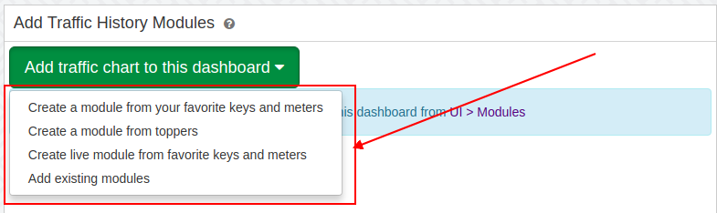
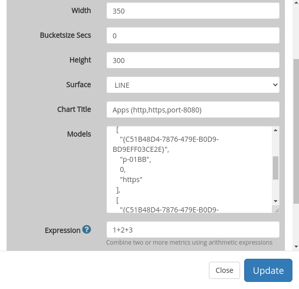
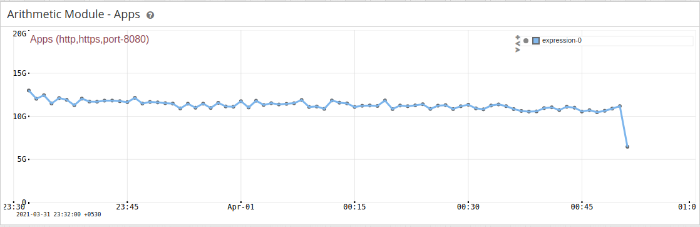

# Dashboards and Modules

A *dashboard* is a web page that contains *modules* at various
positions.

Key rules about modules and dashboards:

1. A dashboard may contain several modules.  

2. A module may appear in any number of dashboards.  

3. A module may even appear multiple times in the same dashboard.  

4. A change in a module property will propagate to all the dashboards
   which use the module.  

5. If there are no modules in a particular position that position is not
   rendered at all as trisul modules auto adjust for width.

## An example - Current Hosts

The first screen you will see when you login is the Current Hosts
overview dashboard

  
*Figure: Host Dashboard*

You can see that this dashboard is nothing but four modules laid out in
two columns. Trisul has well defined column positions into which you can
place modules. See [Module Positions](/docs/ug/ui/dashmod_intro#how-to-add-modules-to-the-dashboard)

Lets take a closer look at the dashboard shown above.

| Top 2 position column 1                   | Top 2 position column 2                        |
| ----------------------------------------- | ---------------------------------------------- |
| Module : In vs out traffic (past 6 hours) | Module : Active TCP connections (past 6 hours) |
| Module : Top Internal Hosts (current)     | Module : Top External Hosts (current)          |

## Toolbars

### Dashboard Toolbars

You can control dashboard layout and contents by using the toolbars.

\* Dashboard toolbars can be accessed from the right side corner of each
dashboard window.

  
*Dashboard level toolbar*

#### Operations

The following operations can be performed using the toolbars:

| Operation                | Description                                                    |
| ------------------------ | -------------------------------------------------------------- |
| Customize                | Edit dashboard parameters like name, description,modules etc.. |
| Toggle labels            | Toogle reaable vs lable only on table list                     |
| Set as default dashboard | Set as home page                                               |
| Collpase all modules     | Click on the dashboard to disable all modules                  |
| Expand all modules       | Click on the dashboard to enable all modules                   |
| Download as PDF          | Export data in PDF file                                        |

### Module Toolbars

- Module toolbar appears when the mouse is clicked on the icon.

  
*Module toolbar*

#### Operations

The following operations can be performed using the toolbars:

| Operation             | Description                                                |
| --------------------- | ---------------------------------------------------------- |
| Rearrange modules     | Click on the module’s title bar and drag it to a new place |
| Customize             | Edit module parameters like name, description, etc..       |
| Historical Chart      | View long term historical view of this chart               |
| Remove from Dashboard | Remove module from this dashboard                          |
| Disable/Enabel Module | Disable / Enable this module                               |

## Creating a new dashboard

To create a new dashboard

- Select Customize -\> UI -\> Dashboards.

- Click -\>Create a new dashboard.

- Supply value for the following fields.

| Field Name       | Description                                                                                                                                         |
| ---------------- | --------------------------------------------------------------------------------------------------------------------------------------------------- |
| Owner            | Trisul user                                                                                                                                         |
| Package          | Name of package (default)                                                                                                                           |
| Key              | A unique identifier for this dashboard(No special characters).                                                                                      |
| Name             | Dashboard title                                                                                                                                     |
| Description      | Subtitle                                                                                                                                            |
| Dashboard type   | LIVE or RETRO (see [Dashboard Types](/docs/ug/ui/dashmod_intro))                                                                                    |
| Position Left    | Click on *Add module* to select modules. Module numbers are shown separated by commas and you can split them into columns using the pipe character. |
| Position Right   | As above                                                                                                                                            |
| Position Top1    | As above                                                                                                                                            |
| Position Top2    | As above                                                                                                                                            |
| Position Mid3    | As above                                                                                                                                            |
| Position Mid4    | As above                                                                                                                                            |
| Position Bottom2 | As above                                                                                                                                            |
| Position Bottom1 | As above                                                                                                                                            |

## Modules

In Modules information is presented in tables and charts . You can
create your own modules using the pre-existing module template.Trisul
has 40 different types of modules.See [Module Templates](/docs/ug/ui/module_templates) for more information about modules.

### Create new modules

To create a new module

- Select Customize -\> UI -\> Modules  

- A list of available modules will appear.  

- Clone a similar module to create new module.  

- Edit the required fields.

### How to add modules to empty dashboard

You can create and add new modules as well as existing modules to empty
dashbord.  
Create an empty live dashboard dashboard. Don’t add any modules.

- Select Dashboard -\> Show all  

- Select the empty dashboard you have created

  
*Empty dashboard ready to add modules to it*

#### Create a module from your favorite keys and meters

- Click create a module from your favorite keys and meters  

- Select the Counter Group and Keys to add modules to the dashboard.  

- If you want plot multiple keys in one module(per meter) check the
  Multiple Keys box.  

- Default all selected meters ploted in one module(per key).

#### Create Modules from topper

- Click create Modules from topper  

- Select keys from topper list. (You can change Counter and Meters)  

- Click Add modules button to add modules to dashboard

#### Create live module from your favorite keys and meters

- Create live module from your favorite keys and meters  

- Select the Counter Group and Keys to add modules to the dashboard.  

- Click Add modules button to add modules to dashboard

#### Add existing modules to empty dashbord

- Click Add Existing Modules to add existing modules to empty dashbpard  

- Select module postion and modules.

- Click Add button to add selected modules to dashboard.

### How to add modules to the dashboard

##### Method - I

To add a module to a specific position

- Select Customize -\> UI -\> Dashboards  

- A list of available dashboards will appear.  

- Click -\> Edit option for the dashboard you want to add the module to.  

- Click -\> Add Module button in any position.  

- You will be shown a list of modules.  

- Select the modules and click -\> Select button to take changes.

You can also specify the module number of your choice at any point.To
find the module numbers,  
Select Customize -\> UI -\> Modules

##### Method - II

- Click -\> Plus on the [dashboard toolbar](/docs/ug/ui/dashmod_intro#toolbars)  

- A list of available modules will appear.  

- Module position can be seen at the top of the form.  

- Select a position and a module you wish to add to that position.  

- Click -\> Save.

##### Method - III

- Click -\> Plus on the [module toolbar](/docs/ug/ui/dashmod_intro#module-toolbars)  

- A list of dashboards are available.  

- Select the dashboard into which you want to add the module.

The module will be added to the top 1 position, you can open the
dashboard and rearrange if required.

### How to edit a module

To edit a module from a dashboard

- Click -\>pencil icon on the [module toolbar](/docs/ug/ui/dashmod_intro#module-toolbars)

You can also edit it by selecting Customize -\> UI -\> Modules.

### How to delete a module from the dashboard

To delete a module from a dashboard

- Click -\> Minus on the [module toolbar](/docs/ug/ui/dashmod_intro#module-toolbars)

You can also delete it by selecting Customize -\> UI -\> Dashboards.

### Creating Modules with arithmetic expressions

You can also create modules with the help of arithmetic expressions.You
can combine different metrics together and show in a module.

Generally Models are numbered as 1,2,3,etc. Supported operators are
+,\_,\*,%,/,()

For eg. Add two Metrics, You have to enter arithmetic expression as
(1+2),(3-4) or Metric 1 as a percentage of 2 and 3 as 1%(2+3)

A custom module dashboard with arithmetic expressions will look like
this.

