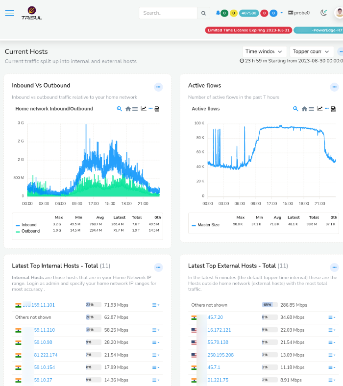
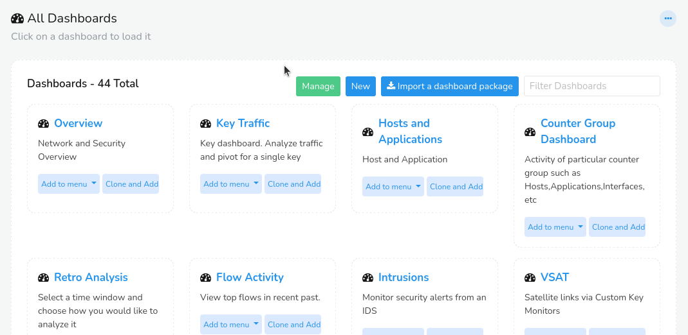
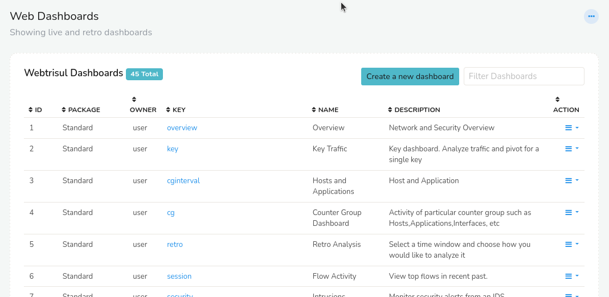
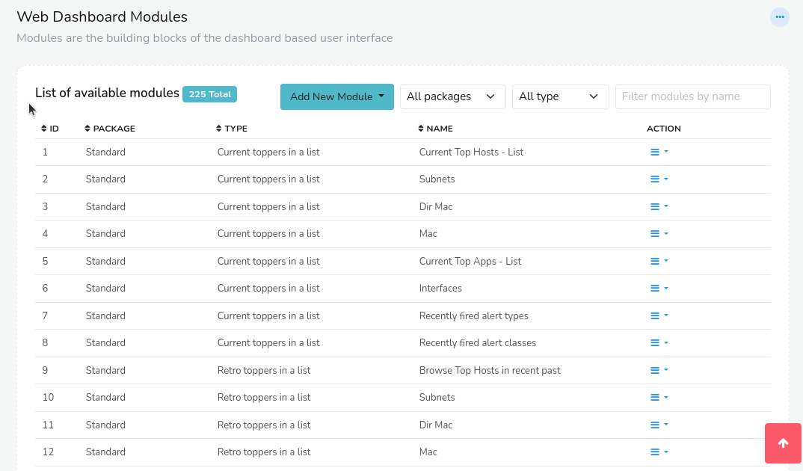
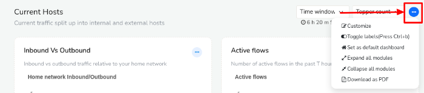
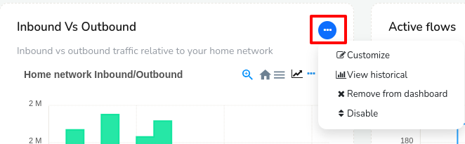

# Introduction to Dashboards and Modules

A *Dashboard* is a visual representation of key performance indicators and metrics that are used to measure the performance of a network traffic. Using Dashboards you can easily monitor and and analyze data in real- time. A Trisul *Dashboard* contains *modules* at various positions.

Dashboards are,

**Visual** You can use charts, graphs, tables and other visual elements to display data

**Interactive** You can interact with dashboards to drilldown into details, filter data, and explore different scenarios

**Real-Time** Dashboards display up to date data reflecting the current status of the network

**Customizable** You can play around with dashboards that can be personalized/customized to specific needs of different users

## Key Rules About *Modules* and *Dashboards*

1. A dashboard may contain several modules.  

2. A module may appear in any number of dashboards.  

3. A module may even appear multiple times in the same dashboard.  

4. A change in a module property will propagate to all the dashboards
   which use the module.  

5. If there are no modules in a particular position that position is not
   rendered at all as trisul modules auto adjust for width.

*Modules* are like widgets or tiles in a *dashboard* that are individual components displaying  specific information, metrics, or data visualizations. They are the building blocks of a *dashboard* and can be customized to show various types of content. 

Modules in a dashboard can be of various types including,

**Charts and Graphs** Display data visualizations, such as line charts, bar charts, or pie charts.

**Tables and Lists** Show tabular data, such as lists and tables.

**KPIs** Display important metrics, such as numbers, percentages, or gauges.

**Maps and GeoSpatial**Show geographic data, such as maps and location-based information.

**Texts and Labels** Display static or dynamic text, such as titles, descriptions, or notifications.

**Gauges and Meters** Display progress or measurement indicators, as in speedometers or thermometers.

**Real-Time Traffic Feeds** Real-time traffic updates, including congestion, incidents, and threats.

**Custom Modules** Can be developed to meet specific needs, such as integrating with external services.

## An Example - Current Hosts

The first screen you will see when you login as user is the Current Hosts
overview dashboard

  
*Figure: Host Dashboard*

You can see that this dashboard is nothing but four modules laid out in
two columns. Trisul has well defined column positions into which you can
place modules. See [Module Positions](/docs/ug/ui/modules#add-modules-to-a-newexisting-dashboard)

Lets take a closer look at the dashboard shown above.

| Top 2 position column 1                   | Top 2 position column 2                        |
| ----------------------------------------- | ---------------------------------------------- |
| Module : In vs out traffic (past 6 hours) | Module : Active TCP connections (past 6 hours) |
| Module : Top Internal Hosts (current)     | Module : Top External Hosts (current)          |

## View a Dashboard/All Dashboards

There are more than one way to navigate to view all dashboards

**Method 1:**

:::info navigation

From the Menu, Go to *Dashboards* &rarr;  *Show all*

:::

*Figure: Showing All Dashboards*

This shows the list of available dashboards.

**Method 2:**

:::note path

From the Menu, Go to Customize-> Show all-> Dashboards

:::

*Figure: Showing All Dashboards*

This also shows the list of available dashboards.

To **open a particular dashboard**, from the list of dashboards, click on the dashboard you would like to view.

## View a Module/All Modules

To view all modules,

:::note path

From the Menu, Go to Customize-> Show all-> Modules

:::

*Figure: Showing All Modules*

This will show a list of all available modules.

To **view one particular module** from the list, check on the name of the dashboard that contains the module and navigate to that dashboard to select the module.

## Toolbars

### Dashboard Toolbars

You can control dashboard layout and contents by using the toolbars.

Dashboard toolbars can be accessed from the right side corner of each
dashboard window. 

  
*Figure: Dashboard level toolbar*

With Dashboard Toolbar you can

**Customize** Allows you to personalize the dashboard to your preferences, such as rearranging modules, adding or removing modules, and changing the layout.

**Toggle Labels** Toggles the display of labels for each module on the dashboard, providing a more detailed information.

**Set as Default Dashboard** Saves the current dashboard configuration as your default view, so every time you log in, this customized dashboard will be displayed.

**Expand all Modules** Opens up all collapsed modules on the dashboard, allowing you to see all the information at once.

**Collapse all modules** Collapses all expanded modules on the dashboard, providing a more compact view and reducing clutter.

**Download as PDF** You can exports the current dashboard view as a PDF file, and save, or share the data for reports.

#### Operations

The following operations can be performed using the toolbars:

| Operation                | Description                                                    |
| ------------------------ | -------------------------------------------------------------- |
| Customize                | Edit dashboard parameters like name, description,modules etc.. |
| Toggle labels            | Toogle reaable vs lable only on table list                     |
| Set as default dashboard | Set as home page                                               |
| Expand all modules       | Click on the dashboard to enable all modules                   |
| Collapse all modules     | Click on the dashboard to disable all modules                  |
| Download as PDF          | Export data in PDF file                                        |

### Module Toolbars

Module toolbar is the three dots on the top right corner of the [module](/docs/ug/ui/dashmod_intro#view-a-moduleall-modules). By clicking on the module toolbar you get a list of actions that can be done on the modules.

  
*Figure: Module toolbar*

#### Operations

The following operations can be performed using the toolbars:

| Operation             | Description                                          |
| --------------------- | ---------------------------------------------------- |
| Customize             | Edit module parameters like name, description, etc.. |
| Historical Chart      | View long term historical view of this chart         |
| Remove from Dashboard | Remove module from this dashboard                    |
| Disable               | Disable / Enable this module                         |

# 
