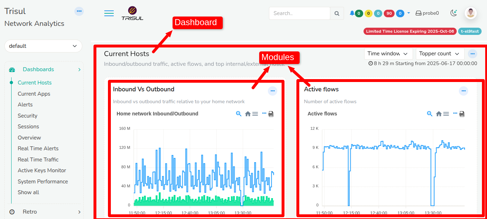
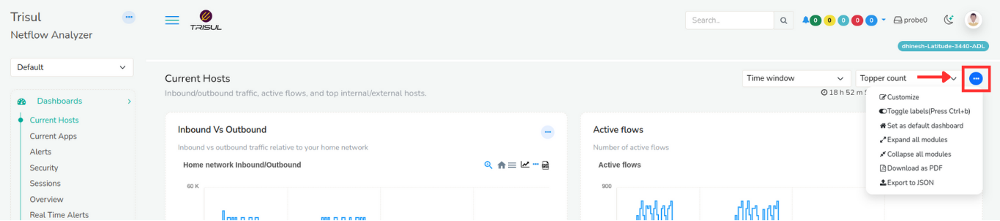

# Introduction to Dashboards and Modules

A **Dashboard** is a visual tool that displays key performance indicators (KPIs) and metrics to help you monitor and understand network traffic performance. Dashboards provide real-time visibility into your network, allowing you to track activity as it happens.

In Trisul, a dashboard is made up of multiple **modules** placed in different positions, each showing specific types of data.

  
*Figure: Showing Dashboard and Modules*

Dashboards are,

**Visual** You can use charts, graphs, tables and other visual elements to display data

**Interactive** You can interact with dashboards to drilldown into details, filter data, and explore different scenarios

**Real-Time** Dashboards display up to date data reflecting the current status of the network

**Customizable** You can play around with dashboards that can be personalized/customized to specific needs of different users

## Key Rules For *Modules* and *Dashboards*

1. A **dashboard** may contain several **modules**.  

2. A **module** may appear in any number of **dashboards**.  

3. A **module** may even appear multiple times in the same **dashboard**.  

4. A change in a **module** property will propagate to all the **dashboards**
   which use the module.  

5. If there are no **modules** in a particular position that position is not
   rendered at all as trisul modules auto adjust for width.

**Modules** are like widgets or tiles in a **dashboard** that are individual components displaying  specific information, metrics, or data visualizations. They are the building blocks of a **dashboard** and can be customized to show various types of content. 

Modules in a dashboard can be of various types including,

- **Charts and Graphs** Display data visualizations, such as line charts, bar charts, or pie charts.

- **Tables and Lists** Show tabular data, such as lists and tables.

- **KPIs** Display important metrics, such as numbers, percentages, or gauges.

- **Maps and GeoSpatial**Show geographic data, such as maps and location-based information.

- **Texts and Labels** Display static or dynamic text, such as titles, descriptions, or notifications.

- **Gauges and Meters** Display progress or measurement indicators, as in speedometers or thermometers.

- **Real-Time Traffic Feeds** Real-time traffic updates, including congestion, incidents, and threats.

- **Custom Modules** Can be developed to meet specific needs, such as integrating with external services.

## An Example - Current Hosts

The first screen you will see when you login as user is the *Current Hosts* dashboard

  
*Figure: Current Host Dashboard*

You can see that this dashboard is nothing but four modules laid out in two columns. Trisul has well defined column positions into which you can place modules. See Module Positions in ["Add Modules to a New/Existing Dashboard"](/docs/ug/ui/modules#add-modules-to-a-newexisting-dashboard)

Lets take a closer look at the dashboard shown above.

| Top 2 position column 1                   | Top 2 position column 2                        |
| ----------------------------------------- | ---------------------------------------------- |
| Module : In vs out traffic (past 6 hours) | Module : Active TCP connections (past 6 hours) |
| Module : Top Internal Hosts (current)     | Module : Top External Hosts (current)          |

## View a Dashboard/All Dashboards

There are more than one way to navigate to view all dashboards

**Method 1:**

:::info navigation

:point_right: From the Menu, Go to *Dashboards* &rarr;  *Show all*

:::

*Figure: Showing All Dashboards*

This shows the list of available dashboards.

**Method 2:**

:::info path

:point_right: From the Menu, Go to Customize&rarr; Show all&rarr; Dashboards

:::

*Figure: Showing All Dashboards*

This also shows the list of available dashboards.

To **open a particular dashboard**, from the list of dashboards, click on the dashboard you would like to view.

## View a Module/All Modules

To view all modules,

:::info path

:point_right: From the Menu, Go to Customize&rarr; Show all&rarr; Modules

:::

*Figure: Showing All Modules*

This will show a list of all available modules.

To **view one particular module** from the list, check on the name of the dashboard that contains the module and navigate to that dashboard to select the module.

## Dashboard Customization

### Dashboard Menu Button

You can manage the layout and contents of a dashboard using the **menu options** available at the dashboard level. To access these options, click the **ellipsis icon** located at the top-right corner of the dashboard window.

  
*Figure: Dashboard level menu options*

### Dashboard Menu Options

The following operations can be performed using the dashboard menu options:

| Operation                | Description                                                    |
| ------------------------ | -------------------------------------------------------------- |
| Customize                | Personalize the dashboard by rearranging modules, changing the layout, or editing dashboard parameters such as name and description. |
| Toggle labels            | Show or hide the title and descriptive labels of each module. Hiding labels gives a cleaner look, while showing them provides more context and detail.                     |
| Set as default dashboard | Save the current dashboard as your default home page. It will automatically load when you log in next time.                                               |
| Expand all modules       | Expand all collapsed modules on the dashboard to display full details at once.                  |
| Collapse all modules     | Collapse all expanded modules to create a compact, less cluttered view.                 |
| Download as PDF          | Export the current dashboard view as a PDF file for reporting or sharing.                                   |
| Export to JSON           | Export the dashboard configuration and data in JSON format, useful for backups or importing elsewhere. |

